# Enterprise Java Codebase Mastery Guide

> **For Senior Engineers Joining Large FinTech / Product-Based Companies**
> A complete, battle-tested field manual for mastering complex enterprise SOAP + REST Java applications — fast.

---

## Table of Contents

- [Phase 1 — Enterprise Java Architecture Fundamentals](#phase-1--enterprise-java-architecture-fundamentals)
  - [1.1 Monolith vs Microservices](#11-monolith-vs-microservices)
  - [1.2 Layered Architecture](#12-layered-architecture)
  - [1.3 Hexagonal Architecture](#13-hexagonal-architecture)
  - [1.4 Clean Architecture](#14-clean-architecture)
  - [1.5 Domain Driven Design Basics](#15-domain-driven-design-basics)
  - [1.6 Why Enterprise Systems Look Complex](#16-why-enterprise-systems-look-complex)
- [Phase 2 — How to Read Unknown Codebases](#phase-2--how-to-read-unknown-codebases)
- [Phase 3 — Reverse Engineering Existing Applications](#phase-3--reverse-engineering-existing-applications)
- [Phase 4 — Debugging Mastery](#phase-4--debugging-mastery)
- [Phase 5 — Eclipse Mastery](#phase-5--eclipse-mastery)
- [Phase 6 — IntelliJ IDEA Mastery](#phase-6--intellij-idea-mastery)
- [Phase 7 — Logging / Monitoring / Tracing](#phase-7--logging--monitoring--tracing)
- [Phase 8 — SOAP Mastery](#phase-8--soap-mastery)
- [Phase 9 — REST Mastery](#phase-9--rest-mastery)
- [Phase 10 — Database Tracing](#phase-10--database-tracing)
- [Phase 11 — Becoming Application Expert](#phase-11--becoming-application-expert)
- [Supplement A — Async Flow Tracing](#supplement-a--async-flow-tracing)
  - [A.1 What "Async" Means in Enterprise Java](#a1-what-async-means-in-enterprise-java)
  - [A.2 @Async — Complete Internals](#a2-async--complete-internals)
  - [A.3 MDC Propagation Across Thread Boundaries](#a3-mdc-propagation-across-thread-boundaries)
  - [A.4 Tracing Async Flows End-to-End](#a4-tracing-async-flows-end-to-end)
  - [A.5 CompletableFuture — Tracing and Debugging](#a5-completablefuture--tracing-and-debugging)
  - [A.6 Spring Application Events (Async)](#a6-spring-application-events-async)
  - [A.7 Message-Driven Async Flows (JMS / Kafka / RabbitMQ)](#a7-message-driven-async-flows-jms--kafka--rabbitmq)
  - [A.8 Async Flow Debugging Checklist](#a8-async-flow-debugging-checklist)
  - [A.9 Async Debugging Lab](#a9-async-debugging-lab)
- [Supplement B — Scheduler / Job Flow Tracing](#supplement-b--scheduler--job-flow-tracing)
  - [B.1 Why Scheduled Jobs Are Hard to Debug](#b1-why-scheduled-jobs-are-hard-to-debug)
  - [B.2 @Scheduled — Spring's Built-In Trigger](#b2-scheduled--springs-built-in-trigger)
  - [B.3 Adding Observability to @Scheduled Jobs](#b3-adding-observability-to-scheduled-jobs)
  - [B.4 Preventing Job Overlap with ShedLock](#b4-preventing-job-overlap-with-shedlock)
  - [B.5 Quartz Scheduler — Enterprise Job Scheduling](#b5-quartz-scheduler--enterprise-job-scheduling)
  - [B.6 Spring Batch — Processing Large Datasets](#b6-spring-batch--processing-large-datasets)
  - [B.7 Tracing a Scheduler / Job Flow End-to-End](#b7-tracing-a-scheduler--job-flow-end-to-end)
  - [B.8 Job Debugging Checklist](#b8-job-debugging-checklist)
  - [B.9 Scheduler Debugging Lab](#b9-scheduler-debugging-lab)
- [Supplement C — Production Troubleshooting Playbook](#supplement-c--production-troubleshooting-playbook)
  - [C.1 How to Use This Playbook](#c1-how-to-use-this-playbook)
  - [C.2 NullPointerException Investigation](#c2-nullpointerexception-investigation)
  - [C.3 Timeout Debugging](#c3-timeout-debugging)
  - [C.4 Slow API Debugging](#c4-slow-api-debugging)
  - [C.5 Memory Leak Debugging](#c5-memory-leak-debugging)
  - [C.6 DB Lock Debugging](#c6-db-lock-debugging)
  - [C.7 SOAP Fault Debugging](#c7-soap-fault-debugging)
  - [C.8 HTTP 500 Error Debugging](#c8-http-500-error-debugging)
  - [C.9 Application Startup Failure Debugging](#c9-application-startup-failure-debugging)
  - [C.10 Production Incident Response Template](#c10-production-incident-response-template)
  - [C.11 Production Troubleshooting Master Checklist](#c11-production-troubleshooting-master-checklist)
- [Supplement D — Mermaid Diagram Reference](#supplement-d--mermaid-diagram-reference)
  - [D.1 Architecture Diagrams](#d1-architecture-diagrams)
  - [D.2 Request Lifecycle Diagrams](#d2-request-lifecycle-diagrams)
  - [D.3 Spring Internals Diagrams](#d3-spring-internals-diagrams)
  - [D.4 Database Flow Diagrams](#d4-database-flow-diagrams)
  - [D.5 SOAP Diagrams](#d5-soap-diagrams)
  - [D.6 Logging and Tracing Diagrams](#d6-logging-and-tracing-diagrams)
  - [D.7 Debugging Flow Diagrams](#d7-debugging-flow-diagrams)
  - [D.8 CI/CD and Deployment Diagrams](#d8-cicd-and-deployment-diagrams)
  - [D.9 Eclipse and IntelliJ Workflow Diagrams](#d9-eclipse-and-intellij-workflow-diagrams)
  - [D.10 System-Level Architecture Reference](#d10-system-level-architecture-reference)

---

# Phase 1 — Enterprise Java Architecture Fundamentals

> **Senior Engineer Mindset**: Before reading a single line of code, the best engineers build a **mental architectural map**. They ask: *"What shape is this system? How does data flow? Where are the boundaries?"* This phase gives you that map.

---

## 1.1 Monolith vs Microservices

### What You Will Encounter in Enterprise FinTech

In most established FinTech companies, you will encounter **one of three realities**:

| Reality | Description |
|--------|-------------|
| **Classic Monolith** | One deployable WAR/EAR. All features in one codebase. Common in banks, insurance systems built pre-2015. |
| **Modular Monolith** | Still one deployment unit, but internally divided into Maven modules with clear boundaries. |
| **Microservices (partial)** | Legacy monolith partially decomposed. You'll have a mix — some services are standalone, others are still monolithic. |

> **Warning (Anti-pattern)**: Many companies claim they "have microservices" but actually have a **distributed monolith** — services that cannot be deployed independently because of shared databases, shared session state, or tight runtime coupling. Recognize this early.

---

### Monolith — Deep Anatomy

```
+--------------------------------------------------+
|              Enterprise Monolith (WAR)           |
|                                                  |
|  +------------+  +------------+  +------------+ |
|  |  Web Layer |  | Service    |  |  DAO Layer | |
|  | (Servlets/ |  | Layer      |  | (Hibernate/| |
|  |  JSP / MVC)|  | (Business  |  |  JPA /     | |
|  |            |  |  Logic)    |  |  JDBC)     | |
|  +------------+  +------------+  +------------+ |
|                                                  |
|  +----------+  +------------+  +--------------+ |
|  | Scheduler|  | SOAP Layer |  | REST Layer   | |
|  | (Quartz/ |  | (CXF / JAX |  | (Spring MVC/ | |
|  |  Spring) |  | -WS)       |  |  Jersey)     | |
|  +----------+  +------------+  +--------------+ |
|                                                  |
|  +--------------------------------------------+ |
|  | Shared Utilities / Config / Constants       | |
|  +--------------------------------------------+ |
|                                                  |
+--------------------------------------------------+
              |               |
     +--------+               +--------+
     |   Oracle / DB2 /               |
     |   PostgreSQL                  External Systems
     |   (Single shared DB)          (SWIFT / FTP / MQ)
     +------------------------------------+
```

**Characteristics of a Monolith you must recognize:**
- Single `pom.xml` at root OR a parent POM with child modules
- Single `web.xml` / `applicationContext.xml` / `@SpringBootApplication`
- All business logic in one JVM process
- Shared database schema
- Common `utils`, `constants`, `config` packages used everywhere

---

### Microservices — Enterprise Reality

```
+------------------+     HTTP/REST     +------------------+
|  API Gateway     |------------------>|  Auth Service    |
|  (Zuul / Kong /  |                   +------------------+
|   Spring Cloud)  |
+------------------+
        |
        | Routes to:
        |
  +-----+------+----------+-----------+
  |            |           |           |
  v            v           v           v
+------+  +--------+  +--------+  +--------+
|Loan  |  |Payment |  |Account |  |Report  |
|Svc   |  |Svc     |  |Svc     |  |Svc     |
+------+  +--------+  +--------+  +--------+
  |  DB     |  DB       |  DB       |  DB
  v         v           v           v
[loans]  [payments]  [accounts]  [reports]
```

**What senior engineers check first in microservices:**
- [ ] Is there a shared library (internal Maven artifact) that all services depend on?
- [ ] Do services share a database schema? If yes, it's a distributed monolith.
- [ ] Is there a message broker (Kafka, RabbitMQ, IBM MQ)?
- [ ] Is there a service registry (Eureka, Consul)?
- [ ] Is there a centralized config server (Spring Cloud Config)?
- [ ] How is distributed tracing done? (Sleuth, Zipkin, Jaeger)

---

### Key Interview-Level Explanation

> *"In a true microservices architecture, each service is independently deployable, owns its data store, and communicates via well-defined contracts (REST/messaging). In practice, most enterprise systems are somewhere on the spectrum — you should assess the actual coupling, not the stated architecture."*

---

## 1.2 Layered Architecture

### The Classic N-Tier Model (What You'll See Daily)

```
+-----------------------------------------------------------+
|                  PRESENTATION LAYER                       |
|  (REST Controllers / SOAP Endpoints / JSP / Thymeleaf)    |
+-----------------------------------------------------------+
                          |
                          v
+-----------------------------------------------------------+
|                   SERVICE LAYER                           |
|  (@Service / Business Logic / Transaction Boundary)       |
+-----------------------------------------------------------+
                          |
                          v
+-----------------------------------------------------------+
|                 REPOSITORY / DAO LAYER                    |
|  (@Repository / JpaRepository / HibernateDAO / JDBC)      |
+-----------------------------------------------------------+
                          |
                          v
+-----------------------------------------------------------+
|                    DATABASE LAYER                         |
|  (Oracle / PostgreSQL / DB2 / MySQL)                      |
+-----------------------------------------------------------+
```

---

### Rules Senior Engineers Know (That Juniors Break)

| Rule | Correct | Anti-Pattern |
|------|---------|--------------|
| Layer responsibility | Each layer has one job | Controller calling DAO directly |
| Transaction ownership | Service layer owns transactions | DAO managing transactions |
| DTO usage | Controllers use DTOs, not entities | Entities leaking to REST response |
| Exception handling | Service layer catches, wraps, rethrows | Raw `SQLException` in controller |
| Validation | Controller validates input | Validation scattered everywhere |

---

### Package Structure You Will Encounter

```
com.company.appname
├── config/               ← Spring config, beans, datasource, security
├── controller/           ← REST endpoints (@RestController)
├── service/              ← Business logic (@Service)
│   └── impl/             ← Implementations
├── repository/           ← Data access (@Repository / JpaRepository)
├── domain/               ← JPA Entities (@Entity)
├── dto/                  ← Data Transfer Objects (request/response POJOs)
├── mapper/               ← Entity ↔ DTO conversion (MapStruct / manual)
├── exception/            ← Custom exceptions + global handler
├── util/                 ← Shared utilities
├── soap/                 ← SOAP endpoints + generated JAXB classes
├── integration/          ← External system connectors
└── scheduler/            ← Scheduled jobs (@Scheduled / Quartz)
```

> **Practical Exercise**: On your first day, map the actual package structure of your new app against this template. Note what's different. That difference tells you the system's history and priorities.

---

### How Data Flows Through Layers (Request Lifecycle)

```
HTTP Request
     |
     v
[DispatcherServlet] → [Filter Chain] → [HandlerMapping]
     |
     v
[@RestController method]
     |  (validates input, calls service)
     v
[@Service method]  ←→  starts @Transactional
     |  (business logic, orchestration)
     v
[@Repository / DAO]
     |  (Hibernate / JPA generates SQL)
     v
[DataSource / Connection Pool (HikariCP)]
     |
     v
[Database]
     |
     v (result set)
[Entity returned] → [mapped to DTO] → [serialized to JSON]
     |
     v
HTTP Response
```

---

## 1.3 Hexagonal Architecture

### What It Is and Why Enterprise Systems Use It

Hexagonal Architecture (Ports & Adapters) was introduced by Alistair Cockburn. In modern enterprise systems (especially those being modernized from monolith), you will encounter it more and more.

**Core idea**: The business domain is the center. Everything else (REST, SOAP, DB, MQ) is an adapter that plugs into the domain.

```
                     +-------------------+
                     |   Driving Adapters|
                     | (REST Controller, |
                     |  SOAP Endpoint,   |
                     |  Batch Job,       |
                     |  Scheduler)       |
                     +--------+----------+
                              |
                              v (via Port interface)
          +-------------------+--------------------+
          |                                        |
          |         APPLICATION CORE               |
          |                                        |
          |   +-----------+   +-------------+      |
          |   |  Domain   |   |  Use Cases  |      |
          |   |  Entities |   |  (Services) |      |
          |   +-----------+   +-------------+      |
          |                                        |
          +-------------------+--------------------+
                              |
                              v (via Port interface)
                     +--------+----------+
                     |  Driven Adapters  |
                     | (JPA Repository,  |
                     |  Kafka Producer,  |
                     |  External HTTP,   |
                     |  Email Service)   |
                     +-------------------+
```

### Ports vs Adapters

| Concept | Definition | Example |
|---------|-----------|---------|
| **Driving Port** | Interface the core exposes to the outside world | `PaymentService` interface |
| **Driving Adapter** | Calls the driving port | `PaymentRestController` |
| **Driven Port** | Interface the core requires from infrastructure | `PaymentRepository` interface |
| **Driven Adapter** | Implements what core needs | `JpaPaymentRepository` |

### How to Recognize It in Code

```java
// Driven Port (interface in domain/application layer)
public interface PaymentRepository {
    Payment findById(String paymentId);
    void save(Payment payment);
}

// Driven Adapter (infrastructure layer — implements port)
@Repository
public class JpaPaymentRepository implements PaymentRepository {
    @Autowired private PaymentJpaEntityRepository jpaRepo;

    @Override
    public Payment findById(String paymentId) {
        PaymentEntity entity = jpaRepo.findById(paymentId).orElseThrow(...);
        return PaymentMapper.toDomain(entity);
    }
}
```

> **Senior Engineer Tip**: If you see interfaces in `domain/` or `application/` packages that are implemented in `infrastructure/` or `adapter/` packages — you are in a hexagonal codebase. The dependency points **inward**, not outward.

---

### Checklist: Is This Hexagonal?

- [ ] Are there `port/in/` and `port/out/` packages?
- [ ] Are `@Service` classes in a separate module from `@Repository`?
- [ ] Do domain entities have no JPA annotations?
- [ ] Is there a `mapper/` or `assembler/` that converts JPA entities to domain objects?
- [ ] Are external system calls hidden behind interfaces in the domain layer?

---

## 1.4 Clean Architecture

### Uncle Bob's Layers (as They Appear in Enterprise Java)

```
+-----------------------------------------------+
|            Frameworks & Drivers               |  ← Spring, Hibernate, REST, DB
|  +---------------------------------------+    |
|  |         Interface Adapters            |    |  ← Controllers, Gateways, Presenters
|  |  +-------------------------------+   |    |
|  |  |      Application Layer        |   |    |  ← Use Cases / Interactors
|  |  |  +-------------------------+  |   |    |
|  |  |  |     Domain Layer        |  |   |    |  ← Entities, Business Rules
|  |  |  +-------------------------+  |   |    |
|  |  +-------------------------------+   |    |
|  +---------------------------------------+    |
+-----------------------------------------------+

        Dependency Rule: Points INWARD only.
        Inner layers know NOTHING about outer layers.
```

### Clean Architecture vs Layered Architecture

| Aspect | Layered | Clean |
|--------|---------|-------|
| Dependency direction | Top-down | Inward only |
| Domain entities | Often JPA entities | Pure Java objects |
| Testability | Medium | Very high (core testable without Spring) |
| Complexity | Low–Medium | Medium–High |
| Common in | Legacy enterprise | Modern greenfield |

### How Senior Engineers Spot It

```
com.company.app
├── domain/
│   ├── model/            ← Pure Java business entities (NO @Entity)
│   └── service/          ← Business rules
├── application/
│   └── usecase/          ← Orchestration (calls domain + ports)
├── adapter/
│   ├── in/
│   │   └── rest/         ← REST controllers
│   └── out/
│       └── persistence/  ← JPA repositories + entity mappers
└── infrastructure/
    └── config/           ← Spring config, beans
```

---

## 1.5 Domain Driven Design Basics

### Key DDD Concepts That Appear in Enterprise Code

| Concept | What It Is | Code Signal |
|---------|-----------|-------------|
| **Entity** | Object with identity | `@Entity` or domain class with `id` field |
| **Value Object** | Immutable, identified by value | `Money`, `Address`, `Currency` classes — no `id` |
| **Aggregate** | Cluster of entities with a root | `Order` contains `OrderLine` items |
| **Repository** | Retrieves aggregates from storage | `OrderRepository` interface |
| **Domain Service** | Business logic that doesn't fit in one entity | `InterestCalculationService` |
| **Application Service** | Orchestrates use cases | `ProcessPaymentUseCase` |
| **Domain Event** | Something that happened | `PaymentCompletedEvent` |
| **Bounded Context** | Explicit boundary around a domain model | Separate Maven module or microservice |

---

### How to Read DDD Code

```java
// Aggregate Root
public class Order {
    private OrderId id;           // Value Object
    private CustomerId customerId; // Value Object (reference to Customer aggregate)
    private List<OrderLine> lines; // Entities within aggregate
    private Money totalAmount;    // Value Object
    private OrderStatus status;   // Enum / Value Object

    // Business logic lives ON the aggregate
    public void addLine(Product product, int quantity) {
        // Domain rule enforced here
        if (status != OrderStatus.DRAFT) {
            throw new DomainException("Cannot modify confirmed order");
        }
        lines.add(new OrderLine(product, quantity));
        recalculateTotal();
    }
}
```

> **Anti-pattern to watch for**: Anemic Domain Model — entities are just POJOs with getters/setters, and all business logic is in service classes. Very common in legacy enterprise apps. Not necessarily wrong, but a sign of accidental architecture.

---

### DDD Package Signals

```
If you see:                          It means:
----------------------------------------
model/ or domain/                →  DDD or Clean Architecture intent
valueobject/ or vo/              →  Value Objects (DDD)
aggregate/ or aggregateroot/     →  DDD Aggregates
event/ under domain/             →  Domain Events
usecase/ or interactor/          →  Application Services (DDD/Clean)
bounded context per module       →  Module-level DDD
shared/ or common/               →  Shared Kernel
```

---

## 1.6 Why Enterprise Systems Look Complex

### The Hidden Forces That Create Complexity

Senior engineers don't get overwhelmed by complex systems because they understand **why** the complexity exists. Every strange pattern in an enterprise system has a cause.

```
WHY ENTERPRISE SYSTEMS ARE COMPLEX
====================================

1. AGE
   └── Code written over 10-15 years by many teams
   └── Different eras: EJB → Spring → Spring Boot
   └── Multiple refactoring attempts, never completed

2. COMPLIANCE & REGULATION (FinTech specific)
   └── Audit trails everywhere → extra logging, interceptors
   └── Immutable records → soft deletes, history tables
   └── Encryption at rest → encrypted entity fields
   └── Role-based access → security in every layer

3. INTEGRATION COMPLEXITY
   └── SWIFT, FIX protocol, ISO 20022
   └── Legacy mainframe via MQ or file-based integration
   └── Third-party vendors with SOAP APIs from 2005
   └── Scheduled file drops (FTP/SFTP) still in production

4. TEAM DYNAMICS
   └── Each team "owned" a module and made it their own
   └── No unified coding standard enforced
   └── Multiple Spring versions coexisted for years
   └── Fear of touching "that class" → code preserved as-is

5. PERFORMANCE WORKAROUNDS
   └── Custom caching (pre-Spring Cache)
   └── Manually batched DB calls
   └── Hand-written connection pools
   └── Stored procedures for performance-critical paths

6. OPERATIONAL REQUIREMENTS
   └── Zero-downtime deployment constraints
   └── Hot config reloading
   └── Feature flags / toggles
   └── Multi-tenancy support
```

---

### How Senior Engineers Navigate Complexity

The following is the **mental algorithm** a senior engineer applies when dropped into an unknown enterprise codebase:

```
STEP 1: Understand what the system DOES (business domain)
  └── Read wiki, Confluence, README
  └── Ask: "What is the primary business function?"

STEP 2: Find the entry points
  └── REST: grep for @RestController, @RequestMapping
  └── SOAP: grep for @WebService, @Endpoint
  └── Batch: grep for @Scheduled, implements Job, CommandLineRunner

STEP 3: Trace ONE complete request end-to-end
  └── Pick the most important business operation
  └── Follow: Controller → Service → Repo → DB

STEP 4: Map the external integrations
  └── What does the system call?
  └── What calls the system?
  └── What queues/topics exist?

STEP 5: Understand the data model
  └── Find the core entities (@Entity classes)
  └── Understand the DB schema (ERD if available)
  └── Identify the aggregate roots

STEP 6: Find where configuration lives
  └── application.properties / application.yml
  └── @Configuration classes
  └── External config server (if microservices)

STEP 7: Run it locally
  └── Get it compiling and running
  └── Trigger one real operation
  └── Verify one test passes
```

---

### Complexity Anti-Patterns You Will Find (and Must Not Add To)

| Anti-Pattern | What It Looks Like | Why It Exists |
|-------------|-------------------|---------------|
| **God Class** | `PaymentProcessorImpl` with 3,000 lines | Grew organically, nobody refactored |
| **Magic Numbers** | `if (status == 3)` | Original enums were DB-stored, then hardcoded |
| **Utility Hell** | `StringUtil`, `DateUtil`, `ValidationUtil` with 200 methods | Shared library added to over years |
| **Dual Write** | Same data written to two tables/systems | Migration in progress, never finished |
| **Dead Code** | Methods with `@Deprecated` since 2014, still called | Afraid to delete |
| **Config Sprawl** | Properties in `.properties`, DB table, and JNDI | Added piece by piece across years |
| **Exception Swallowing** | `catch(Exception e) { log.error("error"); }` | Quick fix, never revisited |
| **Transaction Leaks** | `@Transactional` on `@Controller` | Misunderstanding of Spring TX proxy |

---

### Debugging Lab 1.1 — Architecture Identification Exercise

**Goal**: Within 30 minutes of joining a new codebase, identify its architectural pattern.

**Steps**:

```
[ ] 1. Open the root directory. Count the number of pom.xml / build.gradle files.
        - 1 file = single module (monolith)
        - Multiple = multi-module (modular monolith or microservice)

[ ] 2. Find the main entry point:
        - @SpringBootApplication class → Spring Boot app
        - web.xml → legacy Spring MVC or Servlet app
        - ejb-jar.xml → EJB-based (rare but exists in banks)

[ ] 3. Check the package root structure (list top-level packages):
        - com.company.app.controller + service + repo → layered
        - com.company.app.domain + adapter + application → hexagonal/clean
        - com.company.appname + com.company.otherfeature → DDD bounded context

[ ] 4. Check dependencies in pom.xml:
        - spring-boot-starter-web → REST application
        - spring-ws-core or cxf-spring-boot-starter → SOAP application
        - spring-cloud-* → microservices with Spring Cloud
        - quartz or spring-batch → scheduled/batch application

[ ] 5. Identify the database access style:
        - spring-boot-starter-data-jpa → JPA/Hibernate
        - mybatis → MyBatis (common in Asian FinTech)
        - JdbcTemplate → raw JDBC (legacy or performance-critical)
        - Both JPA + JDBC → mixed (migration in progress)

[ ] 6. Document your findings as an architecture map (even hand-drawn)
```

**Output**: A one-page architecture summary you write yourself. This becomes your north star.

---

### Architecture Templates

#### Template: New Application Architecture Summary

```
Application Name: ___________________________
Date of Assessment: _________________________

TYPE:
[ ] Classic Monolith (WAR)
[ ] Modular Monolith (multi-module Maven)
[ ] Microservice
[ ] Distributed Monolith (microservices in name only)

ARCHITECTURE STYLE:
[ ] Layered (N-tier)
[ ] Hexagonal (Ports & Adapters)
[ ] Clean Architecture
[ ] Mixed / Unclear

ENTRY POINTS:
REST Controllers: ___________________ (package/class)
SOAP Endpoints:  ___________________ (package/class)
Schedulers:      ___________________ (package/class)
Batch Jobs:      ___________________ (package/class)
MQ Listeners:    ___________________ (package/class)

CORE BUSINESS DOMAIN:
Primary entities: ___________________
Core business operations: ___________

EXTERNAL INTEGRATIONS:
Systems called:  ___________________
Systems calling: ___________________
Message queues:  ___________________

DATABASE:
Type:            ___________________
ORM/Access:      ___________________
Schema count:    ___________________

NOTABLE OBSERVATIONS:
____________________________________________
____________________________________________
```

---

> **Phase 1 Complete.**
> 
> You now have a deep understanding of the architectural shapes you will encounter in enterprise Java systems, the forces that create complexity, and the mental model senior engineers use to navigate them.
>
> Say **"continue"** to proceed to **Phase 2 — How to Read Unknown Codebases**.

---

# Phase 2 — How to Read Unknown Codebases

> **Senior Engineer Mindset**: Experienced engineers never start by reading code top-to-bottom. They scan, triangulate, and build a map before diving deep. This phase gives you the exact methodology used by senior engineers who can onboard onto any large codebase within a week.

---

## 2.1 Where to Start

### The First 2 Hours Rule

When dropped into an unknown codebase, your first 2 hours should produce a **map**, not deep code understanding. The goal is orientation, not mastery.

```
FIRST 2 HOURS CHECKLIST
========================

[ ] 1. Find and read the README.md (if it exists)
[ ] 2. Open the root build file (pom.xml / build.gradle)
[ ] 3. Count modules — understand the project structure
[ ] 4. Find the application entry point (main class / web.xml)
[ ] 5. Find the configuration files (application.yml / .properties)
[ ] 6. Identify what external systems this app talks to
[ ] 7. Find the test directory — look at test class names (they tell you what the app does)
[ ] 8. Run: grep -r "@RestController" src/ → lists all REST entry points
[ ] 9. Run: grep -r "@WebService\|@Endpoint" src/ → lists all SOAP entry points
[ ] 10. Find the DB schema or @Entity classes — understand the data model
```

---

### Reading `pom.xml` Like a Senior Engineer

The `pom.xml` (or `build.gradle`) is the **biography of the application**. It tells you:

```xml
<!-- From pom.xml, a senior engineer extracts: -->

<!-- 1. What kind of app is this? -->
<dependency>
  <groupId>org.springframework.boot</groupId>
  <artifactId>spring-boot-starter-web</artifactId>     <!-- REST app -->
</dependency>
<dependency>
  <artifactId>spring-ws-core</artifactId>              <!-- SOAP app -->
</dependency>
<dependency>
  <artifactId>spring-batch-core</artifactId>           <!-- Batch jobs -->
</dependency>

<!-- 2. What database and ORM? -->
<dependency>
  <artifactId>spring-boot-starter-data-jpa</artifactId>  <!-- JPA/Hibernate -->
</dependency>
<dependency>
  <artifactId>ojdbc8</artifactId>                        <!-- Oracle DB -->
</dependency>

<!-- 3. What messaging? -->
<dependency>
  <artifactId>spring-kafka</artifactId>                  <!-- Kafka -->
</dependency>
<dependency>
  <artifactId>spring-boot-starter-activemq</artifactId> <!-- ActiveMQ / IBM MQ -->
</dependency>

<!-- 4. What security framework? -->
<dependency>
  <artifactId>spring-boot-starter-security</artifactId> <!-- Spring Security -->
</dependency>

<!-- 5. Internal shared libraries (proprietary artifacts) -->
<dependency>
  <groupId>com.company.internal</groupId>               <!-- !! Internal lib !!
  <artifactId>company-commons</artifactId>              <!-- Read this carefully -->
</dependency>

<!-- 6. Code generation tools -->
<dependency>
  <artifactId>jaxb2-maven-plugin</artifactId>           <!-- SOAP class generation from WSDL/XSD -->
</dependency>
<dependency>
  <artifactId>mapstruct</artifactId>                    <!-- Auto DTO mapping -->
</dependency>
```

> **Key Insight**: Internal shared libraries (`com.company.*`) are the most important dependency to understand. They contain cross-cutting concerns — security, logging, auditing, crypto. Spend time reading them.

---

### Reading `application.yml` / `application.properties`

```yaml
# What a senior engineer extracts from application.yml:

# 1. What databases does this connect to?
spring:
  datasource:
    url: jdbc:oracle:thin:@hostname:1521:ORCL   # Oracle DB location
    username: ${DB_USER}                          # Env variable — check how this is set
  jpa:
    show-sql: true                               # SQL logging enabled (useful for debugging)
    hibernate:
      ddl-auto: validate                         # Schema not auto-created — DDL scripts exist separately

# 2. What external services?
integration:
  payment-gateway:
    url: https://payments.internal.company.com/api
    timeout: 30000
  swift:
    host: swift.company.com
    port: 9901

# 3. What feature flags exist?
features:
  new-payment-engine: false                      # Feature toggle — old/new code paths
  enhanced-logging: true

# 4. What app server config?
server:
  port: 8080
  servlet:
    context-path: /app

# 5. What messaging?
spring:
  kafka:
    bootstrap-servers: kafka1:9092,kafka2:9092
    consumer:
      group-id: payment-service
```

---

## 2.2 How Senior Engineers Scan Code

### The Four Scanning Modes

Senior engineers switch between four modes depending on what they need:

| Mode | Purpose | Technique |
|------|---------|-----------|
| **Breadth-first scan** | Get the big picture fast | Read class names, method signatures, not bodies |
| **Depth-first trace** | Follow one flow end-to-end | Pick one operation, trace controller → DB |
| **Pattern recognition** | Spot known patterns | Look for @Transactional, @Async, @Scheduled |
| **Anomaly detection** | Find surprises | Scan for TODOs, HACKs, deprecated, catch(Exception) |

---

### Breadth-First Code Scanning Technique

```
1. Open the service layer package (com.company.app.service or impl/)
2. Read ONLY the class names and method signatures (Ctrl+O in Eclipse / Ctrl+F12 in IntelliJ)
3. Do NOT read method bodies yet
4. Ask: "What operations does this system support?"
5. Write them down

Example scan output:
  PaymentService
    - processPayment(PaymentRequest) : PaymentResult
    - reversePayment(String paymentId) : void
    - getPaymentStatus(String transactionId) : PaymentStatus

  AccountService
    - getAccount(String accountNumber) : AccountDTO
    - debit(String accountNumber, Money amount) : TransactionResult
    - credit(String accountNumber, Money amount) : TransactionResult
    - freeze(String accountNumber, String reason) : void

6. You now understand the system's core operations — without reading a single method body.
```

---

### Depth-First Request Tracing Technique

Pick the **most important business operation** (e.g., "process a payment") and trace it completely through the system.

```
TRACE TEMPLATE
==============

Entry Point:
  Class:  PaymentController
  Method: POST /api/v1/payments
  Line:   processPayment(@RequestBody PaymentRequest request)

  ↓ calls

Service Layer:
  Class:  PaymentServiceImpl
  Method: processPayment(PaymentRequest request)
  Notes:  @Transactional — transaction starts here
          Calls: accountService.debit(), fxRateService.getRate()

  ↓ calls

Repository Layer:
  Class:  PaymentRepository (Spring Data JPA)
  Method: save(PaymentEntity entity)
  Notes:  Auto-generates INSERT SQL

  ↓ also calls

External Integration:
  Class:  PaymentGatewayClient
  Method: submitPayment(GatewayRequest request)
  Notes:  RestTemplate / WebClient call to external system
          Timeout: 30s
          Retry: 3 attempts

  ↓ result flows back up

Response:
  DTO:    PaymentResponse
  Mapper: PaymentMapper.toResponse(PaymentEntity)
  HTTP:   201 CREATED with Location header
```

---

## 2.3 Dependency Mapping

### Why Dependency Mapping Matters

In enterprise systems, the biggest surprises come from **hidden dependencies**:
- A service that calls 12 other services
- A class that holds static state
- A scheduler that fires a chain of 6 jobs
- A Spring `@EventListener` that silently triggers on every save

Dependency mapping surfaces these before they surprise you in production.

---

### Internal Dependency Map (Class Level)

```
How to build it:

1. Pick a service class (e.g., PaymentServiceImpl)
2. List all @Autowired / constructor-injected fields
3. For each dependency, list its own dependencies
4. Draw the tree

Example:

PaymentServiceImpl
├── AccountRepository           (DB access)
├── PaymentRepository           (DB access)
├── FxRateService               (→ FxRateRepository, ExternalFxClient)
├── AuditService                (→ AuditRepository, KafkaProducer)
├── NotificationService         (→ EmailClient, SMSClient)
├── PaymentValidationService    (→ ComplianceCheckClient [SOAP!])
└── PaymentMapper               (MapStruct — no further deps)
```

> **Red Flag**: If a service has more than 7 direct dependencies, it is doing too much. This is a God Service. Expect bugs here.

---

### External Dependency Map (System Level)

```
Build this by scanning:
- RestTemplate / WebClient / FeignClient beans → REST calls
- JaxWsProxyFactoryBean / CXF configs → SOAP calls
- KafkaTemplate / JmsTemplate → messaging
- FtpClient / SftpClient → file integration
- DataSource beans → databases

Result diagram:

                    ┌───────────────────────────────┐
                    │      Payment Application       │
                    └──────────────┬────────────────┘
                                   │
          ┌────────────────────────┼──────────────────────────┐
          │                        │                          │
          ▼                        ▼                          ▼
   ┌─────────────┐      ┌──────────────────┐      ┌──────────────────┐
   │  Oracle DB  │      │  Payment Gateway  │      │  Compliance Svc  │
   │  (primary)  │      │  (REST / HTTPS)   │      │  (SOAP / CXF)    │
   └─────────────┘      └──────────────────┘      └──────────────────┘
          │                        │
          ▼                        ▼
   ┌─────────────┐      ┌──────────────────┐
   │  Audit DB   │      │  Kafka Topic:     │
   │  (secondary)│      │  payment.events   │
   └─────────────┘      └──────────────────┘
```

---

### Dependency Tracing via IDE

**IntelliJ IDEA**:
- Right-click a class → `Diagrams` → `Show Diagram` → shows class dependency graph
- `Ctrl+Alt+H` → Call hierarchy — shows who calls a method
- `Alt+F7` → Find Usages — shows where a class/method is used

**Eclipse**:
- Right-click class → `Open Call Hierarchy` → shows callers tree
- `Ctrl+Shift+H` → Type hierarchy
- Window → Show View → `Plug-in Dependencies` (for OSGi projects)

---

## 2.4 Package Understanding

### Decoding Package Names

```
Package naming patterns and what they reveal:

com.company.app.web          → Presentation layer (old Spring MVC / Struts)
com.company.app.controller   → REST controllers
com.company.app.endpoint     → SOAP endpoints
com.company.app.service      → Business logic
com.company.app.service.impl → Implementations (Interface + Impl pattern)
com.company.app.dao          → Data Access Objects (old style)
com.company.app.repository   → Spring Data repos (newer)
com.company.app.domain       → Business entities (may or may not be JPA)
com.company.app.model        → Often JPA entities (sometimes DTOs — check!)
com.company.app.entity       → Explicit JPA entities
com.company.app.dto          → Data Transfer Objects
com.company.app.vo           → Value Objects (check if truly immutable)
com.company.app.mapper       → Object mapping (MapStruct or manual)
com.company.app.config       → Spring @Configuration classes
com.company.app.util         → Utility classes (beware: often contains business logic)
com.company.app.exception    → Custom exceptions + @ControllerAdvice
com.company.app.filter       → Servlet filters / Spring security filters
com.company.app.interceptor  → Spring MVC / Hibernate interceptors
com.company.app.scheduler    → @Scheduled methods or Quartz jobs
com.company.app.batch        → Spring Batch jobs
com.company.app.integration  → External system connectors
com.company.app.soap         → SOAP-related classes (often JAXB-generated)
com.company.app.generated    → Auto-generated code (DO NOT EDIT manually)
```

> **Critical Warning**: Many enterprise apps put **business logic in `util/` packages**. Always scan utility classes — they often contain critical domain rules buried under generic names like `PaymentUtil` or `AccountHelper`.

---

### Package Anti-Patterns to Know

| Anti-Pattern | What You See | Risk |
|-------------|-------------|------|
| **Circular packages** | `service` imports from `controller` | Architectural violation; hard to test |
| **Business logic in DTOs** | `PaymentDTO.calculateFee()` | Logic hidden in wrong place |
| **Mixed concerns** | Entity + DTO in same class | Tight coupling to DB schema |
| **Utils with state** | Static mutable fields in util class | Thread-safety bugs |
| **God package** | `misc/`, `common/` with 50+ classes | No clear ownership |

---

## 2.5 Module Understanding

### Multi-Module Maven Projects (Common in Enterprise)

```
enterprise-payment-app/          ← Parent POM (packaging: pom)
├── pom.xml                      ← Defines modules, shared dependency versions
│
├── payment-api/                 ← Public interfaces / DTOs shared across modules
│   └── src/main/java/
│       └── com.company.payment.api/
│           ├── dto/
│           └── service/         ← Interfaces only
│
├── payment-domain/              ← Business logic (no Spring, no JPA ideally)
│   └── src/main/java/
│       └── com.company.payment.domain/
│           ├── model/
│           └── service/
│
├── payment-infrastructure/      ← DB, messaging, external calls
│   └── src/main/java/
│       └── com.company.payment.infra/
│           ├── repository/
│           └── client/
│
├── payment-web/                 ← REST/SOAP endpoints (depends on api + domain)
│   └── src/main/java/
│       └── com.company.payment.web/
│           └── controller/
│
└── payment-app/                 ← Spring Boot main, assembles everything
    └── src/main/java/
        └── com.company.payment/
            └── PaymentApplication.java
```

**How to navigate:**
1. Start with the parent `pom.xml` — lists all modules and their relationships
2. Find the `app` or `boot` module — this is the runnable entry point
3. Find the `api` module — this defines the public contract
4. Find the `domain` module — this has the core business logic

---

### Module Dependency Direction

```
Correct dependency direction (check this!):

payment-app
    └── depends on → payment-web
                          └── depends on → payment-api
                                               └── depends on → payment-domain
                                                                     └── depends on → (nothing — pure Java)
    └── depends on → payment-infrastructure
                          └── implements interfaces from → payment-api

If you see payment-domain depending on payment-infrastructure → VIOLATION.
Domain should never know about infrastructure.
```

---

## 2.6 Build Understanding (Maven / Gradle)

### Maven Build Lifecycle — What Senior Engineers Know Cold

```
PHASE ORDER (each phase runs all previous phases):
===================================================
validate    → checks pom.xml is correct
compile     → compiles src/main/java
test        → runs src/test/java (unit tests only)
package     → creates JAR/WAR in target/
verify      → runs integration tests
install     → puts artifact in local ~/.m2 repo
deploy      → pushes to remote Maven repo (Nexus/Artifactory)

MOST USED COMMANDS:
===================
mvn clean compile                  → compile only
mvn clean test                     → compile + run unit tests
mvn clean package -DskipTests      → build JAR/WAR without tests
mvn clean install -DskipTests      → build + install to local repo
mvn dependency:tree                → show full dependency tree
mvn dependency:analyze             → find unused / undeclared deps
mvn help:effective-pom             → show final merged POM (including parent)
mvn spring-boot:run                → run Spring Boot app directly
mvn versions:display-dependency-updates  → check for newer versions
```

---

### Reading Multi-Module Builds

```xml
<!-- Parent pom.xml — what to look for: -->
<project>
  <groupId>com.company</groupId>
  <artifactId>payment-parent</artifactId>
  <version>2.5.1-SNAPSHOT</version>
  <packaging>pom</packaging>       <!-- Must be "pom" for parent -->

  <modules>
    <module>payment-api</module>
    <module>payment-domain</module>
    <module>payment-infrastructure</module>
    <module>payment-web</module>
    <module>payment-app</module>   <!-- Build order matters! -->
  </modules>

  <dependencyManagement>
    <!-- Central version control — child POMs don't specify versions -->
    <dependencies>
      <dependency>
        <groupId>org.springframework.boot</groupId>
        <artifactId>spring-boot-dependencies</artifactId>
        <version>2.7.18</version>
        <type>pom</type>
        <scope>import</scope>
      </dependency>
    </dependencies>
  </dependencyManagement>

  <properties>
    <java.version>11</java.version>     <!-- Target Java version -->
    <mapstruct.version>1.5.5</mapstruct.version>
  </properties>
</project>
```

---

### Gradle Equivalent (If You Encounter It)

```groovy
// settings.gradle — module list
rootProject.name = 'payment-app'
include 'payment-api', 'payment-domain', 'payment-infrastructure', 'payment-web'

// build.gradle (root) — common config
subprojects {
    apply plugin: 'java'
    apply plugin: 'org.springframework.boot'

    dependencies {
        implementation platform('org.springframework.boot:spring-boot-dependencies:2.7.18')
    }
}

// Key Gradle commands:
// ./gradlew clean build
// ./gradlew clean build -x test     (skip tests)
// ./gradlew dependencies             (dependency tree)
// ./gradlew bootRun                  (run Spring Boot)
```

---

### Build Profiles — A Critical Enterprise Concept

```xml
<!-- Profiles allow environment-specific config -->
<profiles>
  <profile>
    <id>dev</id>
    <activation><activeByDefault>true</activeByDefault></activation>
    <properties>
      <db.url>jdbc:oracle:thin:@localhost:1521:DEV</db.url>
    </properties>
  </profile>
  <profile>
    <id>sit</id>           <!-- System Integration Test env -->
    <properties>
      <db.url>jdbc:oracle:thin:@sit-server:1521:SIT</db.url>
    </properties>
  </profile>
  <profile>
    <id>prod</id>
    <properties>
      <db.url>jdbc:oracle:thin:@prod-server:1521:PROD</db.url>
    </properties>
  </profile>
</profiles>

<!-- Activate a profile: -->
<!-- mvn clean package -Pprod -->
```

> **Enterprise Reality**: Many apps have 4–5 profiles: `dev`, `sit`, `uat`, `preprod`, `prod`. The prod profile often has database URLs, credentials, and endpoints obtained from environment variables or a secrets manager (Vault, AWS Secrets Manager). Never hardcode these.

---

## Debugging Lab 2.1 — Codebase Mapping in 60 Minutes

**Scenario**: You've just been given access to a new enterprise Java application. You have 60 minutes before your first team standup.

**Exercise**:

```
MINUTE 0-10: Build orientation
  [ ] Run: find . -name "pom.xml" | head -20
  [ ] Count modules. Identify the boot/app module.
  [ ] Run: mvn dependency:tree -pl payment-app > deps.txt
  [ ] Open deps.txt — identify top-level dependencies

MINUTE 10-20: Entry points
  [ ] Run: grep -r "@RestController" src/ --include="*.java" -l
  [ ] Run: grep -r "@WebService\|@Endpoint" src/ --include="*.java" -l
  [ ] Run: grep -r "@Scheduled\|implements Job" src/ --include="*.java" -l
  [ ] List what you found in a notepad

MINUTE 20-30: Data model
  [ ] Run: grep -r "@Entity" src/ --include="*.java" -l
  [ ] Open 3 entity classes — understand core business objects
  [ ] Sketch a rough ER diagram (even 5 boxes with arrows)

MINUTE 30-45: Trace one flow
  [ ] Pick the most important REST endpoint
  [ ] Trace it: Controller → Service → Repository → DB
  [ ] Note every @Transactional, @Async annotation on the way

MINUTE 45-60: Write your summary
  [ ] Fill in the Architecture Summary Template from Phase 1
  [ ] List 3 questions you need to ask the team
  [ ] Identify the ONE class you most want to read deeply next
```

---

## Investigation Template 2.1 — Unknown Codebase Entry

```
CODEBASE INVESTIGATION LOG
===========================
Date: ___________
App Name: ___________
Investigator: ___________

MODULE STRUCTURE:
  Number of Maven modules: ___
  Boot module: _______________
  Core domain module: ________

TOP DEPENDENCIES (from pom.xml):
  Web framework: ______________
  DB framework: _______________
  Messaging: __________________
  Security: ___________________
  Internal libs: ______________

ENTRY POINTS FOUND:
  REST Controllers: (list class names)
    -
    -
  SOAP Endpoints:
    -
  Schedulers:
    -

CORE ENTITIES (from @Entity scan):
  -
  -
  -

KEY FLOW TRACED:
  Operation: _______________
  Controller: _____________
  Service: ________________
  Repository: _____________
  External calls: _________

OPEN QUESTIONS FOR TEAM:
  1.
  2.
  3.

NEXT DEEP-DIVE TARGET:
  Class: __________________
  Reason: _________________
```

---

> **Phase 2 Complete.**
>
> You now have the exact mental model and techniques senior engineers use to orient themselves in any large unknown Java codebase within hours — not weeks.
>
> Say **"continue"** to proceed to **Phase 3 — Reverse Engineering Existing Applications**.

---

# Phase 3 — Reverse Engineering Existing Applications

> **Senior Engineer Mindset**: Reverse engineering is not guesswork — it is a systematic discipline. You follow threads. Every class leaves evidence of what it does, who calls it, and what it depends on. You learn to read those threads fluently, like reading a map, not a novel.

---

## 3.1 The Reverse Engineering Mindset

### What Reverse Engineering Means in Enterprise Java

In enterprise contexts, "reverse engineering" means:

1. **Understanding undocumented code** — No wiki, no comments, no original authors available
2. **Tracing execution paths** — Following a bug or feature through multiple layers and services
3. **Rebuilding mental models** — Creating documentation that should have existed
4. **Impact analysis** — Understanding what breaks if you change a class

### The Three Questions Framework

Before touching any unfamiliar code, answer three questions:

```
QUESTION 1: "What does this code DO?"
  → What business operation does it represent?
  → What input does it take? What output does it produce?
  → What side effects does it have? (DB writes, API calls, events)

QUESTION 2: "Who CALLS this code?"
  → Who are the callers? (Use: Alt+F7 in IntelliJ / Ctrl+Alt+H)
  → Is it called from tests? (If no tests → risky to change)
  → Is it called from a scheduler, MQ listener, or REST endpoint?

QUESTION 3: "What does this code DEPEND ON?"
  → What does it call? What does it inject?
  → Which external systems does it touch?
  → Which DB tables/entities does it read or write?
```

---

## 3.2 Controller to DB Tracing

### Full Stack Trace — REST Request to Database

This is the most important skill to develop. You must be able to follow **any** request from its HTTP entry point all the way to the SQL statement that executes.

```
LAYER 1: HTTP Entry — @RestController
======================================

@RestController
@RequestMapping("/api/v1/payments")
public class PaymentController {

    @Autowired
    private PaymentService paymentService;  // ← FOLLOW THIS

    @PostMapping
    public ResponseEntity<PaymentResponse> processPayment(
            @Valid @RequestBody PaymentRequest request) {
                                 // ↑ @Valid triggers Bean Validation — check constraints on PaymentRequest
        PaymentResult result = paymentService.processPayment(request);
        //                     ↑ TRACE INTO THIS METHOD NEXT
        return ResponseEntity.status(HttpStatus.CREATED).body(mapper.toResponse(result));
    }
}

What to note at this layer:
  - HTTP method + URL → POST /api/v1/payments
  - Request body class → PaymentRequest (check its @NotNull, @Size constraints)
  - Which service method is called → paymentService.processPayment()
  - Response status and body type
  - Are there @PreAuthorize or security annotations? → access control
  - Are there @RequestHeader parameters? → auth tokens, correlation IDs
```

```
LAYER 2: Business Logic — @Service
====================================

@Service
@Transactional          // ← TRANSACTION STARTS HERE — note this!
public class PaymentServiceImpl implements PaymentService {

    @Autowired private AccountRepository accountRepo;     // ← DB dependency
    @Autowired private PaymentRepository paymentRepo;     // ← DB dependency
    @Autowired private FxRateService fxRateService;       // ← Another service
    @Autowired private PaymentGatewayClient gatewayClient;// ← External HTTP call
    @Autowired private AuditService auditService;         // ← Side effect

    @Override
    public PaymentResult processPayment(PaymentRequest request) {

        // Step 1: Validate business rules
        Account sourceAccount = accountRepo.findByAccountNumber(request.getSourceAccount())
            .orElseThrow(() -> new AccountNotFoundException(request.getSourceAccount()));
        //  ↑ DB CALL — SELECT query on accounts table

        // Step 2: FX rate lookup
        BigDecimal rate = fxRateService.getCurrentRate(
            request.getSourceCurrency(), request.getTargetCurrency());
        //  ↑ MAY be DB call or external API call — trace fxRateService next

        // Step 3: Build entity
        PaymentEntity payment = buildPaymentEntity(request, rate, sourceAccount);

        // Step 4: Persist
        PaymentEntity saved = paymentRepo.save(payment);
        //  ↑ DB CALL — INSERT into payments table (within same transaction)

        // Step 5: Call gateway
        GatewayResponse gwResponse = gatewayClient.submit(payment);
        //  ↑ EXTERNAL HTTP CALL — happens INSIDE transaction (risky!)

        // Step 6: Update status based on gateway response
        saved.setStatus(PaymentStatus.fromGatewayCode(gwResponse.getCode()));
        //  ↑ Hibernate dirty checking — UPDATE will fire on transaction commit

        // Step 7: Audit
        auditService.record(AuditEvent.paymentProcessed(saved));
        //  ↑ Is this @Async? Separate transaction? Or same? — check AuditService

        return PaymentMapper.toResult(saved);
    }
}

What to note at this layer:
  - @Transactional scope — where does the transaction start and end?
  - All @Autowired dependencies — each is a potential DB/network call
  - External HTTP calls INSIDE a transaction → risk of holding DB connection too long
  - @Async methods — these run in separate thread; transaction does NOT propagate
  - Exception handling — does any catch block swallow exceptions quietly?
```

```
LAYER 3: Repository — Spring Data JPA
=======================================

public interface PaymentRepository extends JpaRepository<PaymentEntity, Long> {

    // Derived query — Spring Data generates SQL automatically
    Optional<PaymentEntity> findByTransactionId(String transactionId);
    // → SELECT * FROM payments WHERE transaction_id = ?

    // JPQL query — explicit HQL
    @Query("SELECT p FROM PaymentEntity p WHERE p.status = :status AND p.createdAt > :since")
    List<PaymentEntity> findPendingPaymentsSince(
        @Param("status") PaymentStatus status,
        @Param("since") LocalDateTime since);
    // → SELECT * FROM payments WHERE status = ? AND created_at > ?

    // Native SQL query — escape hatch for complex queries
    @Query(value = "SELECT * FROM payments p JOIN accounts a ON p.account_id = a.id " +
                   "WHERE a.customer_id = :customerId", nativeQuery = true)
    List<PaymentEntity> findByCustomerId(@Param("customerId") String customerId);
    // → Raw SQL — check for N+1 risks, missing indexes
}

What to note at this layer:
  - Derived queries (findBy...) — Spring generates SQL; simple but can be inefficient
  - @Query with JPQL — explicit, more control
  - nativeQuery = true — raw SQL; watch for SQL injection if string concatenation exists
  - fetch type on relationships (LAZY vs EAGER) — critically important!
```

```
LAYER 4: Entity — @Entity
===========================

@Entity
@Table(name = "payments")
public class PaymentEntity {

    @Id
    @GeneratedValue(strategy = GenerationType.SEQUENCE, generator = "payment_seq")
    @SequenceGenerator(name = "payment_seq", sequenceName = "PAYMENT_SEQ", allocationSize = 1)
    private Long id;

    @Column(name = "transaction_id", nullable = false, unique = true)
    private String transactionId;

    @ManyToOne(fetch = FetchType.LAZY)    // ← LAZY — extra SELECT only when accessed
    @JoinColumn(name = "account_id")
    private AccountEntity account;         // ← N+1 risk here if accessed in a loop

    @OneToMany(mappedBy = "payment",
               cascade = CascadeType.ALL,
               fetch = FetchType.LAZY,
               orphanRemoval = true)
    private List<PaymentLineEntity> lines; // ← LAZY collection — extra SELECT if iterated

    @Enumerated(EnumType.STRING)           // ← Stored as string, not number — check DB column
    @Column(name = "status")
    private PaymentStatus status;

    @Column(name = "created_at")
    private LocalDateTime createdAt;

    @Version                              // ← Optimistic locking! Concurrent update protection
    private Long version;
}

What to note at this layer:
  - Table name → confirms which DB table this maps to
  - ID generation strategy → SEQUENCE (Oracle/PostgreSQL) vs IDENTITY (MySQL)
  - FetchType.LAZY on relations → MUST be accessed within transaction or LazyInitException
  - @Version → optimistic lock → will throw OptimisticLockException on concurrent update
  - @Column(nullable = false) → DB constraint → maps to NOT NULL
  - cascade = CascadeType.ALL → delete parent = delete children (dangerous if not intended)
```

---

### Full Trace Diagram

```
HTTP POST /api/v1/payments
          │
          ▼
[Filter Chain]
  - SecurityFilter        → validates JWT token, sets SecurityContext
  - MDCFilter             → sets correlationId in MDC for logging
  - LoggingFilter         → logs request/response
          │
          ▼
[PaymentController.processPayment()]
  - @Valid validates PaymentRequest fields
  - Calls paymentService.processPayment(request)
          │
          ▼
[PaymentServiceImpl.processPayment()]   ← @Transactional opens connection here
  │
  ├─ accountRepo.findByAccountNumber()  → SELECT FROM accounts
  ├─ fxRateService.getCurrentRate()     → SELECT FROM fx_rates (or HTTP call)
  ├─ paymentRepo.save(entity)           → INSERT INTO payments
  ├─ gatewayClient.submit()             → HTTP POST to external gateway
  ├─ entity.setStatus()                 → Hibernate dirty-checks on commit
  └─ auditService.record()              → INSERT INTO audit_log
          │
          ▼
[Transaction commits]
  - Hibernate flushes dirty entities → UPDATE payments SET status = ?
  - Connection returned to pool (HikariCP)
          │
          ▼
[PaymentMapper.toResponse()]
  - Entity → DTO mapping
  - NO DB access here
          │
          ▼
HTTP 201 CREATED { "transactionId": "...", "status": "PENDING" }
```

---

## 3.3 SOAP Endpoint Tracing

### SOAP in Enterprise Java — What You Will Encounter

Most legacy enterprise systems (especially banks) have SOAP services. You will encounter SOAP in three forms:

| Form | Technology | Recognizable By |
|------|-----------|----------------|
| **JAX-WS** | Standard Java SOAP | `@WebService`, `@WebMethod` annotations |
| **Apache CXF** | Most common enterprise SOAP | `cxf-spring-boot-starter`, `CXFServlet` bean |
| **Spring-WS** | Spring's SOAP framework | `@Endpoint`, `@PayloadRoot`, `MessageDispatcherServlet` |

---

### Tracing a CXF SOAP Service

```
STEP 1: Find the WSDL / endpoint definition
=============================================

In Spring Boot with CXF:

@Configuration
public class SoapConfig {

    @Bean
    public Endpoint paymentSoapEndpoint(Bus bus, PaymentSoapService service) {
        EndpointImpl endpoint = new EndpointImpl(bus, service);
        endpoint.publish("/PaymentService");
        //                ↑ SOAP URL suffix: http://host/app/services/PaymentService?wsdl
        return endpoint;
    }

    @Bean
    public ServletRegistrationBean<CXFServlet> cxfServlet() {
        return new ServletRegistrationBean<>(new CXFServlet(), "/services/*");
        //                                                      ↑ All SOAP under /services/
    }
}

How to find WSDL at runtime:
  http://localhost:8080/app/services/PaymentService?wsdl
```

```
STEP 2: Read the Service Interface (@WebService)
=================================================

@WebService(name = "PaymentSoapService",
            targetNamespace = "http://soap.company.com/payment")
public interface PaymentSoapService {

    @WebMethod(operationName = "ProcessPayment")
    @WebResult(name = "PaymentResponse")
    PaymentSoapResponse processPayment(
        @WebParam(name = "PaymentRequest") PaymentSoapRequest request);
    //  ↑ The method name here becomes the SOAP operation name in the WSDL

    @WebMethod(operationName = "GetPaymentStatus")
    PaymentStatusResponse getPaymentStatus(
        @WebParam(name = "TransactionId") String transactionId);
}
```

```
STEP 3: Find the Implementation
================================

@WebService(serviceName = "PaymentSoapService",
            endpointInterface = "com.company.soap.PaymentSoapService")
@Service
public class PaymentSoapServiceImpl implements PaymentSoapService {

    @Autowired
    private PaymentService paymentService;  // ← Delegates to regular service layer
    //  ↑ This is the standard pattern — SOAP impl is thin, calls regular @Service

    @Override
    public PaymentSoapResponse processPayment(PaymentSoapRequest request) {
        // 1. Convert SOAP request (JAXB object) to domain DTO
        PaymentRequest domainRequest = soapMapper.toDomain(request);

        // 2. Call same service layer used by REST
        PaymentResult result = paymentService.processPayment(domainRequest);

        // 3. Convert result back to SOAP response (JAXB object)
        return soapMapper.toSoapResponse(result);
    }
}

Key insight: SOAP impl should be THIN.
It converts JAXB ↔ domain objects and delegates.
If you see business logic here → anti-pattern.
```

```
STEP 4: Understand JAXB Generated Classes
==========================================

In src/main/java/com/company/generated/ (or similar):
  - These are AUTO-GENERATED from XSD schema files
  - Look for @XmlRootElement, @XmlAccessorType, @XmlElement annotations
  - DO NOT edit manually — they regenerate on each build

@XmlRootElement(name = "PaymentRequest",
                namespace = "http://soap.company.com/payment")
@XmlAccessorType(XmlAccessType.FIELD)
public class PaymentSoapRequest {

    @XmlElement(name = "SourceAccount", required = true)
    private String sourceAccount;

    @XmlElement(name = "Amount", required = true)
    private BigDecimal amount;

    @XmlElement(name = "Currency")
    private String currency;
}

Where XSD/WSDL files typically live:
  src/main/resources/wsdl/
  src/main/resources/xsd/
  src/main/resources/schema/
```

```
STEP 5: SOAP Interceptors (CXF)
================================

CXF interceptors run before/after SOAP message processing.
They handle: logging, security (WS-Security), validation, transformation.

@Configuration
public class SoapInterceptorConfig {

    @Bean
    public Endpoint paymentEndpoint(Bus bus, PaymentSoapService svc) {
        EndpointImpl endpoint = new EndpointImpl(bus, svc);
        endpoint.publish("/PaymentService");

        // Inbound interceptors (process incoming SOAP request)
        endpoint.getInInterceptors().add(new LoggingInInterceptor());
        endpoint.getInInterceptors().add(new WSSecurity4JInInterceptor(wsProps()));

        // Outbound interceptors (process outgoing SOAP response)
        endpoint.getOutInterceptors().add(new LoggingOutInterceptor());

        return endpoint;
    }
}

Where to look for cross-cutting SOAP concerns:
  - Bus interceptors — apply to ALL endpoints
  - Endpoint interceptors — apply to ONE endpoint
  - AbstractSoapInterceptor subclasses in interceptor/ package
  - @InInterceptors / @OutInterceptors annotations on service class
```

---

### SOAP XML Tracing Strategy

Enable CXF logging to see full SOAP XML in logs:

```yaml
# application.yml — enable CXF request/response logging
logging:
  level:
    org.apache.cxf: DEBUG
    com.company.soap: DEBUG
```

```java
// Or programmatically on the Bus:
@Bean
public Bus cxfBus() {
    Bus bus = new SpringBus();
    bus.getInInterceptors().add(new LoggingInInterceptor());
    bus.getOutInterceptors().add(new LoggingOutInterceptor());
    return bus;
}
```

**What you will see in logs:**

```xml
<!-- Incoming SOAP Request -->
<soap:Envelope xmlns:soap="http://schemas.xmlsoap.org/soap/envelope/">
  <soap:Header>
    <wsse:Security>...</wsse:Security>   <!-- WS-Security token -->
  </soap:Header>
  <soap:Body>
    <pay:ProcessPayment xmlns:pay="http://soap.company.com/payment">
      <pay:SourceAccount>ACC-001</pay:SourceAccount>
      <pay:Amount>1000.00</pay:Amount>
      <pay:Currency>USD</pay:Currency>
    </pay:ProcessPayment>
  </soap:Body>
</soap:Envelope>

<!-- Outgoing SOAP Response -->
<soap:Envelope>
  <soap:Body>
    <pay:ProcessPaymentResponse>
      <pay:TransactionId>TXN-20260501-001</pay:TransactionId>
      <pay:Status>PENDING</pay:Status>
    </pay:ProcessPaymentResponse>
  </soap:Body>
</soap:Envelope>
```

---

## 3.4 REST Endpoint Tracing

### Complete REST Request Lifecycle

```
CLIENT
  │
  │ HTTP POST /api/v1/payments
  │ Headers: Authorization: Bearer <JWT>, Content-Type: application/json
  │ Body: { "sourceAccount": "ACC-001", "amount": 1000.00 }
  │
  ▼
SERVLET CONTAINER (Tomcat / Jetty)
  - Accepts TCP connection
  - Parses HTTP request
  - Passes to DispatcherServlet
  │
  ▼
FILTER CHAIN (javax.servlet.Filter — ordered by @Order or web.xml order)
  ├── CorsFilter            → sets CORS headers
  ├── SecurityFilterChain   → Spring Security filters
  │     ├── JwtAuthFilter   → extracts JWT, validates, populates SecurityContext
  │     └── AuthorizationFilter → checks roles/permissions
  ├── MDCContextFilter      → sets correlationId = UUID in MDC
  └── RequestLoggingFilter  → logs method + URL
  │
  ▼
DISPATCHER SERVLET
  - Consults HandlerMapping → finds PaymentController.processPayment()
  - Checks @RequestMapping URL + method match
  │
  ▼
HANDLER INTERCEPTORS (implements HandlerInterceptor — preHandle)
  ├── AuditInterceptor.preHandle()   → records request to audit table
  └── RateLimitInterceptor.preHandle() → check rate limit per user
  │
  ▼
ARGUMENT RESOLVERS
  - @RequestBody → invokes HttpMessageConverter (Jackson) → JSON → PaymentRequest
  - @Valid → invokes Bean Validation (Hibernate Validator) → validates fields
  - @RequestHeader → extracts header values
  │
  ▼
CONTROLLER METHOD EXECUTES
  PaymentController.processPayment(PaymentRequest)
  │
  ▼
SERVICE METHOD EXECUTES
  PaymentServiceImpl.processPayment() — @Transactional
  │  (business logic, DB calls, external calls)
  ▼
RETURN VALUE HANDLING
  - Jackson serializes PaymentResponse → JSON
  - ResponseEntity status set to 201
  │
  ▼
HANDLER INTERCEPTORS (postHandle, afterCompletion)
  └── AuditInterceptor.afterCompletion() → records response status
  │
  ▼
HTTP RESPONSE
  Status: 201 Created
  Headers: Location: /api/v1/payments/TXN-001, Content-Type: application/json
  Body: { "transactionId": "TXN-001", "status": "PENDING" }
```

---

### Reading Spring MVC Configuration

```java
// Find global MVC config — look for WebMvcConfigurer implementations
@Configuration
public class WebConfig implements WebMvcConfigurer {

    @Override
    public void addInterceptors(InterceptorRegistry registry) {
        registry.addInterceptor(new AuditInterceptor())
                .addPathPatterns("/api/**")          // applies to all /api/ paths
                .excludePathPatterns("/api/health"); // except health check
    }

    @Override
    public void addCorsMappings(CorsRegistry registry) {
        registry.addMapping("/api/**")
                .allowedOrigins("https://frontend.company.com")
                .allowedMethods("GET", "POST", "PUT", "DELETE");
    }

    @Override
    public void configureMessageConverters(List<HttpMessageConverter<?>> converters) {
        // Custom Jackson config — date formats, null handling, etc.
        converters.add(new MappingJackson2HttpMessageConverter(customObjectMapper()));
    }
}
```

---

### REST Annotation Quick-Reference

```java
// Controller-level
@RestController                  // = @Controller + @ResponseBody on all methods
@RequestMapping("/api/v1")       // base path for all methods in class

// Method-level mappings
@GetMapping("/payments/{id}")    // GET /api/v1/payments/{id}
@PostMapping("/payments")        // POST /api/v1/payments
@PutMapping("/payments/{id}")    // PUT /api/v1/payments/{id}
@DeleteMapping("/payments/{id}") // DELETE /api/v1/payments/{id}
@PatchMapping("/payments/{id}")  // PATCH /api/v1/payments/{id}

// Parameter extraction
@PathVariable("id") String id           // from URL path
@RequestParam("status") String status   // from query string ?status=PENDING
@RequestParam(required = false, defaultValue = "PENDING") String status
@RequestBody PaymentRequest request     // from JSON body (Jackson deserialization)
@RequestHeader("X-Correlation-Id") String correlationId  // from HTTP header

// Response control
@ResponseStatus(HttpStatus.CREATED)     // overrides default 200 with 201
ResponseEntity<T>                       // full control over status + headers + body

// Validation
@Valid                                  // triggers javax.validation on object
@Validated                             // Spring variant — supports groups
```

---

## 3.5 Request Lifecycle Tracing

### How to Trace a Live Request

**Method 1 — Log correlation (production-friendly)**

```java
// Every request should have a correlation ID in MDC
// Find the filter that sets it:

@Component
@Order(1)
public class CorrelationIdFilter extends OncePerRequestFilter {

    private static final String CORRELATION_HEADER = "X-Correlation-Id";

    @Override
    protected void doFilterInternal(HttpServletRequest request,
                                    HttpServletResponse response,
                                    FilterChain chain) throws IOException, ServletException {
        String correlationId = request.getHeader(CORRELATION_HEADER);
        if (correlationId == null) {
            correlationId = UUID.randomUUID().toString();
        }
        MDC.put("correlationId", correlationId);
        response.setHeader(CORRELATION_HEADER, correlationId);
        try {
            chain.doFilter(request, response);
        } finally {
            MDC.clear();  // ← CRITICAL: must clear MDC after request in thread pool
        }
    }
}

// In logback.xml — include correlationId in every log line:
// <pattern>%d{ISO8601} [%thread] [%X{correlationId}] %-5level %logger - %msg%n</pattern>

// To trace a live request:
// grep "correlationId=abc-123" app.log | less
// Every log line for that request will have the same correlationId
```

**Method 2 — IDE Debugger (local/dev)**

```
BREAKPOINT STRATEGY for request tracing:
=========================================

1. Set breakpoint on @PostMapping method entry
   → Inspect: request body, headers, SecurityContext principal

2. Set breakpoint on @Service method entry
   → Inspect: parsed domain objects, transaction status

3. Set breakpoint on Repository.save() or findBy...() call
   → Inspect: SQL parameters being passed to Hibernate

4. Enable Hibernate SQL logging:
   spring.jpa.show-sql=true
   spring.jpa.properties.hibernate.format_sql=true
   logging.level.org.hibernate.type.descriptor.sql=TRACE
   → This prints every SQL statement + bind parameters to console

5. Set conditional breakpoint on all exceptions:
   → Run → Breakpoints → Add Exception Breakpoint
   → java.lang.Exception → suspend on throw
   → Catches swallowed exceptions
```

---

## 3.6 Transaction Tracing

### Understanding @Transactional Deeply

This is one of the most important (and most misunderstood) concepts in enterprise Spring Java.

```
@Transactional PROPAGATION VALUES:
====================================

REQUIRED (default)
  → Join existing transaction; create new one if none exists
  → Used on most @Service methods

REQUIRES_NEW
  → Always create a NEW transaction
  → Suspends the current transaction
  → Use case: audit logging — you want audit to commit even if main TX rolls back

NESTED
  → Create a savepoint within the current transaction
  → Inner rollback → only rolls back to savepoint, not whole TX

SUPPORTS
  → Join existing TX if present; run without TX if none
  → Use on read-only queries when you're not sure if TX exists

NOT_SUPPORTED
  → Always run WITHOUT a transaction
  → Suspends current TX if one exists
  → Use for operations that must NOT participate in DB transaction (e.g. sending email)

NEVER
  → Throw exception if called within a transaction
  → Used to enforce no-TX contracts

MANDATORY
  → Throw exception if called WITHOUT active transaction
  → Enforces that caller must start transaction
```

### Transaction Tracing Exercise

```java
// Trace the transaction boundaries here:

@Service
public class OrderService {

    @Autowired private PaymentService paymentService;
    @Autowired private InventoryService inventoryService;
    @Autowired private AuditService auditService;

    @Transactional   // ← TX-1 starts
    public void placeOrder(OrderRequest request) {

        // Runs inside TX-1
        Order order = orderRepo.save(buildOrder(request));

        // What happens here?
        paymentService.charge(request.getPaymentDetails());
        // → If PaymentService.charge() is @Transactional(REQUIRED) → joins TX-1
        // → If PaymentService.charge() is @Transactional(REQUIRES_NEW) → TX-1 suspended, TX-2 starts

        inventoryService.reserve(request.getItems());
        // → Same question — what propagation?

        auditService.logOrder(order);
        // → If @Transactional(REQUIRES_NEW) → separate TX — audit commits even on main rollback
        // → If @Transactional(REQUIRED) → rolls back if placeOrder rolls back

    }   // ← TX-1 commits here (or rolls back on exception)
}
```

### The @Transactional Proxy Trap (Critical)

```java
// THIS IS THE MOST COMMON TRANSACTION BUG IN ENTERPRISE CODE

@Service
public class PaymentService {

    @Transactional
    public void processPayment(PaymentRequest req) {
        // TX starts here...
        validatePayment(req);  // ← calls internal method
        // ... TX continues
    }

    @Transactional(propagation = Propagation.REQUIRES_NEW)
    public void validatePayment(PaymentRequest req) {
        // DEVELOPER EXPECTS: new transaction starts here
        // REALITY: THIS @Transactional IS IGNORED!
    }
}

WHY IT FAILS:
  - Spring @Transactional works via AOP proxy
  - When processPayment() calls this.validatePayment() internally,
    it calls the RAW object, NOT the proxy
  - The proxy's transaction logic never fires
  - @Transactional on validatePayment() is completely ignored

FIX OPTIONS:
  Option 1: Move validatePayment() to a SEPARATE @Service class
  Option 2: Self-inject the proxy:
    @Autowired private PaymentService self;
    self.validatePayment(req);  // ← calls proxy ✓
  Option 3: Use AspectJ weaving instead of proxy (complex, rare)
```

---

### Transaction Tracing Checklist

```
When tracing a transaction:
[ ] Find the outermost @Transactional method — this is where the TX starts
[ ] Check propagation on all called @Transactional methods
[ ] Look for @Async methods — they run in new thread, transaction DOES NOT propagate
[ ] Look for external HTTP calls inside @Transactional — connection held during HTTP wait
[ ] Look for catch(Exception e) inside @Transactional — may swallow rollback trigger
[ ] Check @Transactional(readOnly = true) on read methods — optimized for reads
[ ] Check @Transactional(rollbackFor = MyCheckedException.class) — checked exceptions
    don't trigger rollback by default!
[ ] Look for LazyInitializationException logs — entity accessed outside transaction
```

---

## Debugging Lab 3.1 — Full Reverse Engineering Exercise

**Scenario**: You are handed a `LoanDisbursementService` class with no documentation. In 45 minutes, reverse engineer it completely.

```
STEP 1 (5 min): Read class-level annotations
  [ ] @Service, @Transactional, @RequiredArgsConstructor?
  [ ] Any @Slf4j, @Component?
  [ ] Any class-level @Transactional defaults?

STEP 2 (5 min): List all injected dependencies
  [ ] Write down every @Autowired / constructor param
  [ ] For each: is it a DB repo? External client? Another service?
  [ ] Count them — more than 7 = God Service

STEP 3 (10 min): Read all method signatures (NOT bodies)
  [ ] List every public method
  [ ] For each: what are the input types? Return types?
  [ ] Any @Transactional overrides on specific methods?
  [ ] Any @Async, @Scheduled?

STEP 4 (10 min): Trace the most important method body
  [ ] Pick the method that processes the main business operation
  [ ] Follow every call — mark DB calls, external calls, side effects
  [ ] Note every exception that can be thrown

STEP 5 (5 min): Find callers
  [ ] Use Alt+F7 (IntelliJ) or Open Call Hierarchy (Eclipse)
  [ ] Who calls this service? Is it a controller? Scheduler? Test?
  [ ] Are there integration tests that demonstrate expected behavior?

STEP 6 (10 min): Document your findings
  Use the Investigation Template below
```

---

## Investigation Template 3.1 — Unknown Service Reverse Engineering

```
SERVICE REVERSE ENGINEERING RECORD
====================================
Class: ___________________________
Date: ____________________________

RESPONSIBILITY (in plain English):
  ___________________________________________

DEPENDENCIES:
  Name                      Type (DB/HTTP/Service/Util)   Purpose
  ──────────────────────────────────────────────────────────────
  ________________          _______________              _______
  ________________          _______________              _______

PUBLIC METHODS:
  Signature                          TX?    Async?  Notes
  ──────────────────────────────────────────────────────────────
  ________________________________   Yes    No      __________
  ________________________________   No     Yes     __________

MAIN FLOW (for most important method):
  Step 1: _______________________
  Step 2: _______________________
  Step 3: _______________________ (DB write)
  Step 4: _______________________ (External call — timeout?)
  Step 5: _______________________

DB TABLES TOUCHED:
  Reads:   ___________________________
  Writes:  ___________________________

EXTERNAL SYSTEMS CALLED:
  System:  ___________________________
  How:     (REST / SOAP / MQ / SFTP)
  On fail: (throws? retries? swallows?)

CALLERS:
  ___________________________
  ___________________________

TESTS:
  Test class: ___________________________
  Coverage:   High / Medium / Low / None

RED FLAGS / RISKS:
  [ ] Exception swallowing found in: ___________
  [ ] External call inside @Transactional at: ___
  [ ] God class (>7 deps or >500 lines)
  [ ] No tests

QUESTIONS TO ASK TEAM:
  1. ___________________________
  2. ___________________________
```

---

> **Phase 3 Complete.**
>
> You can now reverse engineer any unknown Java class, trace any request from HTTP to SQL, understand SOAP internals, and map transaction boundaries with confidence.
>
> Say **"continue"** to proceed to **Phase 4 — Debugging Mastery**.

---

# Phase 4 — Debugging Mastery

> **Senior Engineer Mindset**: A great debugger does not randomly set breakpoints and hope. They form a hypothesis, pick the exact insertion point that will confirm or deny it, and execute. Debugging is scientific method applied to code: observe, hypothesize, test, conclude.

---

## 4.1 Breakpoints

### Types of Breakpoints and When to Use Each

| Breakpoint Type | Use Case | How to Set |
|----------------|---------|-----------|
| **Line breakpoint** | Pause on a specific line | Click gutter (both IDEs) |
| **Method breakpoint** | Pause on any entry/exit of a method | Right-click method signature |
| **Field watchpoint** | Pause when a field is read or written | Right-click field declaration |
| **Exception breakpoint** | Pause when exception is thrown | Run → Breakpoints dialog |
| **Conditional breakpoint** | Pause only when condition is true | Right-click breakpoint → Condition |
| **Logpoint** | Print a message without pausing | Right-click breakpoint → Log message |

---

### Line Breakpoints — Mastery Details

```
WHAT SENIOR ENGINEERS DO (not juniors):

1. Set a breakpoint on the LAST USEFUL line before the problem
   → Not the first line of the method
   → The goal is to arrive with context already built

2. Inspect the full call stack the moment you hit the breakpoint
   → Not just the current frame — go up the stack
   → "How did I get here?" is as important as "What is here?"

3. Look at thread name
   → http-nio-8080-exec-3 → REST request on Tomcat thread
   → scheduling-1 → @Scheduled job
   → kafka-consumer-1 → Kafka listener
   → This tells you how the code was triggered

4. Inspect ALL local variables immediately
   → Don't just look at the one you suspect
   → Often the bug is in a variable you didn't expect

5. Use "Drop Frame" to re-execute a method (IntelliJ)
   → Lets you re-run from the beginning of the current method
   → Saves time vs restarting the whole app
```

---

### Strategic Breakpoint Placement for Common Problems

```
PROBLEM: Wrong HTTP response returned
→ Breakpoint: Last line of @RestController method, just before return
→ Inspect: The ResponseEntity or DTO being returned

PROBLEM: Database not saving correctly
→ Breakpoint: repository.save(entity) call
→ Inspect: The entity object passed to save — is it populated correctly?
→ Also: Enable show-sql=true, check SQL in console

PROBLEM: NullPointerException in service
→ Breakpoint: Line number from stack trace
→ Inspect: Which reference is null? Trace why it wasn't set.

PROBLEM: Wrong business logic result
→ Breakpoint: First line of the business method
→ Step through line by line using F8 (Step Over)
→ Watch how values change with each step

PROBLEM: External API call returning unexpected data
→ Breakpoint: Line that invokes RestTemplate / WebClient / CXF proxy
→ Inspect: Request object before the call
→ Breakpoint: Line receiving the response
→ Inspect: Raw response data before any mapping

PROBLEM: Transaction not rolling back
→ Breakpoint: catch block that you suspect is swallowing the exception
→ Exception Breakpoint on RuntimeException → find where it originates
→ Also check: @Transactional(noRollbackFor = ...) on service
```

---

## 4.2 Conditional Breakpoints

### The Power of Conditional Breakpoints

Conditional breakpoints are one of the most powerful debugging tools for enterprise systems. They let you pause **only when a specific condition is true** — critical when a method is called thousands of times but the bug only happens for one specific input.

```
SYNTAX (both IntelliJ and Eclipse accept Java expressions):

// Pause only for a specific account number:
request.getAccountNumber().equals("ACC-99999")

// Pause only when amount exceeds threshold:
amount.compareTo(new java.math.BigDecimal("100000")) > 0

// Pause when a collection is unexpectedly empty:
payments.isEmpty()

// Pause when a specific user triggers the flow:
SecurityContextHolder.getContext().getAuthentication()
    .getName().equals("problematic.user@company.com")

// Pause when a specific payment status is encountered:
payment.getStatus() == com.company.domain.PaymentStatus.FAILED

// Pause on N-th hit (IntelliJ: "Pass count" field):
// Set pass count = 50 → only breaks on 50th invocation
// Useful for loop bugs: which iteration breaks?
```

### Conditional Breakpoint — Enterprise Scenario

```
REAL SCENARIO:
"Payment processing fails for one specific customer, but works for all others.
 The method is called 10,000 times per hour."

WRONG APPROACH:
  → Set plain breakpoint on processPayment() line 47
  → App halts on every single call
  → Takes 3 hours to hit the right one
  → Everyone complains the dev server is frozen

RIGHT APPROACH:
  → Set conditional breakpoint: customerId.equals("CUST-PROBLEM-001")
  → App runs at full speed
  → Pauses ONLY when that customer's payment is processed
  → You see the state instantly
  → Fix in 20 minutes
```

---

## 4.3 Exception Breakpoints

### Using Exception Breakpoints to Catch Swallowed Errors

Enterprise codebases are full of `catch(Exception e) { log.error("error", e); }` blocks that swallow exceptions silently. Exception breakpoints let you catch these at the throw point, before any catch block.

**IntelliJ IDEA**:
```
Run → View Breakpoints (Ctrl+Shift+F8)
→ Click "+" → Java Exception Breakpoints
→ Type: java.lang.RuntimeException
→ Check: "Caught exceptions" AND "Uncaught exceptions"
→ Now ANY RuntimeException pauses the debugger at the throw site
```

**Eclipse**:
```
Run → Add Java Exception Breakpoint
→ Type exception class name
→ Check "Suspend on caught" and "Suspend on uncaught"
```

### Exception Breakpoint Strategy

```
TIER 1 — Start broad (first scan):
  java.lang.Exception
  → Catches everything — very noisy, but finds anything

TIER 2 — Narrow to common enterprise exceptions:
  org.springframework.dao.DataAccessException     → DB errors
  javax.persistence.OptimisticLockException       → concurrent update conflicts
  org.springframework.web.client.RestClientException → external HTTP call failures
  javax.xml.ws.WebServiceException                → SOAP call failures
  org.springframework.transaction.TransactionException → TX failures

TIER 3 — Custom application exceptions:
  com.company.exception.PaymentException
  com.company.exception.AccountNotFoundException
  → These tell you exactly which business rule was violated
```

---

## 4.4 Watches and Evaluate Expression

### Watches — Persistent Variable Monitoring

Watches let you define expressions that are **evaluated on every breakpoint pause**, showing their current value without manual inspection.

```
WHAT TO WATCH:
  - The main entity being processed: payment
  - The running total in a loop: totalAmount
  - An intermediate calculation: rate.multiply(amount)
  - SecurityContext principal: SecurityContextHolder.getContext().getAuthentication().getName()
  - Thread info: Thread.currentThread().getName()
  - Current transaction status: TransactionSynchronizationManager.isActualTransactionActive()
```

### Evaluate Expression — The Debug REPL

Both IntelliJ and Eclipse let you **execute arbitrary Java expressions** in the context of a paused breakpoint. This is extraordinarily powerful.

```java
// In IntelliJ: Alt+F8 (Evaluate Expression)
// In Eclipse: Ctrl+Shift+I (Inspect), or right-click → Watch

// Examples of expressions you can evaluate mid-debug:

// Check the SQL Hibernate would generate:
sessionFactory.getCurrentSession().createQuery("FROM PaymentEntity WHERE status = 'PENDING'").list()

// Check if a Spring bean is available:
applicationContext.getBean(PaymentService.class)

// Inspect a lazy collection that would trigger LazyInitException in normal code:
Hibernate.initialize(payment.getLines())
payment.getLines().size()

// Call a method directly to test it:
paymentValidator.validate(payment)

// Check date/time at the moment of execution:
java.time.LocalDateTime.now()

// Check environment property:
environment.getProperty("payment.gateway.url")

// Decode a Base64 string on the fly:
new String(java.util.Base64.getDecoder().decode("dGVzdA=="))

// Check Spring Security Context:
SecurityContextHolder.getContext().getAuthentication().getAuthorities().toString()
```

> **Senior Engineer Tip**: Evaluate Expression turns the debugger into a **live coding environment**. You can test fix hypotheses without restarting the app. Try the "fixed" expression in Evaluate — if it returns the right value, you know what to change.

---

## 4.5 Memory Inspection

### When Memory Matters in Enterprise Apps

| Symptom | Likely Cause |
|---------|------------|
| `OutOfMemoryError: Java heap space` | Memory leak — objects not being GC'd |
| `OutOfMemoryError: Metaspace` | Class loader leak (common with hot-deploy) |
| Slow response + high GC activity | Excessive object creation, large collections |
| App slows down over time, needs restart | Memory leak accumulating in cache or static field |

---

### Heap Dump Analysis Workflow

```
STEP 1: Take a heap dump
  # Running app (JVM process):
  jmap -dump:format=b,file=heap.hprof <pid>

  # Or from IntelliJ:
  Debug tool window → Memory tab → Capture Memory Snapshot

  # Or configure JVM to dump on OOM:
  -XX:+HeapDumpOnOutOfMemoryError -XX:HeapDumpPath=/var/log/app/

STEP 2: Open in Eclipse Memory Analyzer (MAT) or IntelliJ profiler
  → File → Open Heap Dump → heap.hprof

STEP 3: Run "Leak Suspects Report" (MAT)
  → Identifies objects taking most memory
  → Shows retention path — what is holding the reference

STEP 4: Look for:
  - Large ArrayList / HashMap with millions of entries (unbounded cache)
  - javax.persistence.EntityManager with thousands of cached entities
  - ThreadLocal variables not cleared after request
  - Static collections growing unboundedly
  - JAXB context objects created on every request (should be singleton)
```

---

### Memory Inspection in Debugger (Live App)

```
IntelliJ — Memory View (Debug mode):
  Debug Tool Window → Memory tab
  → Shows count of all live objects by class
  → Sort by "Count" to find unexpectedly large numbers
  → Right-click a class → "Show Instances" → inspect individual objects

Useful scan (what to look for):
  PaymentEntity — count: 5,000,000  ← Entire table loaded into memory!
  HttpSession — count: 50,000       ← Session leak
  byte[]  — count: 1,000,000        ← String or byte array leak
```

---

## 4.6 Threads

### Thread Inspection — Critical for Async / Multi-Thread Bugs

```
DEBUGGING MULTI-THREADED ISSUES:

In IntelliJ debugger:
  Debug view → Threads panel (left side)
  → Lists all active threads
  → Click any thread to see its current stack trace
  → Can suspend/resume individual threads

Thread naming in enterprise Java:
  http-nio-8080-exec-{N}   → Tomcat HTTP request threads
  scheduling-{N}           → @Scheduled methods
  task-{N}                 → @Async methods (ThreadPoolTaskExecutor)
  kafka-consumer-{N}       → Kafka listener threads
  HikariPool-1-conn-{N}   → DB connection pool threads
  GC Thread                → Garbage collector
  Finalizer                → Java finalizer thread
```

### Common Thread-Related Bugs

```java
// BUG 1: MDC not cleared between requests
// Each Tomcat thread is reused — MDC data from previous request leaks into next
// Fix: Always clear MDC in finally block

// BUG 2: ThreadLocal not cleared
// ThreadLocal variables persist for the thread's lifetime
// In thread pools, the "next" request on the same thread inherits previous data
@Component
public class RequestContext {
    private static final ThreadLocal<String> currentUser = new ThreadLocal<>();

    public static void set(String user) { currentUser.set(user); }
    public static String get() { return currentUser.get(); }

    // MUST BE CALLED after request completes:
    public static void clear() { currentUser.remove(); }  // ← Not .set(null)!
}

// BUG 3: Shared mutable state in @Service (singleton)
@Service
public class PaymentService {
    private List<String> processingIds = new ArrayList<>();  // ← NOT thread-safe!
    // Fix: Use ConcurrentHashMap, or don't store state in singleton beans
}

// BUG 4: @Async and transaction
@Async  // ← Runs in different thread
@Transactional  // ← Transaction DOES NOT PROPAGATE across threads
public void processAsync(Payment p) {
    // This starts a NEW transaction (or no transaction if SUPPORTS propagation)
    // The caller's transaction is NOT shared here
}
```

### Deadlock Detection

```
SYMPTOMS of deadlock:
  - App becomes unresponsive
  - CPU drops to near 0% (threads waiting, not working)
  - No errors in logs

HOW TO DETECT:
  # Take thread dump:
  kill -3 <pid>              # Prints to stdout
  jstack <pid>               # Better output
  # Or: IntelliJ → Debug → "Dump Threads" button

LOOK FOR in thread dump:
  "waiting to lock <0x000000076b...>"    ← Thread A waiting for lock
  "locked <0x000000076b...>"             ← Thread B holds that lock
  "waiting to lock <0x000000079c...>"    ← Thread B waiting for another lock
  "locked <0x000000079c...>"             ← Thread A holds that lock
  → Circular dependency = DEADLOCK

COMMON CAUSES in enterprise Java:
  - Two services calling each other inside @Transactional
  - DB row-level locks in nested transactions
  - Synchronized methods calling other synchronized methods
```

---

## 4.7 Remote Debugging

### Setting Up Remote Debug in Enterprise Environments

Remote debugging lets you attach IntelliJ or Eclipse to a running JVM on a remote server (dev or SIT environment). Invaluable for bugs that only reproduce in specific environments.

**Step 1 — Add JVM debug flags to the server:**

```bash
# Add to JVM startup arguments (in start script / Docker / K8s manifest):
-agentlib:jdwp=transport=dt_socket,server=y,suspend=n,address=*:5005

# suspend=n → app starts immediately, waits for debugger to connect
# suspend=y → app WAITS for debugger before starting (use for startup bugs)
# address=*:5005 → listen on port 5005 on all interfaces
# SECURITY: In production, use address=127.0.0.1:5005 (localhost only)
# Then SSH tunnel: ssh -L 5005:remote-host:5005 user@remote-host
```

**Step 2 — Configure in IntelliJ:**

```
Run → Edit Configurations → "+" → Remote JVM Debug
  Host: localhost (or remote server IP if direct)
  Port: 5005
  Debugger mode: Attach to remote JVM

Then: Run → Debug → [your remote config]
→ IntelliJ attaches and breakpoints start working on remote JVM
```

**Step 3 — Configure in Eclipse:**

```
Run → Debug Configurations → Remote Java Application → New
  Host: [remote server]
  Port: 5005
  Connection type: Standard (Socket Attach)
→ Apply → Debug
```

### Remote Debugging Best Practices — Enterprise

```
[ ] NEVER enable remote debug on production without firewall rules
    → Port 5005 should be accessible only from developer VPN
    → Use SSH tunnel when possible

[ ] Set suspend=n in non-local environments
    → suspend=y causes the app to freeze on startup until you attach

[ ] Use "Evaluate Expression" rather than stepping in production-like environments
    → Stepping (F8/F7) slows the JVM significantly
    → Conditional breakpoints that are rarely hit are safer

[ ] Coordinate with team before attaching to shared dev server
    → Setting a plain breakpoint will pause ALL threads on that server
    → Others' requests will time out

[ ] After debugging session — remove or disable all breakpoints before disconnecting
    → Orphaned breakpoints can slow or pause the JVM even without a debugger attached
```

---

## 4.8 Production Issue Debugging Mindset

### The Production Debugging Process

In production, you cannot attach a debugger. Your only tools are **logs, metrics, and thread/heap dumps**. This demands a different, higher-level thinking.

```
PRODUCTION DEBUGGING FRAMEWORK:
=================================

STEP 1: STABILIZE
  → Is the system still running? Or completely down?
  → If down: restart first, investigate second
  → Preserve evidence before restart: heap dump, thread dump, last log files

STEP 2: DEFINE THE PROBLEM PRECISELY
  → What exactly is failing? One endpoint? All endpoints? Specific users?
  → When did it start? (correlates to a deployment, config change, traffic spike)
  → Is it consistent or intermittent?
  → What is the error message? (exact exception class + message)

STEP 3: FORM A HYPOTHESIS
  → Based on the error message, form ONE specific hypothesis:
    "NullPointerException in PaymentServiceImpl line 147 suggests
     the FxRateService is returning null — possibly because the
     cache expired and the external FX API is down"

STEP 4: FIND EVIDENCE IN LOGS
  → Search logs for the correlation ID of a failed request
  → grep "ERROR\|WARN" app.log | tail -200
  → Look for the FIRST error — not the cascade of errors that follow
  → Check logs 5 minutes BEFORE the error for warnings

STEP 5: CHECK METRICS / DASHBOARDS
  → CPU, memory, GC activity → resource exhaustion?
  → DB connection pool usage → pool exhaustion?
  → External API response times → dependency failure?
  → Thread pool queue depth → thread starvation?

STEP 6: REPRODUCE IN LOWER ENVIRONMENT
  → Never fix production blind — reproduce first in SIT/UAT
  → Use the exact same request payload from the failing correlation ID
  → Attach debugger in lower environment

STEP 7: FIX, VERIFY, DEPLOY
  → Fix must be tested end-to-end in SIT
  → Peer review for any production hotfix
  → Monitor metrics for 30 minutes post-deployment

STEP 8: POST-MORTEM
  → Root cause documented
  → What monitoring would have caught this earlier?
  → Was there a unit test gap?
```

---

### Common Production Issue Patterns and Diagnoses

```
SYMPTOM: "503 Service Unavailable" after load increases
========================================================
Likely causes:
  1. Tomcat thread pool exhausted (default 200 threads)
     → Check: Thread dump — all threads in TIMED_WAITING on DB
     → Fix: DB connection pool too small, queries too slow
  2. HikariCP connection pool exhausted
     → Check: Log "HikariPool-1 - Connection is not available, request timed out"
     → Fix: Increase pool size or optimize slow queries
  3. External service call hanging (no timeout configured)
     → Check: All Tomcat threads waiting on same external host
     → Fix: Add timeouts to RestTemplate / WebClient

SYMPTOM: Memory grows over hours, then OOM
==========================================
Likely causes:
  1. Static cache with no eviction (HashMap in @Service)
  2. Hibernate L2 cache misconfigured (caches too many entities)
  3. ThreadLocal data not cleared after request
  4. Event listener accumulating state
     → Check: Heap dump → MAT → Leak Suspects
     → Fix: Add cache bounds, clear ThreadLocals, fix lifecycle

SYMPTOM: Intermittent "OptimisticLockException"
================================================
Cause: Two concurrent requests updating same entity
  → Row version mismatch (@Version field)
Typical flow:
  Thread A reads Payment (version=5)
  Thread B reads Payment (version=5)
  Thread A updates (version becomes 6)
  Thread B tries to update (version=5 ≠ 6) → EXCEPTION
Fix options:
  1. Retry logic on OptimisticLockException (best for rare conflicts)
  2. Switch to @Transactional with PESSIMISTIC_WRITE lock (LockModeType.PESSIMISTIC_WRITE)
  3. Redesign to avoid concurrent updates to same row

SYMPTOM: "LazyInitializationException: could not initialize proxy"
==================================================================
Cause: JPA entity's LAZY collection accessed outside transaction
  → The Session/EntityManager is already closed
Trace:
  → Find where the LAZY field is accessed
  → Check if the @Transactional scope covers that access
  → Common in: controller returning Entity directly (not DTO)
Fix options:
  1. Fetch the association explicitly: @Query("SELECT p FROM Payment p JOIN FETCH p.lines")
  2. Move access inside @Transactional boundary
  3. Use DTO projection — never return Entity from controller

SYMPTOM: Silent data corruption — wrong values saved to DB
==========================================================
Steps:
  1. Enable hibernate.show_sql=true on SIT env
  2. Check the UPDATE SQL being generated
  3. Set Field Watchpoint on the entity field being corrupted
  4. Find where the value is set incorrectly
  5. Check: is this a dirty-check flush? Is there a Converter or listener modifying it?
```

---

## IDE Shortcut Reference — Debugging

### IntelliJ IDEA Debugger Shortcuts

| Action | Shortcut |
|--------|----------|
| Toggle breakpoint | `F9` (click gutter) |
| Step Over (next line) | `F8` |
| Step Into (enter method) | `F7` |
| Step Into (force, skip libraries) | `Alt+Shift+F7` |
| Step Out (exit current method) | `Shift+F8` |
| Resume program | `F9` |
| Evaluate expression | `Alt+F8` |
| View breakpoints | `Ctrl+Shift+F8` |
| Drop frame (re-run method) | `Alt+Shift+F8` |
| Inspect variable | `Alt+F1` |
| Run to cursor | `Alt+F9` |
| Show execution point | `Alt+F10` |
| Watch expression | Add in Variables view |
| Stop debug session | `Ctrl+F2` |

### Eclipse Debugger Shortcuts

| Action | Shortcut |
|--------|----------|
| Toggle breakpoint | `Ctrl+Shift+B` |
| Step Over | `F6` |
| Step Into | `F5` |
| Step Out | `F7` |
| Resume | `F8` |
| Inspect expression | `Ctrl+Shift+I` |
| Display expression | `Ctrl+Shift+D` |
| View breakpoints | `Ctrl+Alt+B` |
| Run to cursor | `Ctrl+R` |
| Show call stack | Debug view (left panel) |
| Watch | Variables view → right-click → Watch |

---

## Debugging Lab 4.1 — Production Issue Simulation

**Scenario**: You receive a Slack alert: *"Payment processing is failing for all USD → EUR payments since 14:32. Error: NullPointerException in FxRateServiceImpl."*

**Exercise**:

```
STEP 1 (5 min): Define the problem precisely
  [ ] What operation is failing? (Which endpoint / service method?)
  [ ] What error? (NullPointerException — WHERE exactly?)
  [ ] When did it start? (14:32 — correlate with deployment log)
  [ ] Scope: all payments? Only USD→EUR?

STEP 2 (5 min): Form your hypothesis before looking at logs
  [ ] Write down: "I think the cause is _______________"
  [ ] What could cause FxRateService to return null for USD→EUR specifically?
      Options: Rate not in DB? External API down? Cache issue? Null handling bug?

STEP 3 (10 min): Investigate logs
  [ ] grep "FxRateServiceImpl" app.log | tail -50
  [ ] Find the first occurrence at 14:32
  [ ] Read the full stack trace — identify the EXACT line
  [ ] Look at WARNING messages in the 5 minutes before 14:32

STEP 4 (10 min): Reproduce in local
  [ ] Write a test that calls processPayment() with USD→EUR
  [ ] Set a breakpoint on FxRateServiceImpl — the offending line
  [ ] Step through: why is the value null?
  [ ] Form your confirmed root cause

STEP 5 (5 min): Fix and verify
  [ ] Write the fix
  [ ] Write a unit test that would have caught this
  [ ] Run the full test suite

STEP 6 (5 min): Write the post-mortem summary:
  Root cause: ________________________
  Why tests didn't catch it: __________
  Monitoring gap: ____________________
  Prevention: ________________________
```

---

> **Phase 4 Complete.**
>
> You now have the complete debugging arsenal of a senior enterprise Java engineer: precise breakpoint strategy, conditional debugging for high-traffic systems, exception interception, memory analysis, remote debugging, multi-thread debugging, and the production issue mindset.
>
> Say **"continue"** to proceed to **Phase 5 — Eclipse Mastery**.

---

# Phase 5 — Eclipse Mastery

> **Senior Engineer Mindset**: Eclipse is not just an editor — it is a code intelligence platform. Engineers who know Eclipse deeply navigate million-line codebases in seconds, refactor safely with zero manual search-and-replace, and debug without guessing. Mastery of the IDE is mastery of speed.

---

## 5.1 Eclipse Workspace and Project Setup

### Setting Up an Enterprise Java Project Correctly

```
STEP 1: Import the project
  File → Import → Maven → Existing Maven Projects
  → Select root folder containing pom.xml
  → Eclipse reads the POM and configures classpath automatically
  → For multi-module: all modules appear as separate Eclipse projects

STEP 2: Set the correct JDK
  Window → Preferences → Java → Installed JREs
  → Add the correct JDK (match the java.version in pom.xml)
  → Right-click project → Properties → Java Build Path → JRE System Library
  → Set to: JavaSE-11 (or 17, 21 as required)

STEP 3: Configure compiler compliance
  Window → Preferences → Java → Compiler
  → Compiler compliance level: match pom.xml java.version

STEP 4: Configure code style
  Window → Preferences → Java → Code Style → Formatter
  → Import team's Eclipse formatter XML file (usually in repo under .settings/)

STEP 5: Spring Tools Suite (STS) plugin — essential
  Help → Eclipse Marketplace → "Spring Tools 4"
  → Adds Spring-aware autocomplete, bean graph, endpoint explorer
```

---

### Workspace Configuration for Large Codebases

```
PERFORMANCE SETTINGS (critical for large enterprise projects):
==============================================================

Window → Preferences → General → Startup and Shutdown
  → Uncheck modules you don't use

Window → Preferences → Java → Editor → Save Actions
  → Be careful: "Organize Imports on Save" can cause unintended changes
  → "Format edited lines only" — safer than "Format source code"

Increase Eclipse heap (eclipse.ini):
  -Xms512m
  -Xmx4g           ← Set based on project size (2-4GB for large projects)
  -XX:+UseG1GC      ← Better GC for large heaps

Window → Preferences → General → Editors → Text Editors
  → Show line numbers: ON
  → Show whitespace characters: useful for tab/space issues

Window → Preferences → Maven
  → Download repository index on startup: OFF (slow on first start)
  → Offline: ON when working without internet
```

---

## 5.2 Essential Eclipse Navigation Shortcuts

### Navigation — The Foundation of Speed

| Action | Shortcut | Senior Use Case |
|--------|----------|----------------|
| **Open Type** | `Ctrl+Shift+T` | Jump directly to any class by name |
| **Open Resource** | `Ctrl+Shift+R` | Open any file (XML, YAML, WSDL, SQL) |
| **Open Declaration** | `F3` | Jump to the definition of any symbol |
| **Open Call Hierarchy** | `Ctrl+Alt+H` | See every caller of current method |
| **Open Type Hierarchy** | `F4` | Show class inheritance tree |
| **Quick Outline** | `Ctrl+O` | List all methods in current class; type to filter |
| **Quick Type Hierarchy** | `Ctrl+T` | Pop-up type hierarchy |
| **Go to Line** | `Ctrl+L` | Jump to specific line number |
| **Back / Forward** | `Alt+Left / Alt+Right` | Navigate back/forward like a browser |
| **Last Edit Location** | `Ctrl+Q` | Jump to last place you edited |
| **Switch Editor** | `Ctrl+E` | Switch between open files |
| **Next / Prev member** | `Ctrl+Shift+↑ / ↓` | Jump between methods in class |
| **Matching bracket** | `Ctrl+Shift+P` | Jump to matching `{` or `}` |

---

### Search Shortcuts — Finding Anything in Enterprise Codebase

| Action | Shortcut | Use Case |
|--------|----------|---------|
| **Find in file** | `Ctrl+F` | Search current file |
| **Find/Replace** | `Ctrl+H` → Search dialog | Workspace-wide text search with regex |
| **Java Search** | `Ctrl+H` → Java Search tab | Find all references/declarations of a symbol |
| **File Search** | `Ctrl+H` → File Search tab | Text search in files matching a pattern |
| **Find References** | `Ctrl+Shift+G` | Where is this class/method used? |
| **Find Declarations** | In Java Search → "Declarations" | Where is this method declared? |
| **Search for annotation** | `Ctrl+H` → `@Transactional` | Find all transactional methods |

### Worked Example — Tracing PaymentService in Eclipse

```
SCENARIO: You need to understand all callers of PaymentService.processPayment()

METHOD 1 — Open Call Hierarchy:
  1. Open PaymentServiceImpl.java
  2. Click inside processPayment() method name
  3. Ctrl+Alt+H → Call Hierarchy opens
  4. See: PaymentController.processPayment() calls it
          PaymentBatchJob.processBatch() calls it
          PaymentScheduler.retryPendingPayments() calls it
  5. Click any caller → jumps to that location

METHOD 2 — Find References across workspace:
  1. Right-click processPayment() → References → Workspace
  2. Search Results view shows EVERY usage in the codebase
  3. Double-click any result → jumps to that location

METHOD 3 — Quick search by text (when you don't have the symbol):
  1. Ctrl+H → File Search
  2. Containing text: "processPayment"
  3. File name patterns: *.java
  4. Scope: Workspace
  5. Returns every file that mentions "processPayment" as text
```

---

## 5.3 Code Navigation Mastery

### Reading Large Classes Efficiently

```
SCENARIO: Opening PaymentServiceImpl — it has 800 lines.

STEP 1: Get the outline (Ctrl+O)
  → Shows all fields, constructors, methods
  → Type filter: "process" → shows only methods containing "process"
  → Double-click → jumps to method

STEP 2: Collapse all methods (code folding)
  → Ctrl+Shift+/ → Folds all blocks (or right-click gutter → Folding → Collapse All)
  → Now see only method signatures — 800 lines becomes readable
  → Click ▶ to expand only the method you need

STEP 3: Use breadcrumb bar
  → Top of editor: package → class → current method
  → Click class name → see all members in drop-down

STEP 4: Minimap / sticky scroll (Eclipse 2023+)
  → View → minimap shows position in large file
  → Sticky scroll keeps method signature visible while scrolling inside body
```

---

### Type Hierarchy — Understanding Inheritance Chains

```
SCENARIO: You see "PaymentService" being injected. What actual class runs at runtime?

F4 on PaymentService interface:
  └── PaymentService (interface)
        ├── PaymentServiceImpl         ← The real runtime class
        └── PaymentServiceMockImpl     ← Test-only (check @Profile annotation)

Ctrl+T (Quick Type Hierarchy popup):
  → Faster than F4 for quick checks
  → Shows implementors directly

WHY THIS MATTERS IN ENTERPRISE:
  → Many interfaces have multiple implementations — prod, test, legacy, V2
  → Spring selects the active one based on @Profile, @Conditional, @Qualifier
  → You must know WHICH implementation runs in each environment
```

---

### Spring Explorer (Spring Tools 4 Plugin)

```
Window → Show View → Spring → Spring Explorer

What it shows:
  → All Spring @Bean definitions
  → All @Autowired injection points
  → Wiring between beans (who injects whom)
  → All @RequestMapping endpoints (REST URL → Controller method)
  → Click any endpoint → opens controller method directly

SPRING ENDPOINT EXPLORER (STS):
  Window → Show View → Spring → Request Mappings
  → Lists every @GetMapping, @PostMapping etc. in the project
  → With URL, HTTP method, controller class + method
  → Like Swagger but in the IDE, works without running the app
```

---

## 5.4 Eclipse Refactoring Tools

### Safe Refactoring in Enterprise Code — Never Manual Search-Replace

```
GOLDEN RULE: Never rename a class or method by hand-editing.
Always use Eclipse refactoring tools — they update ALL references atomically.
```

| Refactoring | Shortcut | What it Does |
|-------------|---------|-------------|
| **Rename** | `Alt+Shift+R` | Renames class/method/field + ALL references |
| **Extract Method** | `Alt+Shift+M` | Extracts selected code into new method |
| **Extract Local Variable** | `Alt+Shift+L` | Extracts expression into named variable |
| **Extract Constant** | `Alt+Shift+C` | Moves magic value to a `static final` constant |
| **Inline** | `Alt+Shift+I` | Inlines a variable/method back to call site |
| **Move** | `Alt+Shift+V` | Moves class to different package (updates imports) |
| **Change Method Signature** | `Alt+Shift+C` on method | Safely adds/removes/reorders parameters |
| **Introduce Parameter** | via Refactor menu | Converts local variable to method parameter |
| **Pull Up / Push Down** | via Refactor menu | Moves method up to interface or down to subclass |
| **Convert to Interface** | via Refactor menu | Extracts interface from concrete class |

---

### Rename Refactoring — Enterprise Use Case

```
SCENARIO: PaymentProcessor class needs to be renamed to PaymentOrchestrator
across a 200,000-line codebase with 47 references.

WRONG WAY (junior):
  → Ctrl+H → Find/Replace: "PaymentProcessor" → "PaymentOrchestrator"
  → Risk: renames false positives (comments, strings, different packages)
  → Misses: Javadoc @see, @link references
  → Breaks: Spring XML config if class is referenced there

RIGHT WAY (senior):
  1. Click on the class name PaymentProcessor
  2. Alt+Shift+R
  3. Eclipse shows: "47 references will be updated"
  4. Preview → see every change before applying
  5. Uncheck any reference that should NOT change (e.g. audit log strings)
  6. Apply → all 47 references updated atomically
  7. Also updates: import statements, Spring XML beans, Javadoc
```

---

## 5.5 Eclipse Code Generation

### Generate Code Automatically — Don't Type Boilerplate

```
Ctrl+1 (Quick Fix) — The Most Powerful Eclipse Key
===================================================
Context-sensitive. Depending on what your cursor is on:

  On an unimplemented interface method:
    → "Add unimplemented methods" → generates method stubs

  On a non-existent method call:
    → "Create method 'xxx' in class YYY" → generates the method

  On a type with compile error:
    → Proposes fixes: add import, create class, change type

  On a local variable:
    → "Extract to field" / "Extract to method" / "Assign to new variable"

  On a red underlined symbol:
    → Fix import, create class, add cast — one click

Source → Generate... menu (Alt+Shift+S):
  Generate Getters/Setters         → from selected fields
  Generate Constructor using Fields → parameterized constructor
  Generate toString()               → useful for debugging
  Generate hashCode() and equals()  → from selected fields
  Generate Delegate Methods         → delegation pattern
  Override/Implement Methods        → shows all overridable methods
```

---

### Templates and Live Templates

```
BUILT-IN CODE TEMPLATES (type prefix + Ctrl+Space):

  sysout  → System.out.println()
  syserr  → System.err.println()
  foreach → for (Type element : collection) { }
  try     → try { } catch (Exception e) { }
  main    → public static void main(String[] args) { }

CUSTOM TEMPLATES (Window → Preferences → Java → Editor → Templates):

  Create a template for your team's standard method header:
    Name: slf4j
    Pattern:
      private static final org.slf4j.Logger log =
          org.slf4j.LoggerFactory.getLogger(${enclosing_type}.class);

  Create template for standard service method:
    Name: svcmethod
    Pattern:
      @Override
      @Transactional
      public ${return_type} ${method_name}(${params}) {
          log.debug("Entering ${method_name} with params: {}", ${first_param});
          ${cursor}
      }
```

---

## 5.6 Eclipse Views for Enterprise Debugging

### Essential Views and How to Use Them

```
PACKAGE EXPLORER (default left panel)
  → Shows project structure
  → Right-click any class → Open Call Hierarchy, Find References, Refactor
  → Filter: type class name in filter box at top of view

OUTLINE VIEW (Ctrl+O or Window → Show View → Outline)
  → Shows current file structure
  → Sorted by: Fields, Constructors, Methods
  → Click to jump
  → Filter by typing

CALL HIERARCHY VIEW (Ctrl+Alt+H)
  → Caller/Callee graph for any method
  → Expandable tree — trace deep call chains
  → "Hierarchy calls" toggle: show who calls me vs who I call

TYPE HIERARCHY VIEW (F4)
  → Shows superclasses, subclasses, implementing classes
  → Toggle: "Show the Supertypes Hierarchy" / "Show the Subtypes Hierarchy"

PROBLEMS VIEW (Window → Show View → Problems)
  → All compilation errors and warnings
  → Double-click → jump to problem
  → Filter by severity: Error / Warning / Info

CONSOLE VIEW
  → Shows stdout / stderr of running application
  → Pin icon: keeps console on last active app (important when running multiple)
  → Scroll lock: prevents auto-scroll to bottom (useful when reading startup logs)

SEARCH RESULTS VIEW
  → Results from Ctrl+H searches
  → Can be kept open while you navigate
  → Multiple search tabs (run multiple searches, switch between)

MARKERS VIEW
  → TODO, FIXME, HACK markers from code comments
  → Window → Show View → Markers
  → Lists every // TODO in codebase — useful for assessing technical debt

TASK VIEW (optional plugin)
  → Integrates with JIRA/Git issues
```

---

## 5.7 Eclipse Git Integration

### Using Git from Eclipse (EGit)

```
OPEN GIT PERSPECTIVE:
  Window → Perspective → Git

KEY VIEWS:
  Git Repositories    → manage repos, branches, remotes
  Git Staging         → stage/unstage files, write commit message
  Git History         → git log with diff viewer
  Synchronize         → see what changed vs remote

ESSENTIAL OPERATIONS:
  Pull latest:           Right-click project → Team → Pull
  Compare with HEAD:     Right-click file → Compare With → HEAD Revision
  Show file history:     Right-click file → Team → Show in History
  Blame (who wrote this line): Right-click file → Team → Show Annotations
                              → Each line shows author + commit
  Stash:                 Team → Stashes → Create Stash
  Cherry-pick:           Git History → right-click commit → Cherry Pick

BLAME (most useful for enterprise):
  → Right-click any .java file → Team → Show Annotations
  → Editor gutter shows: author, date, commit ID for each line
  → Hover over gutter → shows full commit message
  → NOW you know: who wrote this, when, and why (from commit message)
  → Click commit → jumps to full diff of that commit
  → ESSENTIAL when trying to understand "why was this coded this way?"
```

---

## 5.8 Eclipse Productivity Patterns for Enterprise

### Pattern 1 — Working Sets (Partition Large Workspaces)

```
PROBLEM: 30 Maven modules in Eclipse → Package Explorer is overwhelming.

SOLUTION: Working Sets

  Window → Package Explorer → View menu (▼) → Top Level Elements → Working Sets
  → Right-click in Package Explorer → Select Working Set → Manage Working Sets
  → Create working sets:
      "Core Domain" → payment-domain, account-domain
      "Integration" → payment-gateway-client, fx-rate-client
      "Web Layer"   → payment-web, account-web
      "Tests"       → payment-test, account-test

  → Now Package Explorer shows only the working set you care about
  → Switch sets instantly using the drop-down
```

### Pattern 2 — Linked Source Folders for Generated Code

```
PROBLEM: JAXB-generated code is in target/generated-sources/
         Eclipse doesn't see it → compilation errors everywhere.

SOLUTION:
  Right-click project → Properties → Java Build Path → Source tab
  → Add Folder → Select: target/generated-sources/jaxb
  → Now Eclipse indexes generated classes — no more red errors
```

### Pattern 3 — Launch Configurations for Multiple Environments

```
Run → Run Configurations → Java Application
  → Name: "PaymentApp - Local"
  → Main class: com.company.PaymentApplication
  → Arguments tab → VM arguments:
      -Dspring.profiles.active=dev
      -Dspring.config.location=classpath:/application.yml
  → Environment tab:
      DB_PASSWORD = localpassword

Create another:
  → Name: "PaymentApp - SIT"
  → VM arguments:
      -Dspring.profiles.active=sit
      -Dserver.port=8081

Switch between environments with Run Configuration dropdown.
Never change application.yml to switch environments.
```

### Pattern 4 — Quick Access (The Eclipse Command Palette)

```
Ctrl+3 → Quick Access (equivalent to VS Code's Ctrl+P / Command Palette)
  → Type any Eclipse command, menu item, or view name
  → Examples:
      "organize imports" → runs organize imports immediately
      "format" → formats current file
      "run" → opens Run Configurations
      "heap" → opens heap stats
      "problems" → opens Problems view
      "rest" → takes you to any REST-related Spring view

This is faster than navigating menus for any operation.
```

---

## 5.9 Eclipse Debugging Deep-Dive

### Step Filters — Skip Library Code During Step-Into

```
PROBLEM: You press F5 (Step Into) and end up deep inside Spring's internal code.
         You wanted to step into YOUR service method, not the proxy internals.

SOLUTION: Step Filters

  Window → Preferences → Java → Debug → Step Filtering
  → "Use step filters": ON
  → Add filters:
      org.springframework.*      ← Skip all Spring internals
      java.lang.reflect.*        ← Skip reflection internals
      sun.*                      ← Skip JDK internals
      com.sun.*
      org.hibernate.*            ← Skip Hibernate internals when not debugging ORM

Now F5 jumps directly to YOUR code, skipping framework boilerplate.
Toggle filters: Run → Use Step Filters (on/off as needed)
```

### Display View — Evaluate Without Pausing

```
Window → Show View → Display

The Display view is a persistent scratchpad where you can:
  → Type Java expressions and evaluate them (Ctrl+Shift+I)
  → Inspect complex objects with custom formatting
  → Run multi-line scripts without setting a breakpoint

Example — inspect a Hibernate query result in Display view:
  ((org.hibernate.Session)entityManager.getDelegate())
      .createQuery("FROM PaymentEntity WHERE status = 'FAILED'")
      .setMaxResults(5)
      .list()
      .stream()
      .map(p -> ((PaymentEntity)p).getTransactionId())
      .collect(java.util.stream.Collectors.toList())
```

### Variables View — Advanced Usage

```
BASIC: Variables view shows local variables when paused.

ADVANCED:
  → Right-click any variable → Change Value → modify it live
     → Test what happens if this property had a different value
     → No restart needed

  → Right-click → Watch → adds to Expressions view for persistent monitoring

  → Right-click → Inspect → shows detailed object tree
     → For collections: shows elements inline
     → For proxies: shows underlying target object

  → Logical structure toggle (button at top of Variables view)
     → Makes collections show elements directly instead of internal array structure
     → Makes maps show key=value pairs instead of Entry[] objects
     → Makes Optional show its value if present

  → Preferences → Show that fields / static fields / constants
     → Turn on "Show static fields" to see @Value injected constants
```

---

## Debugging Lab 5.1 — Eclipse Navigation Speed Exercise

**Goal**: Navigate a large enterprise codebase in Eclipse, touching 10 different files in under 5 minutes using only keyboard shortcuts.

```
EXERCISE (do this on your actual project):

[ ] 1. Ctrl+Shift+T → type "PaymentService" → Enter → opens interface
[ ] 2. F4 → see all implementors
[ ] 3. Click PaymentServiceImpl → F3 → opens implementation
[ ] 4. Ctrl+O → type "process" → see all process* methods
[ ] 5. Double-click processPayment → jump to method
[ ] 6. Inside method body: click on accountRepo.save → F3 → opens JpaRepository
[ ] 7. Alt+Left → back to PaymentServiceImpl
[ ] 8. Ctrl+Alt+H → see all callers of processPayment
[ ] 9. Click on PaymentController caller → Alt+Left → back
[ ] 10. Ctrl+Shift+R → type "application.yml" → open config file
[ ] 11. Alt+Left → back to PaymentServiceImpl
[ ] 12. Ctrl+Q → jump back to last edit point

REFLECTION:
  [ ] Could you do all 12 steps without using the mouse?
  [ ] Which shortcuts felt slow? Practice those.
  [ ] Time yourself: 5 mins = competent, 2 mins = senior, sub-1 min = mastery
```

---

## Eclipse IDE Shortcut Master Reference

### Navigation

| Shortcut | Action |
|----------|--------|
| `Ctrl+Shift+T` | Open Type (jump to any class) |
| `Ctrl+Shift+R` | Open Resource (any file) |
| `F3` | Open Declaration |
| `Ctrl+Alt+H` | Open Call Hierarchy |
| `F4` | Open Type Hierarchy |
| `Ctrl+O` | Quick Outline (methods in file) |
| `Ctrl+T` | Quick Hierarchy popup |
| `Alt+Left/Right` | Navigate back/forward |
| `Ctrl+Q` | Last edit location |
| `Ctrl+L` | Go to Line |
| `Ctrl+E` | Switch open editor |
| `Ctrl+Shift+↑/↓` | Next/prev member |

### Search

| Shortcut | Action |
|----------|--------|
| `Ctrl+F` | Find in file |
| `Ctrl+H` | Open Search dialog |
| `Ctrl+Shift+G` | Find references in workspace |
| `Ctrl+G` | Find declarations in workspace |

### Edit

| Shortcut | Action |
|----------|--------|
| `Ctrl+1` | Quick Fix |
| `Ctrl+Space` | Content assist (autocomplete) |
| `Ctrl+Shift+O` | Organize imports |
| `Ctrl+Shift+F` | Format source |
| `Alt+Shift+R` | Rename (refactor) |
| `Alt+Shift+M` | Extract method |
| `Alt+Shift+L` | Extract local variable |
| `Alt+Shift+S` | Source menu (generate) |
| `Ctrl+D` | Delete line |
| `Ctrl+/` | Toggle line comment |
| `Ctrl+Shift+/` | Block comment |
| `Alt+Up/Down` | Move line up/down |
| `Ctrl+Alt+Up/Down` | Duplicate line up/down |

### Debug

| Shortcut | Action |
|----------|--------|
| `F5` | Step Into |
| `F6` | Step Over |
| `F7` | Step Out |
| `F8` | Resume |
| `Ctrl+R` | Run to cursor |
| `Ctrl+Shift+B` | Toggle breakpoint |
| `Ctrl+Alt+B` | Disable all breakpoints |
| `Ctrl+Shift+I` | Inspect expression |
| `Ctrl+Shift+D` | Display expression |

### Run

| Shortcut | Action |
|----------|--------|
| `Ctrl+F11` | Run last launch config |
| `F11` | Debug last launch config |
| `Alt+Shift+X, J` | Run as Java Application |
| `Alt+Shift+X, T` | Run as JUnit Test |
| `Alt+Shift+D, J` | Debug as Java Application |
| `Alt+Shift+D, T` | Debug as JUnit Test |

---

> **Phase 5 Complete.**
>
> You now have deep Eclipse mastery: workspace setup, navigation at speed, refactoring safety, debugging techniques specific to Eclipse, and productivity patterns for large enterprise multi-module projects.
>
> Say **"continue"** to proceed to **Phase 6 — IntelliJ IDEA Mastery**.

---

# Phase 6 — IntelliJ IDEA Mastery

> **Senior Engineer Mindset**: IntelliJ IDEA is the most intelligent Java IDE ever built. Engineers who master it stop searching for things manually — the IDE surfaces everything. The goal is to use IntelliJ as a thinking partner: it finds what you need before you finish asking.

---

## 6.1 Project Setup in IntelliJ IDEA

### Importing an Enterprise Maven Project

```
STEP 1: Open the project
  File → Open → select root folder containing pom.xml
  → IntelliJ detects Maven automatically
  → Import Maven projects popup: click "Trust Project"
  → All modules load and classpath is configured from POM

STEP 2: Verify SDK
  File → Project Structure (Ctrl+Alt+Shift+S)
  → Project tab → SDK: set to correct JDK (match pom.xml java.version)
  → Language level: set to match (e.g. "11 - Local variable syntax for lambda parameters")

STEP 3: Maven tool window
  View → Tool Windows → Maven (or right side panel, "M" icon)
  → Shows all modules, lifecycle phases, plugins
  → Double-click "package" → runs mvn package
  → Use "Reload All Maven Projects" after pom.xml changes

STEP 4: Spring Boot run configuration
  For Spring Boot apps — IntelliJ detects @SpringBootApplication automatically
  → A "Run" button appears next to main class
  → Right-click → Run / Debug
  → Or: Run → Edit Configurations → Spring Boot template
        → Program arguments: --spring.profiles.active=dev
        → VM options: -Xmx1g -Dfile.encoding=UTF-8

STEP 5: Install essential plugins
  Settings → Plugins → Marketplace:
  - "Lombok"               → required if project uses @Data, @Builder etc.
  - "MapStruct Support"    → navigation support for MapStruct mappers
  - "SonarLint"            → static code analysis (enterprise standard)
  - "Key Promoter X"       → teaches shortcuts as you use menus (self-training)
  - "Rainbow Brackets"     → color-coded matching brackets (clarity in deep nesting)
  - "GitToolBox"           → inline blame annotations in editor
```

---

### Settings Tuning for Large Codebases

```
Settings (Ctrl+Alt+S):

EDITOR → GENERAL:
  Auto Import → Add unambiguous imports on the fly: ON
  Auto Import → Optimize imports on the fly: ON (with caution on shared code)
  Code Completion → Show suggestions as you type: ON
  Editor Tabs → Tab limit: 10 (prevent tab overload)
  Editor Tabs → Show only pinned tabs: useful for large projects

EDITOR → INSPECTIONS:
  Java → Probable Bugs: ON (finds null dereferences, unreachable code)
  Java → Performance Issues: ON (flags slow patterns like String+ in loops)
  Spring → Spring Core: ON (detects missing beans, wrong annotations)

BUILD, EXECUTION, DEPLOYMENT → COMPILER:
  Build project automatically: ON (enables live error display)
  Shared build process heap size: 2048 MB (for large projects)

APPEARANCE:
  Show line numbers: ON
  Show method separators: ON (visual break between methods — very useful)
  Highlight usages of element at caret: ON (highlights all uses of what cursor is on)

ADVANCED SETTINGS:
  Maximum heap size for IDE: 2048+MB (Help → Change Memory Settings)
```

---

## 6.2 IntelliJ Navigation — The Complete System

### The Three Master Navigation Keys

These three shortcuts cover 80% of all navigation needs:

```
Ctrl+N          → Open Class (type any class name)
Ctrl+Shift+N    → Open File (any file — XML, YAML, SQL, WSDL)
Ctrl+Alt+Shift+N → Open Symbol (method, field, constant by name)

POWER USAGE:
  Ctrl+N → type "PayServ" → shows PaymentService, PaymentServiceImpl...
           (camelCase abbreviation matching — no need to type full name)

  Ctrl+N → type "PSI$" → "PaymentServiceImpl" ($ = end)

  Ctrl+Shift+N → type "application" → shows application.yml, application.properties
               → type "payment.wsdl" → shows WSDL file

  Ctrl+Alt+Shift+N → type "processPayment" → jumps to ANY method named processPayment
                    across the entire project, including dependencies
```

### Full Navigation Shortcut Reference

| Action | Shortcut | Senior Use Case |
|--------|----------|----------------|
| **Go to Declaration** | `Ctrl+B` or `Ctrl+Click` | Jump to class/method definition |
| **Go to Implementation** | `Ctrl+Alt+B` | When on interface → jump to impl |
| **Go to Super Method** | `Ctrl+U` | Navigate up inheritance chain |
| **Go to Test** | `Ctrl+Shift+T` | Jump between class and its test |
| **File Structure** | `Ctrl+F12` | All methods in current file (like Eclipse Ctrl+O) |
| **Recent Files** | `Ctrl+E` | Recently opened files list |
| **Recent Locations** | `Ctrl+Shift+E` | Recently visited code locations |
| **Back / Forward** | `Ctrl+Alt+Left/Right` | Browser-style navigation |
| **Last Edit Location** | `Ctrl+Shift+Backspace` | Jump to last edited location |
| **Navigate to Line** | `Ctrl+G` | Go to line:column |
| **Call Hierarchy** | `Ctrl+Alt+H` | Who calls this method? (tree view) |
| **Type Hierarchy** | `Ctrl+H` | Superclasses / implementors |
| **Find Usages** | `Alt+F7` | All usages in project |
| **Show Usages** | `Ctrl+Alt+F7` | Compact popup of usages |
| **Next/Prev Method** | `Alt+Up/Down` | Jump between methods |
| **Next/Prev Error** | `F2 / Shift+F2` | Navigate between compilation errors |
| **Bookmarks** | `F11` | Toggle bookmark on line |
| **Show Bookmarks** | `Shift+F11` | List all bookmarks |
| **Mnemonic Bookmark** | `Ctrl+F11` | Set bookmark with number (0-9) |
| **Jump to Bookmark** | `Ctrl+[0-9]` | Jump to numbered bookmark |

---

### Find Usages — The Most Important Navigation Tool

```
Alt+F7 on any symbol → opens "Find Usages" tool window

WHAT IT SHOWS (grouped by category):
  Usages in:
    → Method calls         (where is this method invoked?)
    → Field reads          (where is this field accessed?)
    → Field writes         (where is this field modified?)
    → Import statements    (which files import this class?)
    → Overriding methods   (which subclasses override this?)
    → Implementing classes (which classes implement this interface?)

FILTERING:
  → Scope: Project, Module, All (including JDK/libraries), Custom
  → File type filter: *.java only, or include XML, YAML

ADVANCED:
  Right-click on result → Find Usages again → drill deeper
  "Group by module" → see which Maven module uses this
  "Preview" panel → see code context without opening file

REAL USE CASE — Who reads the 'status' field of PaymentEntity?
  1. Open PaymentEntity
  2. Click on 'status' field
  3. Alt+F7 → "Field reads: 28, Field writes: 5"
  4. See every location where status is read or written
  5. Identify the 5 write locations → understand all state transitions
```

---

## 6.3 IntelliJ Search — Structural and Text

### Search Everywhere — The Universal Search

```
Shift+Shift (double-shift) → Search Everywhere

Searches simultaneously:
  → Classes
  → Files
  → Methods / symbols
  → Actions (IDE commands)
  → Settings
  → Recent files
  → Git commits (commit messages)

POWER TIPS:
  → Type "# processPayment" → searches symbols only (prefix with #)
  → Type "/" → searches actions/commands
  → Type "!" → searches recent files
  → Enables camelCase abbreviation: "PSI" → PaymentServiceImpl
```

### Find in Path — Enterprise Text Search

```
Ctrl+Shift+F → Find in Path

Options:
  → Scope: Project / Module / Directory / Scope
  → File mask: *.java  *.xml  *.yml  *.properties  *.sql
  → Case sensitive: usually OFF
  → Regex: ON for complex patterns
  → Words only: useful to avoid partial matches

REAL ENTERPRISE USE CASES:

  Find all places where a specific table is referenced:
    Text: "FROM payments"  OR  "payments WHERE"
    File mask: *.java,*.xml,*.sql
    → Finds JPQL, native queries, MyBatis XML, SQL scripts

  Find all @Transactional(propagation = REQUIRES_NEW):
    Text: REQUIRES_NEW
    → Finds every place that starts a new transaction

  Find all external HTTP calls:
    Text: restTemplate.  |OR|  webClient.
    → Finds every outbound REST call

  Find all hardcoded IPs / URLs (anti-pattern hunt):
    Regex: https?://[0-9]{1,3}\.[0-9]{1,3}
    → Flags hardcoded IP addresses

  Find all swallowed exceptions:
    Regex: catch.*Exception.*\n.*log\.(error|warn).*\n.*\}
    → Pattern: catch → log → close block (no rethrow)
```

### Structural Search — IntelliJ's Unique Superpower

```
Edit → Find → Search Structurally (Ctrl+Shift+F, then click "Structural")
OR: Edit → Find → Structural Replace

Structural Search finds code PATTERNS, not text:
  → Find all calls to methods whose name starts with "get":
    $x$.get$y$()
  → Find all @Transactional methods with readOnly=false (mutable transactions):
    @Transactional($params$)
    void $method$($args$)
  → Find all empty catch blocks:
    try { $statements$; } catch ($Exception$ $e$) { }
  → Find all uses of new Date() (deprecated, should use LocalDate):
    new Date()
    → Structural Replace: replace with LocalDate.now()

This is how senior engineers find architectural violations across a 500-class codebase.
```

---

## 6.4 IntelliJ Code Intelligence

### Inlay Hints — See What the IDE Knows

```
IntelliJ shows inline hints directly in code:

PARAMETER NAME HINTS:
  processPayment(/*amount=*/ 1000, /*currency=*/ "USD")
  → Even when method is called without named params, IntelliJ shows param names
  → Settings → Editor → Inlay Hints → Java → Parameter names

RETURN TYPE HINTS (Java 10+ var):
  var payment = paymentRepo.findById(id);
  //            ← hint shows: Optional<PaymentEntity>

CHAIN METHOD HINTS:
  Stream.of(payments)
      .filter(...)    // ← hint: Stream<Payment>
      .map(...)       // ← hint: Stream<PaymentDTO>
      .collect(...)   // ← hint: List<PaymentDTO>
```

### Code Analysis — Let IntelliJ Find Bugs for You

```
INSPECTIONS (run continuously in background):
  → Red underline: error (will not compile)
  → Yellow underline: warning (potential bug)
  → Green underline: suggestion (style/optimization)

RUN FULL INSPECTION MANUALLY:
  Analyze → Inspect Code → Whole project
  → Generates report of ALL warnings/errors
  → Groups by category: Probable bugs, Performance, Security, etc.

KEY INSPECTIONS FOR ENTERPRISE CODE:
  "Constant conditions & exceptions"     → finds guaranteed NPE paths
  "Method may fail"                      → unchecked exception propagation
  "@Nullable / @NotNull contract issues" → null contract violations
  "Serializable class without serialVersionUID" → common enterprise warning
  "Spring @Component scan issues"        → detects duplicate bean names
  "Transactional method called internally" → the proxy trap!

DATAFLOW ANALYSIS:
  Place cursor on a variable → IntelliJ highlights:
    → Where it's assigned (blue)
    → Where it's read (read usages)
    → Where it could be null (yellow warning)
  This is LIVE null analysis — no test needed.
```

### Intentions and Quick Fixes — Alt+Enter

```
Alt+Enter (on any highlighted code) → context menu of smart fixes

EXAMPLES BY SITUATION:

  On "new ArrayList<>()" in a field:
    → "Replace with Collections.emptyList()" (if never modified)
    → "Make field final"

  On a method that catches Exception broadly:
    → "Split into separate catches" → creates catch per exception type

  On a @Transactional method calling itself internally:
    → "Extract to separate class" (IntelliJ recognizes the proxy trap!)

  On a String + String concatenation in a loop:
    → "Replace with StringBuilder"

  On a null check:
    → "Replace with Optional"
    → "Invert condition"

  On an interface with one method:
    → "Convert to @FunctionalInterface"

  On a for-loop:
    → "Replace with forEach"
    → "Replace with stream"
    → "Replace with enhanced for-loop"

  On an imported class:
    → "Inline class" → rolls all usages back to fully qualified name
    → Useful when resolving import conflicts

MOST IMPORTANT FOR ENTERPRISE:
  Alt+Enter on red "Cannot resolve symbol":
    → "Create class X" → generates skeleton class
    → "Create method X" → generates method stub in the target class
    → This is how you code top-down: write usage first, let IntelliJ generate
```

---

## 6.5 IntelliJ Refactoring Mastery

### Refactoring Menu (Ctrl+Alt+Shift+T or right-click → Refactor)

| Refactoring | Shortcut | Enterprise Use Case |
|-------------|---------|-------------------|
| **Rename** | `Shift+F6` | Rename class/method/field + ALL references |
| **Move** | `F6` | Move class to different package |
| **Extract Method** | `Ctrl+Alt+M` | Extract selected code into new method |
| **Extract Variable** | `Ctrl+Alt+V` | Name an inline expression |
| **Extract Constant** | `Ctrl+Alt+C` | Move magic value to constant |
| **Extract Field** | `Ctrl+Alt+F` | Move local var to class field |
| **Extract Parameter** | `Ctrl+Alt+P` | Convert local var to method param |
| **Inline** | `Ctrl+Alt+N` | Inline variable/method/constant |
| **Change Signature** | `Ctrl+F6` | Add/remove/reorder method params safely |
| **Pull Members Up** | via menu | Move method to superclass/interface |
| **Push Members Down** | via menu | Move method to subclass |
| **Extract Interface** | via menu | Extract interface from class |
| **Extract Superclass** | via menu | Extract a parent class |
| **Introduce Parameter Object** | via menu | Group params into a class |

---

### Rename Across the Entire Codebase

```
SCENARIO: Rename "processPayment" to "executePayment" across 500,000 lines

1. Click on processPayment anywhere it appears
2. Shift+F6
3. Dialog shows: "Rename all 47 occurrences"
4. Options:
   → "Search in comments and strings" → finds Javadoc, log messages
   → "Search for text occurrences" → finds in XML, YAML, SQL files
   → "Rename test methods" → updates corresponding test method names
5. Preview: shows every change categorized
6. Refactor → all 47 Java + 3 XML + 2 YAML occurrences updated atomically

THINGS INTELLIJ RENAMES THAT ECLIPSE MISSES:
  → Spring @Qualifier("processPayment") annotations
  → @MockBean / @SpyBean test annotations
  → Javadoc {@link #processPayment()}
  → Spring XML bean id="processPayment"
```

---

### Change Signature — Adding Parameters Safely

```
SCENARIO: Add a new required parameter "userId" to processPayment() which is called in 31 places.

WITHOUT IntelliJ: Edit method signature → compile errors in 31 places → fix manually.

WITH IntelliJ (Ctrl+F6):
  Change Signature dialog:
  → Add parameter: String userId
  → Default value for existing callers: "SYSTEM" (or expression)
  → IntelliJ updates all 31 call sites with the default value
  → No compilation errors
  → Then you update each call site individually with real values

This is how senior engineers make breaking signature changes safely.
```

---

## 6.6 IntelliJ Debugger — Advanced Usage

### Inline Debugger Values — Unique to IntelliJ

```
When paused at a breakpoint, IntelliJ shows variable values INLINE in the source code:

  PaymentEntity payment = paymentRepo.findById(id).orElseThrow();
  //                      ↑ {id=12345, status=PENDING, amount=1000.00}  ← shown inline

This means you can read the state of your entire method without using the Variables panel.
No other IDE does this by default.
```

### Stream Debugger — Debug Java Streams Step by Step

```
PROBLEM: You have a complex stream pipeline and the result is wrong.
You can't set a breakpoint "inside" a stream lambda easily.

IntelliJ SOLUTION — Stream Debugger:

  List<PaymentDTO> result = payments.stream()
      .filter(p -> p.getStatus() == PENDING)
      .map(p -> enrichWithFxRate(p))
      .filter(p -> p.getAmount().compareTo(threshold) > 0)
      .collect(Collectors.toList());

  1. Set breakpoint on this stream expression
  2. When paused: Debug tool window → click "Trace Current Stream Chain" (stream icon)
  3. IntelliJ opens Stream Debugger showing:
     → Each stage as a column
     → Which elements passed the first filter (green) vs filtered out (red)
     → The transformed values after each map()
     → The final collected result
  4. You see EXACTLY where the stream goes wrong
```

### "Evaluate and Log" — Zero-Impact Production Debugging

```
RIGHT-CLICK breakpoint → "More" → Edit Breakpoint
  → Uncheck "Suspend"
  → Check "Evaluate and log": payment.getStatus() + " | " + payment.getId()

Result:
  → Code does NOT pause
  → Value is printed to Debug console on every hit
  → Zero performance impact (compared to actual suspension)
  → Like adding a temporary log statement without modifying source

USE CASE: "I want to see all payment IDs processed in the last 5 minutes
          without stopping the DEV server"
```

### "Drop Frame" — Re-Execute Without Restarting

```
When paused at a breakpoint:
  Debug tool window → Frames panel → right-click current frame → "Drop Frame"

What it does:
  → Rolls back the JVM call stack to the CALLER of current method
  → Re-executes from the beginning of the method
  → Local variables are reset
  → BUT: side effects are NOT rolled back (DB writes, external calls already made)

USE CASE: "I stepped too far and need to re-examine the method from the beginning"
  → Drop Frame → re-enter the method → re-inspect step by step
  → Saves minutes vs restarting the whole app
```

### Watches — Live Expression Monitoring

```
Add any Java expression to Watches panel → evaluated on every breakpoint pause:

USEFUL WATCHES FOR ENTERPRISE CODE:

  // Current transaction active?
  org.springframework.transaction.support.TransactionSynchronizationManager.isActualTransactionActive()

  // Current user:
  org.springframework.security.core.context.SecurityContextHolder.getContext().getAuthentication().getName()

  // MDC correlation ID:
  org.slf4j.MDC.get("correlationId")

  // Hibernate SQL flush mode:
  ((org.hibernate.engine.spi.SessionImplementor)entityManager.getDelegate()).getFlushMode()

  // Connection pool stats:
  com.zaxxer.hikari.HikariPoolMXBean — (access via JMX if registered)

  // System time:
  java.time.LocalDateTime.now().toString()
```

---

## 6.7 IntelliJ Spring Support

### Spring Tool Window

```
View → Tool Windows → Spring

Shows:
  → All Spring @Bean definitions across all @Configuration classes
  → @Component, @Service, @Repository beans by module
  → Profiles → which beans are active under which profile
  → MVC → all @RequestMapping routes with URL + HTTP method + controller
  → Scheduled → all @Scheduled methods
  → Transaction → all @Transactional methods

CLICK any bean → jumps to declaration
CLICK any endpoint → opens controller method
This is the fastest way to find any controller in a large project.
```

### Spring-Aware Navigation

```
IntelliJ understands Spring wiring:

  On @Autowired field:
    → Ctrl+B → jumps to the bean definition (not just the interface)
    → Shows which @Bean or @Component provides the implementation

  On @Value("${payment.gateway.url}"):
    → Ctrl+B → opens application.properties/yml and highlights the property
    → Shows resolved value inline

  On @ConfigurationProperties class:
    → Navigate to all .yml keys that bind to this class

  On @Qualifier("primaryDataSource"):
    → Navigate to the @Bean method with @Qualifier("primaryDataSource")

  Gutter icons:
    → Green "S" next to a class → it's a Spring bean
    → Up arrow next to @Override → see parent declaration
    → Down arrow → see all overriding implementations (click to choose)
    → Leaf icon next to @RequestMapping → it's an HTTP endpoint

ENDPOINT QUICK-FIND:
  Ctrl+Alt+Shift+N → type "POST /payments" → jumps to controller method
  OR: View → Tool Windows → Spring → MVC → filter by URL
```

---

## 6.8 IntelliJ Productivity Patterns

### Pattern 1 — Postfix Completion

```
TYPE CODE SUFFIX and IntelliJ transforms the expression:

  payment.null   + Tab → if (payment == null) { }
  payment.notnull + Tab → if (payment != null) { }
  payment.nn     + Tab → if (payment != null) { }
  payments.for   + Tab → for (Payment payment : payments) { }
  payments.fori  + Tab → for (int i = 0; i < payments.size(); i++) { }
  amount.return  + Tab → return amount;
  amount.var     + Tab → var amount = <original expression>;
  condition.if   + Tab → if (condition) { }
  condition.while + Tab → while (condition) { }
  payments.stream + Tab → payments.stream()
  result.try     + Tab → try { result } catch (Exception e) { }
  "text".sout    + Tab → System.out.println("text");
```

### Pattern 2 — Live Templates (Custom Snippets)

```
Settings → Editor → Live Templates → Java → "+" to add

ENTERPRISE TEMPLATES TO CREATE:

  Abbreviation: logm
  Template: log.debug("Entering $METHOD$ with: $PARAMS$", $PARAMS$);
  Variables: METHOD → methodName(), PARAMS → methodParameters()
  → Type "logm" + Tab → generates method entry log

  Abbreviation: txm
  Template:
    @Transactional
    public $TYPE$ $NAME$($PARAMS$) {
        log.debug("Entering $NAME$");
        $END$
    }
  → Type "txm" + Tab → generates transactional method skeleton

  Abbreviation: repo
  Template:
    @Repository
    public interface $NAME$Repository extends JpaRepository<$ENTITY$, $ID$> {
        $END$
    }
  → Quick repo interface generation

  Abbreviation: svcimpl
  Template:
    @Service
    @RequiredArgsConstructor
    @Slf4j
    public class $NAME$ServiceImpl implements $NAME$Service {
        $END$
    }
```

### Pattern 3 — Multiple Carets (Multi-Cursor Editing)

```
SCENARIO: You need to add @NotNull to 15 consecutive method parameters.

Alt+Click → place additional caret at each location
THEN: type → types at all carets simultaneously

OR: Select a word → Ctrl+G → select next occurrence (like VS Code Ctrl+D)
    Ctrl+Cmd+G → select all occurrences at once

ENTERPRISE USE CASE:
  → Change 10 field declarations from "private" to "private final" simultaneously
  → Add @SuppressWarnings("unchecked") to multiple methods at once
  → Rename matching patterns within a method (without global rename)
```

### Pattern 4 — Scratch Files

```
File → New → Scratch File (Ctrl+Alt+Shift+Insert)

Creates a temporary file NOT in the project — for quick experiments.
Supports: Java, SQL, JSON, XML, Kotlin, etc.

ENTERPRISE USE CASES:
  → Write a quick Java snippet to test date parsing logic before adding to code
  → Format and pretty-print a JSON response payload
  → Test a regex pattern in a Scratch file before using in code
  → Write and execute a SQL query on the connected database

JAVA SCRATCH FILE:
  Can be RUN directly (no main class needed — IntelliJ wraps it)
  → Quick algorithm verification without creating a test class
```

### Pattern 5 — Database Console (Built-In)

```
View → Tool Windows → Database

Connect to the application's database directly from IntelliJ:
  → Add data source: Oracle, PostgreSQL, MySQL, or any JDBC
  → Can read datasource URL from application.yml automatically

USAGE:
  → Run ad-hoc SQL while debugging
  → Inspect table contents alongside code
  → SQL query results appear inline as a table

ADVANCED:
  → Right-click any @Table(name="payments") in code → "Jump to DB Object"
    (navigates directly to the table in Database tool window)
  → Right-click table → "Open in Query Console" → write queries immediately
  → Exported query results to CSV/JSON for analysis
```

---

## 6.9 IntelliJ Git Mastery

### Git Tool Window — Everything in One Place

```
View → Tool Windows → Git (Alt+9)

Tabs:
  Log      → Full git log with graph, filters, search
  Console  → Raw git commandline output
  Branches → All local/remote branches

LOG VIEW:
  → Filter by: author, branch, date, path, commit message
  → Select a commit → see changed files + diff
  → Right-click commit → Cherry-pick, Revert, Reset branch to here
  → Right-click file in commit → Show Diff, Restore from this commit

BLAME (most powerful for enterprise onboarding):
  View → Active Editor → Annotate with Git Blame
  → Every line shows: author, date, commit hash
  → Hover: shows commit message ("Why was this added?")
  → Click: opens full commit diff — see the complete change in context
  → RIGHT-CLICK blame line → "Show all affected files" → see full scope of change
  → "Annotate previous revision" → see who wrote the code BEFORE this commit
    (use this to trace the history of a bug through multiple authors)
```

### Git-Integrated Code Review

```
BEFORE CHANGING LEGACY CODE — always check its history:

1. Right-click file → Git → Show History
   → See every commit that touched this file
   → Find the commit that introduced the "strange" code

2. Click suspicious commit → "Show diff"
   → What else changed in the same commit?
   → Was this a bugfix? A hotfix? A migration?
   → Commit message should explain WHY

3. If commit message is empty/vague (common in legacy):
   → Right-click commit → "Copy Revision Number"
   → Search JIRA for that commit hash → find the ticket
   → JIRA ticket has the real context (requirements, incident, etc.)
```

---

## IntelliJ IDEA Shortcut Master Reference

### Search & Navigation

| Shortcut | Action |
|----------|--------|
| `Shift+Shift` | Search Everywhere |
| `Ctrl+N` | Open Class |
| `Ctrl+Shift+N` | Open File |
| `Ctrl+Alt+Shift+N` | Open Symbol |
| `Ctrl+B` / `Ctrl+Click` | Go to Declaration |
| `Ctrl+Alt+B` | Go to Implementation |
| `Ctrl+U` | Go to Super Method |
| `Ctrl+Shift+T` | Go to Test (toggle) |
| `Ctrl+F12` | File Structure (methods list) |
| `Alt+F7` | Find Usages |
| `Ctrl+Alt+F7` | Show Usages popup |
| `Ctrl+Shift+F` | Find in Path |
| `Ctrl+Shift+R` | Replace in Path |
| `Ctrl+F` | Find in file |
| `Ctrl+E` | Recent Files |
| `Ctrl+Shift+E` | Recent Locations |
| `Ctrl+Alt+Left/Right` | Back / Forward |
| `Ctrl+Shift+Backspace` | Last Edit Location |
| `Ctrl+G` | Go to Line |
| `Ctrl+Alt+H` | Call Hierarchy |
| `Ctrl+H` | Type Hierarchy |
| `F2 / Shift+F2` | Next / Prev Error |

### Edit & Refactor

| Shortcut | Action |
|----------|--------|
| `Alt+Enter` | Show Intentions / Quick Fix |
| `Ctrl+Space` | Basic Completion |
| `Ctrl+Shift+Space` | Smart Completion |
| `Ctrl+Alt+Space` | Class Name Completion |
| `Shift+F6` | Rename |
| `F6` | Move |
| `Ctrl+Alt+M` | Extract Method |
| `Ctrl+Alt+V` | Extract Variable |
| `Ctrl+Alt+C` | Extract Constant |
| `Ctrl+Alt+F` | Extract Field |
| `Ctrl+Alt+P` | Extract Parameter |
| `Ctrl+Alt+N` | Inline |
| `Ctrl+F6` | Change Signature |
| `Ctrl+Alt+Shift+T` | Refactor This (menu) |
| `Ctrl+W` | Extend selection |
| `Ctrl+Shift+W` | Shrink selection |
| `Ctrl+/` | Line comment |
| `Ctrl+Shift+/` | Block comment |
| `Ctrl+D` | Duplicate line |
| `Ctrl+Y` | Delete line |
| `Alt+Shift+Up/Down` | Move line up/down |
| `Ctrl+Shift+Up/Down` | Move method up/down |
| `Ctrl+Alt+O` | Optimize imports |
| `Ctrl+Alt+L` | Reformat code |

### Debug

| Shortcut | Action |
|----------|--------|
| `F8` | Step Over |
| `F7` | Step Into |
| `Shift+F7` | Smart Step Into (choose target) |
| `Shift+F8` | Step Out |
| `F9` | Resume |
| `Alt+F9` | Run to Cursor |
| `Ctrl+F8` | Toggle Breakpoint |
| `Ctrl+Shift+F8` | View All Breakpoints |
| `Alt+F8` | Evaluate Expression |
| `Ctrl+Alt+F8` | Quick Evaluate (cursor word) |
| `F2` (in Evaluate) | Navigate result tree |

### Build & Run

| Shortcut | Action |
|----------|--------|
| `Ctrl+F9` | Build project |
| `Shift+F10` | Run |
| `Shift+F9` | Debug |
| `Ctrl+Shift+F10` | Run current file/test |
| `Ctrl+Shift+F9` | Debug current file/test |
| `Alt+Shift+F10` | Select run configuration |
| `Alt+Shift+F9` | Select debug configuration |

---

## Debugging Lab 6.1 — IntelliJ Speed Navigation Exercise

**Goal**: Navigate an enterprise Java project touching 10 locations in under 3 minutes.

```
[ ] 1. Shift+Shift → type PaymentServiceImpl → Enter
[ ] 2. Ctrl+F12 → filter "process" → Enter on processPayment()
[ ] 3. Inside body: click on accountRepo → Ctrl+Alt+B → jump to impl
[ ] 4. Ctrl+Alt+Left → back to service
[ ] 5. Alt+F7 on processPayment → see all callers
[ ] 6. Click PaymentController caller in results
[ ] 7. On @PostMapping annotation → Ctrl+B → see mapping value
[ ] 8. Ctrl+Shift+T → jump to PaymentControllerTest
[ ] 9. Ctrl+Shift+N → type "application.yml" → open config
[ ] 10. In yml: click "payment.gateway.url" value → see if
        Ctrl+B shows which @Value field uses it
[ ] 11. Ctrl+Shift+Backspace → jump back to last edit point

BONUS: Set a Watch on:
  TransactionSynchronizationManager.isActualTransactionActive()
Run a test with debugger attached → verify transaction is active inside @Service
```

---

> **Phase 6 Complete.**
>
> You now have full IntelliJ IDEA mastery: setup, lightning-fast navigation, structural search, Spring-aware tooling, stream debugger, inline value display, safe refactoring at scale, and the productivity patterns that separate average developers from the ones the team calls when something is hard.
>
> Say **"continue"** to proceed to **Phase 7 — Logging / Monitoring / Tracing**.

---

# Phase 7 — Logging / Monitoring / Tracing

> **Senior Engineer Mindset**: In production, logs are your eyes. A senior engineer writes logs that tell a story — not noise. They know exactly how to search, correlate, and extract meaning from thousands of log lines. Bad logging creates mystery. Good logging creates transparency.

---

## 7.1 SLF4J and Logback — The Enterprise Standard

### The Logging Stack

```
APPLICATION CODE
    │
    │ calls
    ▼
SLF4J API              ← Facade — your code imports ONLY this
(org.slf4j.Logger)      ← No dependency on any specific log framework
    │
    │ bound to (at runtime)
    ▼
Logback                ← The actual implementation in most Spring Boot apps
(ch.qos.logback)        ← Configured via logback-spring.xml or logback.xml
    │
    │ writes to
    ▼
Console / File / Syslog / Kafka / Elasticsearch
```

### Why SLF4J Matters

```java
// CORRECT — depends only on SLF4J API:
import org.slf4j.Logger;
import org.slf4j.LoggerFactory;

public class PaymentService {
    private static final Logger log = LoggerFactory.getLogger(PaymentService.class);
    // OR with Lombok:
    // @Slf4j — generates the above automatically
}

// WRONG — hardcodes the implementation:
import org.apache.log4j.Logger;          // Don't do this
import java.util.logging.Logger;         // Don't do this
import org.apache.commons.logging.Log;   // Don't do this

WHY IT MATTERS:
  → If the company switches from Logback to Log4j2, only the dependency changes
  → Your code changes ZERO lines
  → This is the contract SLF4J provides
```

---

### Logging Levels — Used Correctly

```java
// TRACE — finest grain; method entry/exit, every loop iteration
log.trace("Processing item {} of {}", i, total);
// Use: algorithm walkthrough, performance profiling
// Production: almost always OFF (too verbose)

// DEBUG — diagnostic detail; variable values at key checkpoints
log.debug("Payment {} entering validation, amount={}, currency={}", 
          payment.getId(), payment.getAmount(), payment.getCurrency());
// Use: anything helpful during development/debugging
// Production: usually OFF (can be enabled dynamically)

// INFO — business events; things that SHOULD be logged in production
log.info("Payment {} processed successfully, status={}, duration={}ms",
         payment.getId(), payment.getStatus(), duration);
// Use: service start/stop, successful business operations, config loaded
// Production: ON

// WARN — unexpected but handled; degraded operation
log.warn("FX rate cache miss for {}→{}, falling back to DB lookup", 
         sourceCcy, targetCcy);
// Use: recoverable errors, performance issues, deprecated method calls
// Production: ON — these deserve attention

// ERROR — failure; something broke, requires investigation
log.error("Payment {} failed: {}", payment.getId(), e.getMessage(), e);
// Use: uncaught exceptions, external system failures, data integrity issues
// Production: ON — these are alerts
// ALWAYS include the exception object as last parameter (enables stack trace)
```

### The Most Common Logging Mistakes

```java
// MISTAKE 1: String concatenation (performance issue)
log.debug("Processing payment: " + payment.getId() + " amount: " + amount);
// PROBLEM: String is always built, even when DEBUG is OFF
// FIX: Use parameterized logging:
log.debug("Processing payment: {} amount: {}", payment.getId(), amount);
// Parameters are evaluated ONLY if DEBUG level is active

// MISTAKE 2: Logging exception message only (loses stack trace)
catch (Exception e) {
    log.error("Payment failed: " + e.getMessage()); // WRONG
}
// FIX: Pass exception as last argument — Logback prints full stack trace:
catch (Exception e) {
    log.error("Payment {} failed during processing", paymentId, e); // CORRECT
}

// MISTAKE 3: Logging sensitive data (security / compliance violation)
log.info("User {} authenticated with password {}", username, password); // NEVER
log.info("Processing card {} CVV {}", cardNumber, cvv);                 // NEVER
log.info("JWT token: {}", jwtToken);                                    // NEVER
// FIX: Mask/truncate sensitive fields:
log.info("Processing card ****{}", cardNumber.substring(cardNumber.length() - 4));

// MISTAKE 4: Over-logging in loops
for (Payment p : payments) {
    log.info("Processing payment {}", p.getId()); // INFO in a loop of 100,000
}
// FIX: Log entry/exit of loop, not every iteration:
log.info("Starting batch processing of {} payments", payments.size());
// ... process ...
log.info("Batch complete. Processed={}, Failed={}", successCount, failCount);

// MISTAKE 5: Not logging the correlation ID context
log.info("Payment processed");  // USELESS — which payment? which request?
// FIX: Always include identifiers:
log.info("Payment {} processed for customer {} in {}ms",
         payment.getTransactionId(), payment.getCustomerId(), elapsed);
```

---

## 7.2 Logback Configuration

### `logback-spring.xml` — The Enterprise Standard Config

```xml
<?xml version="1.0" encoding="UTF-8"?>
<configuration>

  <!-- Import Spring Boot defaults (color output, base appenders) -->
  <include resource="org/springframework/boot/logging/logback/defaults.xml"/>

  <!-- Application name from Spring properties -->
  <springProperty scope="context" name="APP_NAME" source="spring.application.name"/>
  <springProperty scope="context" name="ENV" source="spring.profiles.active"/>

  <!-- ============================================
       CONSOLE APPENDER (for local dev)
       ============================================ -->
  <appender name="CONSOLE" class="ch.qos.logback.core.ConsoleAppender">
    <encoder>
      <!-- Pattern includes: timestamp, level, thread, correlationId (from MDC), logger, message -->
      <pattern>%d{yyyy-MM-dd HH:mm:ss.SSS} [%thread] [%X{correlationId:-NO_CORR}] %-5level %logger{36} - %msg%n</pattern>
    </encoder>
  </appender>

  <!-- ============================================
       ROLLING FILE APPENDER (for production)
       ============================================ -->
  <appender name="FILE" class="ch.qos.logback.core.rolling.RollingFileAppender">
    <file>/var/log/app/${APP_NAME}.log</file>
    <rollingPolicy class="ch.qos.logback.core.rolling.TimeBasedRollingPolicy">
      <!-- Roll over daily, keep 30 days -->
      <fileNamePattern>/var/log/app/${APP_NAME}.%d{yyyy-MM-dd}.%i.log.gz</fileNamePattern>
      <timeBasedFileNamingAndTriggeringPolicy
          class="ch.qos.logback.core.rolling.SizeAndTimeBasedFNATP">
        <maxFileSize>100MB</maxFileSize>  <!-- Roll also when file exceeds 100MB -->
      </timeBasedFileNamingAndTriggeringPolicy>
      <maxHistory>30</maxHistory>         <!-- Keep 30 days -->
      <totalSizeCap>3GB</totalSizeCap>    <!-- Max total log disk usage -->
    </rollingPolicy>
    <encoder>
      <!-- JSON format for structured logging (Kibana/ELK-friendly) -->
      <pattern>{"timestamp":"%d{ISO8601}","level":"%level","thread":"%thread",
        "correlationId":"%X{correlationId}","logger":"%logger",
        "message":"%message","exception":"%exception{10}"}%n</pattern>
    </encoder>
  </appender>

  <!-- ============================================
       ASYNC APPENDER (wraps FILE for performance)
       ============================================ -->
  <appender name="ASYNC_FILE" class="ch.qos.logback.classic.AsyncAppender">
    <appender-ref ref="FILE"/>
    <queueSize>512</queueSize>
    <discardingThreshold>0</discardingThreshold>  <!-- Don't discard on queue full -->
    <includeCallerData>false</includeCallerData>  <!-- Skip for performance -->
  </appender>

  <!-- ============================================
       PACKAGE-LEVEL LOG LEVELS
       ============================================ -->
  <!-- Your application: DEBUG in dev, INFO in prod -->
  <springProfile name="dev">
    <logger name="com.company" level="DEBUG"/>
    <logger name="org.springframework.web" level="DEBUG"/>
    <logger name="org.hibernate.SQL" level="DEBUG"/>
    <logger name="org.hibernate.type.descriptor.sql" level="TRACE"/>  <!-- SQL params -->
  </springProfile>

  <springProfile name="prod">
    <logger name="com.company" level="INFO"/>
    <logger name="org.springframework" level="WARN"/>
    <logger name="org.hibernate" level="WARN"/>
  </springProfile>

  <!-- Expensive loggers — always want these controlled -->
  <logger name="org.springframework.security" level="WARN"/>
  <logger name="com.zaxxer.hikari" level="INFO"/>  <!-- Connection pool events -->

  <!-- Root logger -->
  <springProfile name="dev">
    <root level="INFO">
      <appender-ref ref="CONSOLE"/>
    </root>
  </springProfile>

  <springProfile name="prod">
    <root level="INFO">
      <appender-ref ref="ASYNC_FILE"/>
    </root>
  </springProfile>

</configuration>
```

---

### Dynamic Log Level Changes (Production-Safe)

```
Spring Boot Actuator allows changing log levels WITHOUT restart:

1. Expose actuator endpoint (application.yml):
   management:
     endpoints:
       web:
         exposure:
           include: loggers,health,info

2. Check current log level:
   GET /actuator/loggers/com.company.service.PaymentService
   Response: {"configuredLevel":"INFO","effectiveLevel":"INFO"}

3. Change to DEBUG dynamically (curl or Postman):
   POST /actuator/loggers/com.company.service.PaymentService
   Body: {"configuredLevel": "DEBUG"}

4. Debug the issue with verbose logging
5. Change back to INFO after done:
   POST /actuator/loggers/com.company.service.PaymentService
   Body: {"configuredLevel": "INFO"}

THIS IS CRITICAL FOR PRODUCTION:
  → No restart needed
  → Lasts until next restart (not persistent)
  → Secure: protect /actuator with Spring Security in production
```

---

## 7.3 MDC — Mapped Diagnostic Context

### What MDC Is and Why It's Essential

MDC is a thread-local map maintained by SLF4J/Logback. Any key-value pairs you put in MDC are automatically included in every log line from that thread until cleared. This enables **request-scoped logging** without passing context through every method.

```java
// Without MDC — impossible to correlate logs:
[INFO] PaymentController - Received payment request
[INFO] PaymentServiceImpl - Starting validation
[INFO] AccountRepository - Fetching account
[INFO] PaymentServiceImpl - Validation complete
[INFO] PaymentRepository - Saving payment

// With MDC — every line tagged, trivially correlatable:
[INFO] [corrId=abc-123] [user=jsmith] PaymentController - Received payment request
[INFO] [corrId=abc-123] [user=jsmith] PaymentServiceImpl - Starting validation
[INFO] [corrId=abc-123] [user=jsmith] AccountRepository - Fetching account
[INFO] [corrId=abc-123] [user=jsmith] PaymentServiceImpl - Validation complete
[INFO] [corrId=abc-123] [user=jsmith] PaymentRepository - Saving payment

grep "corrId=abc-123" app.log
→ See the complete story of ONE request out of millions
```

---

### MDC Setup Pattern (Enterprise Standard)

```java
// Filter that sets MDC for every HTTP request:
@Component
@Order(Ordered.HIGHEST_PRECEDENCE)
public class MdcContextFilter extends OncePerRequestFilter {

    @Override
    protected void doFilterInternal(HttpServletRequest req,
                                    HttpServletResponse res,
                                    FilterChain chain) throws IOException, ServletException {
        try {
            // 1. Correlation ID — use incoming header or generate new one
            String correlationId = Optional.ofNullable(req.getHeader("X-Correlation-Id"))
                    .filter(s -> !s.isBlank())
                    .orElse(UUID.randomUUID().toString());

            // 2. Set in MDC — appears in EVERY log line for this request
            MDC.put("correlationId", correlationId);
            MDC.put("httpMethod", req.getMethod());
            MDC.put("requestUri", req.getRequestURI());

            // 3. Extract user from SecurityContext (if authentication already done)
            Authentication auth = SecurityContextHolder.getContext().getAuthentication();
            if (auth != null && auth.isAuthenticated()) {
                MDC.put("userId", auth.getName());
            }

            // 4. Pass correlation ID back to caller via response header
            res.setHeader("X-Correlation-Id", correlationId);

            chain.doFilter(req, res);

        } finally {
            // 5. CRITICAL — always clear MDC after request (thread is reused)
            MDC.clear();
        }
    }
}
```

### MDC in Async and Multi-Thread Contexts

```java
// PROBLEM: MDC is thread-local. @Async methods lose MDC context.

// SOLUTION 1: Use a custom TaskDecorator that propagates MDC:
@Configuration
public class AsyncConfig implements AsyncConfigurer {

    @Override
    public Executor getAsyncExecutor() {
        ThreadPoolTaskExecutor executor = new ThreadPoolTaskExecutor();
        executor.setCorePoolSize(5);
        executor.setMaxPoolSize(20);
        executor.setQueueCapacity(100);
        executor.setThreadNamePrefix("async-");
        // KEY LINE: copy MDC context to async thread
        executor.setTaskDecorator(new MdcTaskDecorator());
        executor.initialize();
        return executor;
    }
}

public class MdcTaskDecorator implements TaskDecorator {
    @Override
    public Runnable decorate(Runnable runnable) {
        // Capture MDC from the submitting thread
        Map<String, String> mdcContext = MDC.getCopyOfContextMap();
        return () -> {
            try {
                // Restore MDC in the async thread
                if (mdcContext != null) {
                    MDC.setContextMap(mdcContext);
                }
                runnable.run();
            } finally {
                MDC.clear();
            }
        };
    }
}

// SOLUTION 2: For Kafka listeners — set MDC at consumer start:
@KafkaListener(topics = "payment.events")
public void onPaymentEvent(PaymentEvent event) {
    MDC.put("correlationId", event.getCorrelationId());
    MDC.put("eventType", event.getType());
    try {
        processEvent(event);
    } finally {
        MDC.clear();
    }
}
```

---

## 7.4 Correlation IDs

### The Distributed Request Tracing Pattern

In microservices, a single user action triggers requests across multiple services. Correlation IDs link all those logs together.

```
USER ACTION: "Submit Payment"
          │
          │ HTTP POST /api/v1/payments
          │ X-Correlation-Id: req-abc-123   ← generated by client or API gateway
          ▼
  PAYMENT-SERVICE
    logs: [req-abc-123] Received payment request
    logs: [req-abc-123] Calling FX-Rate-Service
          │
          │ HTTP GET /api/rates/USD/EUR
          │ X-Correlation-Id: req-abc-123   ← PROPAGATED to downstream
          ▼
    FX-RATE-SERVICE
      logs: [req-abc-123] Rate lookup for USD→EUR
      logs: [req-abc-123] Rate found: 1.08
          │
          ▼ (back to payment service)
    PAYMENT-SERVICE
    logs: [req-abc-123] Rate received: 1.08
    logs: [req-abc-123] Publishing to Kafka
          │
          │ KafkaMessage with header correlationId=req-abc-123
          ▼
    NOTIFICATION-SERVICE (consumer)
      logs: [req-abc-123] Processing payment notification

NOW: grep "req-abc-123" across ALL service logs
→ See the complete end-to-end trace of ONE user action
```

### Propagating Correlation IDs Across HTTP Calls

```java
// RestTemplate interceptor — adds correlation ID to all outbound REST calls:
@Component
public class CorrelationIdRestInterceptor implements ClientHttpRequestInterceptor {

    @Override
    public ClientHttpResponse intercept(HttpRequest request, byte[] body,
                                        ClientHttpRequestExecution execution)
            throws IOException {
        // Copy correlationId from MDC into outbound request header
        String correlationId = MDC.get("correlationId");
        if (correlationId != null) {
            request.getHeaders().add("X-Correlation-Id", correlationId);
        }
        return execution.execute(request, body);
    }
}

// Register on RestTemplate bean:
@Bean
public RestTemplate restTemplate() {
    RestTemplate restTemplate = new RestTemplate();
    restTemplate.setInterceptors(List.of(new CorrelationIdRestInterceptor()));
    return restTemplate;
}

// WebClient equivalent:
@Bean
public WebClient webClient() {
    return WebClient.builder()
        .filter((request, next) -> {
            String correlationId = MDC.get("correlationId");
            ClientRequest enriched = ClientRequest.from(request)
                .header("X-Correlation-Id", correlationId)
                .build();
            return next.exchange(enriched);
        })
        .build();
}
```

---

## 7.5 Log Tracing Strategy

### How to Trace a Production Issue Using Only Logs

```
SCENARIO: Customer reports "My payment of $5,000 failed at 14:47 today."

STEP 1: Find the request in logs
  # grep by time window + error level:
  grep "2026-05-01 14:4[5-9]\|2026-05-01 14:5[0-2]" app.log | grep ERROR

  # Better: grep by customer ID:
  grep "customerId=CUST-12345" app.log | grep "14:4[5-9]\|14:5[0-2]"

STEP 2: Extract the correlation ID from any matching log line
  2026-05-01 14:47:23.451 [http-nio-3] [corrId=req-xyz-789] ERROR
  PaymentServiceImpl - Payment failed for customer CUST-12345

  CORRELATION ID FOUND: req-xyz-789

STEP 3: Extract the complete story for that correlation ID
  grep "req-xyz-789" app.log

  Result:
    14:47:21.100 [corrId=req-xyz-789] INFO  - Received POST /payments
    14:47:21.150 [corrId=req-xyz-789] DEBUG - Validating PaymentRequest
    14:47:21.200 [corrId=req-xyz-789] DEBUG - Account ACC-001 found, balance=6000.00
    14:47:21.250 [corrId=req-xyz-789] DEBUG - FX rate USD→EUR = 1.08
    14:47:21.300 [corrId=req-xyz-789] DEBUG - Calling Payment Gateway
    14:47:51.301 [corrId=req-xyz-789] WARN  - Gateway timeout after 30000ms
    14:47:51.302 [corrId=req-xyz-789] ERROR - Payment CUST-12345 failed: Gateway unavailable
    14:47:51.350 [corrId=req-xyz-789] DEBUG - Transaction rolled back

  ROOT CAUSE: Gateway timeout (30 seconds). Gateway was down.
  COMPLETE STORY from 1 grep command.
```

### Log Search Patterns for Common Investigations

```bash
# Find all errors in the last hour:
grep "$(date +%Y-%m-%d\ %H)" app.log | grep "ERROR"

# Find a specific exception type:
grep "NullPointerException\|IllegalArgumentException" app.log | tail -50

# Find slow requests (> 5 seconds):
grep "duration=[5-9][0-9][0-9][0-9]\|duration=[0-9][0-9][0-9][0-9][0-9]" app.log

# Count errors per minute (traffic pattern):
grep "ERROR" app.log | awk '{print $1, $2}' | cut -d: -f1-2 | sort | uniq -c

# Find all requests for a specific user:
grep "userId=jsmith" app.log | grep "INFO\|ERROR"

# Extract all correlation IDs that had an error:
grep "ERROR" app.log | grep -o "corrId=[a-zA-Z0-9-]*" | sort | uniq

# Find the first ERROR of a specific type today:
grep "$(date +%Y-%m-%d)" app.log | grep "PaymentGatewayException" | head -1

# Check if a specific payment was processed:
grep "transactionId=TXN-20260501-001" app.log
```

---

## 7.6 Kibana / ELK Stack

### What ELK Is in Enterprise Environments

```
ELK STACK:
  E = Elasticsearch (stores and indexes logs)
  L = Logstash (collects, parses, transforms logs)
  K = Kibana (UI for search and visualization)

MODERN VARIANT (Elastic Stack):
  Beats (Filebeat) → Logstash → Elasticsearch → Kibana
  OR:
  Filebeat → Elasticsearch (direct, no Logstash)

WHERE LOGS COME FROM:
  App writes JSON logs to file
  → Filebeat agent (on server/container) tails the file
  → Ships to Elasticsearch in near-real-time
  → Kibana queries Elasticsearch
```

### Kibana Query Language (KQL) for Engineers

```
BASIC QUERIES:
  level: ERROR                     → all error logs
  message: "NullPointerException" → exact phrase in message
  correlationId: "req-xyz-789"    → trace a specific request
  userId: jsmith AND level: ERROR  → errors for specific user

TIME FILTERING:
  → Use the time picker (top right) to narrow to last 1 hour, 15 minutes, etc.
  → During incidents: narrow to exact window to reduce noise

FIELD FILTERS:
  service.name: payment-service    → only logs from payment service
  level: ERROR OR level: WARN      → errors and warnings
  NOT logger: "com.zaxxer.hikari"  → exclude connection pool noise

LUCENE SYNTAX (advanced):
  message: payment AND level: ERROR                            → AND
  message: (timeout OR "connection refused")                  → OR
  message: "payment*"                                         → wildcard
  duration: [5000 TO *]                                       → range (>5s)
  message: /NullPointer.*/                                    → regex

USEFUL SAVED SEARCHES TO CREATE FOR YOUR APP:
  "All Errors Today"        → level:ERROR AND service:payment-service
  "Slow Requests"           → duration:[5000 TO *]
  "Gateway Failures"        → message:"gateway" AND level:ERROR
  "Auth Failures"           → message:"authentication" AND level:WARN

VISUALIZATIONS:
  → Bar chart: error count per hour → see when incidents spike
  → Pie chart: error distribution by service → which service fails most
  → Data table: top 10 error messages → what's failing most
  → Line chart: p99 response time → performance trend
```

---

## 7.7 Distributed Tracing (Spring Cloud Sleuth / Micrometer Tracing)

### What Distributed Tracing Adds Over Correlation IDs

```
Correlation IDs link logs. Distributed tracing links SPANS.

TERMINOLOGY:
  Trace   → one complete user request end-to-end (= correlation ID scope)
  Span    → one unit of work within a trace (one method, one DB call, one HTTP call)
  TraceId → identifies the entire trace (= correlation ID)
  SpanId  → identifies one span within the trace

VISUALIZATION:
  TraceId: abc-123
    ├── Span: PaymentController.processPayment   (50ms total)
    │     ├── Span: PaymentService.processPayment  (45ms)
    │     │     ├── Span: DB query accounts          (5ms)
    │     │     ├── Span: HTTP call FxRateService    (20ms)
    │     │     └── Span: DB write payments          (8ms)
    │     └── Span: JSON serialization              (2ms)

This is what Zipkin / Jaeger shows visually.
You see WHERE the time was spent, instantly.
```

### Setting Up Micrometer Tracing (Spring Boot 3)

```xml
<!-- pom.xml -->
<dependency>
    <groupId>io.micrometer</groupId>
    <artifactId>micrometer-tracing-bridge-brave</artifactId>
</dependency>
<dependency>
    <groupId>io.zipkin.reporter2</groupId>
    <artifactId>zipkin-reporter-brave</artifactId>
</dependency>
```

```yaml
# application.yml
management:
  tracing:
    sampling:
      probability: 1.0   # 1.0 = 100% (dev); use 0.1 (10%) in production
spring:
  zipkin:
    base-url: http://zipkin-server:9411
```

```java
// Traces are added automatically to:
//   - @RestController methods
//   - Spring Data repository calls
//   - RestTemplate / WebClient calls
//   - Kafka producers/consumers

// Custom spans for critical business operations:
@Service
public class PaymentService {

    private final Tracer tracer;  // inject Micrometer Tracer

    public PaymentResult processPayment(PaymentRequest request) {
        // Create a custom business span
        Span span = tracer.nextSpan().name("business/process-payment").start();
        span.tag("payment.currency", request.getCurrency());
        span.tag("payment.amount", request.getAmount().toString());

        try (Tracer.SpanInScope ws = tracer.withSpan(span)) {
            // All log statements here get traceId + spanId in MDC automatically
            return doProcessPayment(request);
        } catch (Exception e) {
            span.error(e);
            throw e;
        } finally {
            span.end();
        }
    }
}
```

### Reading a Zipkin Trace

```
WHAT ZIPKIN SHOWS:
  Timeline view:
    ━━━━━━━━━━━━━━━━━━━━━━━━━━━━━━━━━━━━━━━━━━  Total: 250ms
    payment-service  processPayment
    ←────────────────────────────────────────→  250ms

      payment-service  DB:accounts SELECT
      ←──→  12ms

      payment-service  HTTP fx-rate-service GET /rates
                ←──────────────────→  150ms   ← THIS IS SLOW

        fx-rate-service  getRateFromCache
                ←──→  2ms

        fx-rate-service  DB:fx_rates SELECT
                  ←────────────────→  148ms   ← SLOW QUERY HERE

      payment-service  DB:payments INSERT
                                       ←──→  8ms

INSIGHT: The FX rate DB query takes 148ms.
This is immediately visible in Zipkin — no grepping needed.
```

---

## 7.8 Splunk (Enterprise Log Platform)

### Splunk Search Language (SPL) for Engineers

```spl
-- Basic search:
index=payment-app level=ERROR

-- Count errors by logger class (find which class fails most):
index=payment-app level=ERROR
| stats count by logger
| sort -count

-- Top 10 error messages:
index=payment-app level=ERROR
| stats count by message
| sort -count
| head 10

-- Trace one request end-to-end:
index=payment-app correlationId="req-xyz-789"
| sort _time

-- Find all requests slower than 5 seconds:
index=payment-app duration>5000
| table _time, correlationId, userId, duration, requestUri

-- Error rate per 5 minutes (for alerting graph):
index=payment-app
| bucket _time span=5m
| stats count(eval(level="ERROR")) as errors, count as total by _time
| eval error_rate = round((errors/total)*100, 2)
| timechart span=5m avg(error_rate)

-- Find payments that were retried (paid twice):
index=payment-app "Payment.*processed successfully"
| rex "transactionId=(?<txnId>[A-Z0-9\-]+)"
| stats count by txnId
| where count > 1

-- Alert pattern: error spike detection:
index=payment-app level=ERROR
| timechart span=1m count as error_count
| where error_count > 100
```

---

## 7.9 Log Tracing Methodology — End to End

### The Complete Methodology for Any Investigation

```
TIER 1 — NO INCIDENT (proactive monitoring)
  → Set up dashboard: error rate, p99 latency, DB pool usage
  → Weekly review: top error messages, slow query log
  → Goal: catch patterns before they become incidents

TIER 2 — INCIDENT IN PROGRESS
  Step 1: Find the first error (what time did it start?)
           grep "ERROR" app.log | head -1
  Step 2: Identify the error type and affected component
           grep "ERROR" app.log | sort | uniq -c | sort -rn | head -10
  Step 3: Extract correlation ID
           grep "ERROR" app.log | head -1 | grep -o "corrId=[a-zA-Z0-9-]*"
  Step 4: Tell the full story of one failed request
           grep "corrId=FOUND_ID" app.log
  Step 5: Check if it's widespread or isolated
           grep "ERROR" app.log | grep -o "corrId=[a-zA-Z0-9-]*" | wc -l
           (count of unique failed requests)

TIER 3 — POST-INCIDENT DEEP ANALYSIS
  → Use Kibana/Splunk for time-series analysis
  → When did error rate spike?
  → Correlate with deployments, config changes, traffic spikes
  → Find the canary signal (a WARN before the ERROR)

TIER 4 — REPRODUCING IN LOWER ENV
  → Extract exact request payload from logs
  → Replay against SIT environment
  → Attach debugger
  → The logs told you WHERE — the debugger tells you WHY
```

---

## Debugging Lab 7.1 — Log Investigation Exercise

**Scenario**: "Payment service began logging errors at 09:15 this morning. Root cause unknown."

```
EXERCISE (use your application's log file or create a sample):

[ ] STEP 1: Find first error occurrence
    grep "ERROR" app.log | head -5
    → What is the first error? What time? What class?

[ ] STEP 2: Count errors over time
    grep "ERROR" app.log | awk '{print $1, $2}' | cut -c1-16 | sort | uniq -c
    → Is it steady or spiking?

[ ] STEP 3: Identify the most common error
    grep "ERROR" app.log | grep -o "ERROR.*" | sort | uniq -c | sort -rn | head -5

[ ] STEP 4: Extract a correlation ID from an error line
    grep "ERROR" app.log | head -1

[ ] STEP 5: Tell the complete story of that request
    grep "[corrId from step 4]" app.log

[ ] STEP 6: Find the WARN before the ERROR
    grep "WARN\|ERROR" app.log | grep "[time window]" | head -20
    → Is there a warning that precedes each error?

[ ] STEP 7: Write the investigation summary:
    Root cause hypothesis: ______________________
    Evidence: ___________________________________
    Next step to confirm: _______________________
```

---

> **Phase 7 Complete.**
>
> You now have complete mastery of enterprise logging: SLF4J/Logback setup, MDC for request correlation, distributed tracing with traces and spans, Kibana KQL, Splunk SPL, and the systematic investigation methodology that senior engineers use to diagnose production issues in minutes.
>
> Say **"continue"** to proceed to **Phase 8 — SOAP Mastery**.

---

# Phase 8 — SOAP Mastery

> **Senior Engineer Mindset**: SOAP is not dead in enterprise Java — especially in banking, insurance, and government systems. Many critical integrations built in 2005–2015 still run on SOAP, and they will for another decade. A senior engineer does not fear SOAP; they understand it so deeply they can debug it from the raw XML alone.

---

## 8.1 SOAP Fundamentals — What Every Senior Engineer Must Know

### What SOAP Actually Is

```
SOAP = Simple Object Access Protocol

It is a MESSAGING PROTOCOL, not just a remote procedure call system.

KEY COMPONENTS:
┌─────────────────────────────────────────────────┐
│                SOAP Envelope                    │
│  ┌───────────────────────────────────────────┐  │
│  │              SOAP Header                  │  │
│  │  (optional: auth, routing, WS-Security,   │  │
│  │   transaction IDs, correlation tokens)    │  │
│  └───────────────────────────────────────────┘  │
│  ┌───────────────────────────────────────────┐  │
│  │              SOAP Body                    │  │
│  │  (the actual request or response payload) │  │
│  │  OR: SOAP Fault (error response)          │  │
│  └───────────────────────────────────────────┘  │
└─────────────────────────────────────────────────┘

Transport: Usually HTTP/HTTPS (but can be JMS, SMTP, TCP)
Encoding:  XML always
Contract:  Defined by WSDL + XSD
```

### SOAP vs REST — The Honest Comparison

| Aspect | SOAP | REST |
|--------|------|------|
| **Contract** | Strict (WSDL + XSD) — machine-readable | Loose (OpenAPI optional) |
| **Message format** | XML only | JSON, XML, anything |
| **Type safety** | Strong — XSD enforces types | Weak — JSON has no schema by default |
| **Error handling** | Standardized SOAP Fault | HTTP status codes (varied) |
| **Security** | WS-Security (header-level) | OAuth/JWT (transport-level) |
| **Tooling** | JAX-WS, CXF, Spring-WS | Spring MVC, JAX-RS |
| **Performance** | Heavier (XML parsing overhead) | Lighter |
| **Where used** | Banking, insurance, legacy | Modern APIs, microservices |
| **Versioning** | Namespace-based | URL-based (/v1/, /v2/) |

> **Enterprise Reality**: In FinTech, a typical system both **exposes** SOAP services (for older clients) and **consumes** SOAP services (from banking partners, payment networks, compliance systems). You need to understand both sides.

---

## 8.2 WSDL — Reading It Like a Senior Engineer

### WSDL Structure — The Contract

```xml
<?xml version="1.0" encoding="UTF-8"?>
<definitions
    name="PaymentService"
    targetNamespace="http://soap.company.com/payment"
    xmlns="http://schemas.xmlsoap.org/wsdl/"
    xmlns:tns="http://soap.company.com/payment"
    xmlns:xsd="http://www.w3.org/2001/XMLSchema"
    xmlns:soap="http://schemas.xmlsoap.org/wsdl/soap12/">

  <!-- ===================================================
       1. TYPES — The data schemas (usually imported XSD)
       =================================================== -->
  <types>
    <xsd:schema targetNamespace="http://soap.company.com/payment">
      <!-- Can be inline OR imported from external XSD file: -->
      <xsd:import namespace="..." schemaLocation="payment-types.xsd"/>
    </xsd:schema>
  </types>

  <!-- ===================================================
       2. MESSAGES — Request and response payloads
       =================================================== -->
  <message name="ProcessPaymentRequest">
    <part name="parameters" element="tns:ProcessPaymentRequest"/>
    <!-- "element" points to XSD element definition -->
  </message>
  <message name="ProcessPaymentResponse">
    <part name="parameters" element="tns:ProcessPaymentResponse"/>
  </message>

  <!-- ===================================================
       3. PORT TYPE — The abstract interface (operations)
       Think: Java interface
       =================================================== -->
  <portType name="PaymentServicePortType">
    <operation name="ProcessPayment">
      <input message="tns:ProcessPaymentRequest"/>
      <output message="tns:ProcessPaymentResponse"/>
      <!-- Optional: -->
      <fault name="PaymentFault" message="tns:PaymentFaultMessage"/>
    </operation>
    <operation name="GetPaymentStatus">
      <input message="tns:GetPaymentStatusRequest"/>
      <output message="tns:GetPaymentStatusResponse"/>
    </operation>
  </portType>

  <!-- ===================================================
       4. BINDING — HOW to communicate (SOAP 1.1 or 1.2)
       Think: Java implementation details
       =================================================== -->
  <binding name="PaymentServiceBinding" type="tns:PaymentServicePortType">
    <soap:binding style="document" transport="http://schemas.xmlsoap.org/soap/http"/>
    <!-- "document" = entire message as XML document (most common)  -->
    <!-- "rpc"     = method name + params (older, less common)      -->

    <operation name="ProcessPayment">
      <soap:operation soapAction="http://soap.company.com/payment/ProcessPayment"/>
      <!-- soapAction is the HTTP header value identifying the operation -->
      <input>
        <soap:body use="literal"/>
        <!-- "literal" = XML matches schema exactly (always use this) -->
      </input>
      <output>
        <soap:body use="literal"/>
      </output>
    </binding>

  <!-- ===================================================
       5. SERVICE — The actual URL endpoint
       Think: the @RequestMapping in Spring
       =================================================== -->
  <service name="PaymentService">
    <port name="PaymentServicePort" binding="tns:PaymentServiceBinding">
      <soap:address location="https://payments.company.com/services/PaymentService"/>
      <!-- THIS is the URL you call -->
    </port>
  </service>

</definitions>
```

### WSDL Reading Checklist

```
When reading an unknown WSDL:

[ ] 1. Find <service> → <port> → <soap:address> — the URL to call
[ ] 2. Find <binding> → <soap:binding style="..."> — document or rpc?
[ ] 3. Find <portType> → list all <operation> names — what operations exist?
[ ] 4. For each <operation>: note input/output message names
[ ] 5. Trace message names to <types> → find the XSD element definitions
[ ] 6. Note the targetNamespace — needed for JAXB object creation
[ ] 7. Check: is there a <fault> defined? — how does this service signal errors?
[ ] 8. Check <soap:operation soapAction> — the HTTP SOAPAction header value
```

---

## 8.3 XSD — Schema Deep Dive

### Reading XSD Elements and Types

```xml
<!-- payment-types.xsd -->
<xsd:schema xmlns:xsd="http://www.w3.org/2001/XMLSchema"
            targetNamespace="http://soap.company.com/payment"
            xmlns:tns="http://soap.company.com/payment"
            elementFormDefault="qualified">

  <!-- ===================================================
       SIMPLE TYPES — restrictions on primitives
       =================================================== -->
  <xsd:simpleType name="CurrencyCodeType">
    <xsd:restriction base="xsd:string">
      <xsd:pattern value="[A-Z]{3}"/>  <!-- Must be 3 uppercase letters: USD, EUR, GBP -->
      <xsd:length value="3"/>
    </xsd:restriction>
  </xsd:simpleType>

  <xsd:simpleType name="AmountType">
    <xsd:restriction base="xsd:decimal">
      <xsd:minInclusive value="0.01"/>
      <xsd:totalDigits value="15"/>
      <xsd:fractionDigits value="2"/>
    </xsd:restriction>
  </xsd:simpleType>

  <!-- ===================================================
       COMPLEX TYPES — structured objects
       =================================================== -->
  <xsd:complexType name="PaymentRequestType">
    <xsd:sequence>
      <!-- minOccurs=1 = required, minOccurs=0 = optional -->
      <xsd:element name="SourceAccount" type="xsd:string" minOccurs="1"/>
      <xsd:element name="TargetAccount" type="xsd:string" minOccurs="1"/>
      <xsd:element name="Amount"        type="tns:AmountType" minOccurs="1"/>
      <xsd:element name="Currency"      type="tns:CurrencyCodeType" minOccurs="1"/>
      <xsd:element name="Reference"     type="xsd:string" minOccurs="0"/>
      <!-- maxOccurs="unbounded" = list of elements -->
      <xsd:element name="Tag"           type="xsd:string" minOccurs="0" maxOccurs="unbounded"/>
    </xsd:sequence>
    <!-- Attributes on the element itself: -->
    <xsd:attribute name="priority" type="xsd:string" use="optional" default="NORMAL"/>
  </xsd:complexType>

  <!-- ROOT ELEMENTS — what JAXB generates @XmlRootElement for -->
  <xsd:element name="ProcessPaymentRequest"  type="tns:PaymentRequestType"/>
  <xsd:element name="ProcessPaymentResponse" type="tns:PaymentResponseType"/>

  <!-- FAULT element -->
  <xsd:element name="PaymentFault">
    <xsd:complexType>
      <xsd:sequence>
        <xsd:element name="ErrorCode"    type="xsd:string"/>
        <xsd:element name="ErrorMessage" type="xsd:string"/>
        <xsd:element name="TransactionId" type="xsd:string" minOccurs="0"/>
      </xsd:sequence>
    </xsd:complexType>
  </xsd:element>
</xsd:schema>
```

### XSD to Java Mapping (JAXB)

```
XSD Type               → Java Type
─────────────────────────────────────────────
xsd:string             → String
xsd:int                → int / Integer (nillable → Integer)
xsd:long               → long / Long
xsd:decimal            → BigDecimal        ← Always for money!
xsd:boolean            → boolean / Boolean
xsd:dateTime           → XMLGregorianCalendar (old) / LocalDateTime (with adapter)
xsd:date               → XMLGregorianCalendar / LocalDate
xsd:base64Binary       → byte[]
minOccurs=0            → field is optional (nullable in Java)
maxOccurs=unbounded    → List<T>
xsd:complexType        → Generated Java class with @XmlType
xsd:element (root)     → Generated class with @XmlRootElement
xsd:simpleType enum    → Generated Java enum with @XmlEnum
xsd:attribute          → @XmlAttribute on field
```

---

## 8.4 JAXB — Deep Understanding

### How JAXB Generated Classes Work

```java
// Generated from XSD — DO NOT EDIT MANUALLY
// Located in: target/generated-sources/jaxb/  OR  src/main/java/generated/

@XmlAccessorType(XmlAccessType.FIELD)
// XmlAccessType.FIELD = JAXB reads/writes fields directly (not getters)
// XmlAccessType.PROPERTY = JAXB uses getters/setters
@XmlType(name = "PaymentRequestType",
         propOrder = { "sourceAccount", "targetAccount", "amount", "currency", "reference", "tag" })
// propOrder = XML element ORDER must match this list
// (XML is ORDER-SENSITIVE — missing/wrong order causes parse errors)
@XmlRootElement(name = "ProcessPaymentRequest",
                namespace = "http://soap.company.com/payment")
public class ProcessPaymentRequest {

    @XmlElement(name = "SourceAccount", required = true)
    // required=true → maps to minOccurs=1 in XSD
    protected String sourceAccount;

    @XmlElement(name = "Amount", required = true)
    protected BigDecimal amount;

    @XmlElement(name = "Currency", required = true)
    protected String currency;

    @XmlElement(name = "Reference")
    // no required=true → maps to minOccurs=0 (optional)
    protected String reference;

    @XmlElement(name = "Tag")
    protected List<String> tag;      // maxOccurs=unbounded → List

    @XmlAttribute(name = "priority")
    protected String priority;
}
```

### JAXB Marshalling and Unmarshalling

```java
// MARSHALLING: Java object → XML string (for sending)
JAXBContext context = JAXBContext.newInstance(ProcessPaymentRequest.class);
Marshaller marshaller = context.createMarshaller();
marshaller.setProperty(Marshaller.JAXB_FORMATTED_OUTPUT, true);  // pretty print

ProcessPaymentRequest request = new ProcessPaymentRequest();
request.setSourceAccount("ACC-001");
request.setAmount(new BigDecimal("1000.00"));
request.setCurrency("USD");

StringWriter writer = new StringWriter();
marshaller.marshal(request, writer);
String xml = writer.toString();

// UNMARSHALLING: XML string → Java object (for receiving)
Unmarshaller unmarshaller = context.createUnmarshaller();
String xmlResponse = "<ProcessPaymentResponse>...</ProcessPaymentResponse>";
JAXBElement<ProcessPaymentResponse> element =
    unmarshaller.unmarshal(new StreamSource(new StringReader(xmlResponse)),
                           ProcessPaymentResponse.class);
ProcessPaymentResponse response = element.getValue();
```

### JAXB Performance Critical — Reuse JAXBContext

```java
// WRONG — JAXBContext creation is EXPENSIVE (100ms+)
// Creating it on every request kills performance
public void processRequest(String xml) {
    JAXBContext context = JAXBContext.newInstance(ProcessPaymentRequest.class); // SLOW
    Unmarshaller u = context.createUnmarshaller();
    // ...
}

// CORRECT — Create JAXBContext ONCE as a singleton bean
@Configuration
public class JaxbConfig {

    @Bean
    public JAXBContext paymentJaxbContext() throws JAXBException {
        // Pass the package containing JAXB classes
        return JAXBContext.newInstance("com.company.generated.payment");
        // OR list specific classes:
        // return JAXBContext.newInstance(ProcessPaymentRequest.class,
        //                               ProcessPaymentResponse.class,
        //                               PaymentFault.class);
    }
}

// Unmarshaller/Marshaller are NOT thread-safe — create per-use, not per-app:
@Service
public class PaymentSoapMapper {

    @Autowired private JAXBContext jaxbContext;  // singleton — OK

    public ProcessPaymentRequest unmarshal(String xml) throws JAXBException {
        Unmarshaller u = jaxbContext.createUnmarshaller(); // create per-call — cheap
        return (ProcessPaymentRequest) u.unmarshal(new StringReader(xml));
    }
}
```

---

## 8.5 Apache CXF — Enterprise SOAP Framework

### CXF Architecture in Spring Boot

```
                    CLIENT REQUEST
                         │
                         │ HTTP POST /services/PaymentService
                         │ SOAPAction: ProcessPayment
                         │ Body: <soap:Envelope>...</soap:Envelope>
                         ▼
              ┌──────────────────────┐
              │     CXFServlet        │  ← Mapped to /services/*
              └──────────┬───────────┘
                         │
                         ▼
              ┌──────────────────────┐
              │    CXF Bus           │  ← Central registry of all endpoints
              └──────────┬───────────┘
                         │
                         ▼ Inbound Interceptor Chain
              [ LoggingInInterceptor ]
              [ WSSecurity4JInInterceptor ]  ← WS-Security validation
              [ SchemaValidationInInterceptor ] ← XML schema validation
                         │
                         ▼
              ┌──────────────────────┐
              │  JAX-WS Endpoint     │  ← Matches SOAPAction → dispatches to service
              └──────────┬───────────┘
                         │
                         ▼
              ┌──────────────────────┐
              │ PaymentSoapServiceImpl│  ← Your @WebService implementation
              └──────────┬───────────┘
                         │
                         ▼ Outbound Interceptor Chain
              [ LoggingOutInterceptor ]
              [ WSSecurity4JOutInterceptor ] ← Signs response
                         │
                         ▼
                    SOAP RESPONSE
```

### Complete CXF Spring Boot Configuration

```java
@Configuration
public class SoapServiceConfig {

    // 1. CXF Servlet — maps all SOAP services under /services/
    @Bean
    public ServletRegistrationBean<CXFServlet> cxfServletRegistration() {
        ServletRegistrationBean<CXFServlet> registration =
            new ServletRegistrationBean<>(new CXFServlet(), "/services/*");
        registration.setLoadOnStartup(1);
        return registration;
    }

    // 2. CXF Bus — the core engine; register global interceptors here
    @Bean(name = Bus.DEFAULT_BUS_ID)
    public SpringBus springBus() {
        SpringBus bus = new SpringBus();
        // Global inbound interceptors — apply to ALL endpoints:
        bus.getInInterceptors().add(new SchemaValidationFeature().createInInterceptor());
        return bus;
    }

    // 3. Publish the endpoint
    @Bean
    public Endpoint paymentServiceEndpoint(SpringBus bus,
                                           PaymentSoapServiceImpl serviceImpl) {
        EndpointImpl endpoint = new EndpointImpl(bus, serviceImpl);
        endpoint.publish("/PaymentService");
        // URL: http://host/app/services/PaymentService
        // WSDL: http://host/app/services/PaymentService?wsdl

        // Endpoint-specific interceptors:
        endpoint.getInInterceptors().add(paymentLoggingInterceptor());
        endpoint.getOutInterceptors().add(paymentLoggingInterceptor());

        // Enable logging:
        endpoint.getFeatures().add(new LoggingFeature());

        // Enable MTOM (for binary attachments, if needed):
        // endpoint.getProperties().put("mtom-enabled", Boolean.TRUE);

        return endpoint;
    }

    @Bean
    public PaymentLoggingInterceptor paymentLoggingInterceptor() {
        return new PaymentLoggingInterceptor();
    }
}
```

---

## 8.6 CXF Interceptors — Deep Dive

### Writing a Custom CXF Interceptor

```java
// Interceptors run at specific "phases" in the message processing pipeline.
// Key phases:
//   RECEIVE → UNMARSHAL → INVOKE → MARSHAL → SEND

@Component
public class PaymentAuditInterceptor extends AbstractPhaseInterceptor<Message> {

    private static final Logger log = LoggerFactory.getLogger(PaymentAuditInterceptor.class);

    @Autowired private AuditService auditService;

    public PaymentAuditInterceptor() {
        // Run after message is fully parsed (UNMARSHAL phase)
        super(Phase.UNMARSHAL);
        // If you need to run BEFORE another interceptor in the same phase:
        // addBefore(SomeOtherInterceptor.class.getName());
    }

    @Override
    public void handleMessage(Message message) throws Fault {
        // Get the SOAP operation being called:
        String operationName = (String) message.get(Message.WSDL_OPERATION);

        // Get client IP:
        HttpServletRequest request = (HttpServletRequest)
            message.get(AbstractHTTPDestination.HTTP_REQUEST);
        String clientIp = request != null ? request.getRemoteAddr() : "unknown";

        // Get the SOAP body as XML string (for audit logging):
        InputStream is = message.getContent(InputStream.class);
        String soapXml = streamToString(is);
        // IMPORTANT: Put the stream back — or the message processing fails!
        message.setContent(InputStream.class, new ByteArrayInputStream(soapXml.getBytes()));

        // Record audit entry:
        log.info("SOAP operation '{}' invoked from {}", operationName, clientIp);
        auditService.record(operationName, clientIp, soapXml);
    }

    @Override
    public void handleFault(Message message) {
        // called when an error occurs — use for fault audit logging
        Exception cause = message.getContent(Exception.class);
        log.error("SOAP fault in operation: {}", cause.getMessage());
    }
}
```

### WS-Security — Authentication in SOAP

```java
// WS-Security adds authentication tokens to the SOAP Header
// Common in enterprise: UsernameToken (username + password)

// SERVER SIDE — validate incoming WS-Security header:
@Bean
public Endpoint paymentEndpoint(SpringBus bus, PaymentSoapServiceImpl svc) {
    EndpointImpl endpoint = new EndpointImpl(bus, svc);
    endpoint.publish("/PaymentService");

    // WS-Security interceptor (server validates incoming requests):
    WSS4JInInterceptor wssIn = new WSS4JInInterceptor();
    Map<String, Object> inProps = new HashMap<>();
    inProps.put(WSHandlerConstants.ACTION, WSHandlerConstants.USERNAME_TOKEN);
    inProps.put(WSHandlerConstants.PASSWORD_TYPE, WSConstants.PW_TEXT);
    // Custom password validator — checks username/password against your DB:
    inProps.put(WSHandlerConstants.PW_VALIDATOR_CLASS, 
                "com.company.soap.security.DatabasePasswordValidator");
    wssIn.setProperties(inProps);
    endpoint.getInInterceptors().add(wssIn);

    return endpoint;
}

// Custom password validator:
public class DatabasePasswordValidator implements Validator {
    @Override
    public Credential validate(Credential credential, RequestData data)
            throws WSSecurityException {
        UsernameTokenPrincipal principal = 
            (UsernameTokenPrincipal) credential.getPrincipal();
        String username = principal.getName();
        String password = new String(principal.getPassword());

        // Validate against DB / LDAP / config:
        if (!userService.isValidCredential(username, password)) {
            throw new WSSecurityException(
                WSSecurityException.ErrorCode.FAILED_AUTHENTICATION);
        }
        return credential;
    }
}

// CLIENT SIDE — add WS-Security token to outgoing requests:
@Bean
public PaymentServicePortType paymentServiceClient() {
    JaxWsProxyFactoryBean factory = new JaxWsProxyFactoryBean();
    factory.setServiceClass(PaymentServicePortType.class);
    factory.setAddress("https://external.partner.com/services/PaymentService");

    // Add WS-Security to outbound calls:
    WSS4JOutInterceptor wssOut = new WSS4JOutInterceptor();
    Map<String, Object> outProps = new HashMap<>();
    outProps.put(WSHandlerConstants.ACTION, WSHandlerConstants.USERNAME_TOKEN);
    outProps.put(WSHandlerConstants.USER, "serviceuser");
    outProps.put(WSHandlerConstants.PASSWORD_TYPE, WSConstants.PW_TEXT);
    outProps.put(WSHandlerConstants.PW_CALLBACK_CLASS,
                 "com.company.soap.client.PasswordCallbackHandler");
    wssOut.setProperties(outProps);
    factory.getOutInterceptors().add(wssOut);

    return (PaymentServicePortType) factory.create();
}
```

---

## 8.7 XML Debugging — Reading SOAP Envelopes

### Enabling Full SOAP XML Logging

```yaml
# application.yml — enable full CXF message logging
logging:
  level:
    org.apache.cxf: DEBUG
    org.apache.cxf.services: INFO   # Shows SOAP XML at INFO level
```

```java
// Programmatic full message logging:
@Bean(name = Bus.DEFAULT_BUS_ID)
public SpringBus springBus() {
    SpringBus bus = new SpringBus();
    LoggingFeature loggingFeature = new LoggingFeature();
    loggingFeature.setPrettyLogging(true);       // Format XML with indentation
    loggingFeature.setVerbose(true);              // Include all headers
    loggingFeature.setLogMultipart(true);         // Log MTOM attachments
    loggingFeature.setLimit(100_000);             // Max chars to log (prevent truncation)
    bus.getFeatures().add(loggingFeature);
    return bus;
}
```

### Anatomy of a Real SOAP Exchange

#### Request:
```xml
POST /services/PaymentService HTTP/1.1
Host: payments.company.com
Content-Type: text/xml; charset=utf-8
SOAPAction: "http://soap.company.com/payment/ProcessPayment"
X-Correlation-Id: req-abc-123

<soap:Envelope
    xmlns:soap="http://www.w3.org/2003/05/soap-envelope"
    xmlns:pay="http://soap.company.com/payment">

  <soap:Header>
    <!-- WS-Security: UsernameToken authentication -->
    <wsse:Security xmlns:wsse="http://docs.oasis-open.org/wss/...">
      <wsse:UsernameToken>
        <wsse:Username>serviceuser</wsse:Username>
        <wsse:Password Type="...#PasswordText">s3cr3t!</wsse:Password>
        <!-- Nonce + Created prevent replay attacks: -->
        <wsse:Nonce>dGVzdA==</wsse:Nonce>
        <wsu:Created>2026-05-01T09:15:00Z</wsu:Created>
      </wsse:UsernameToken>
    </wsse:Security>
    <!-- Optional: transaction routing header -->
    <pay:RoutingHeader>
      <pay:Priority>HIGH</pay:Priority>
      <pay:CorrelationId>req-abc-123</pay:CorrelationId>
    </pay:RoutingHeader>
  </soap:Header>

  <soap:Body>
    <pay:ProcessPaymentRequest priority="NORMAL">
      <pay:SourceAccount>ACC-001</pay:SourceAccount>
      <pay:TargetAccount>ACC-002</pay:TargetAccount>
      <pay:Amount>1000.00</pay:Amount>
      <pay:Currency>USD</pay:Currency>
      <pay:Reference>INV-2026-001</pay:Reference>
    </pay:ProcessPaymentRequest>
  </soap:Body>
</soap:Envelope>
```

#### Response:
```xml
HTTP/1.1 200 OK
Content-Type: text/xml; charset=utf-8

<soap:Envelope xmlns:soap="http://www.w3.org/2003/05/soap-envelope"
               xmlns:pay="http://soap.company.com/payment">
  <soap:Header>
    <pay:CorrelationId>req-abc-123</pay:CorrelationId>
  </soap:Header>
  <soap:Body>
    <pay:ProcessPaymentResponse>
      <pay:TransactionId>TXN-20260501-001</pay:TransactionId>
      <pay:Status>ACCEPTED</pay:Status>
      <pay:Timestamp>2026-05-01T09:15:02Z</pay:Timestamp>
    </pay:ProcessPaymentResponse>
  </soap:Body>
</soap:Envelope>
```

#### SOAP Fault (error):
```xml
<soap:Envelope xmlns:soap="http://www.w3.org/2003/05/soap-envelope">
  <soap:Body>
    <soap:Fault>
      <soap:Code>
        <soap:Value>soap:Sender</soap:Value>
        <!-- soap:Sender = client error (bad request) -->
        <!-- soap:Receiver = server error               -->
      </soap:Code>
      <soap:Reason>
        <soap:Text xml:lang="en">Insufficient funds for account ACC-001</soap:Text>
      </soap:Reason>
      <soap:Detail>
        <!-- Application-specific fault detail — matches XSD fault element -->
        <pay:PaymentFault xmlns:pay="http://soap.company.com/payment">
          <pay:ErrorCode>INSUFFICIENT_FUNDS</pay:ErrorCode>
          <pay:ErrorMessage>Account ACC-001 balance too low</pay:ErrorMessage>
          <pay:TransactionId>TXN-FAILED-001</pay:TransactionId>
        </pay:PaymentFault>
      </soap:Detail>
    </soap:Fault>
  </soap:Body>
</soap:Envelope>
```

---

## 8.8 Calling External SOAP Services (Client Side)

### Generating Client Code from a WSDL

```bash
# Using wsimport (JAX-WS, built into JDK):
wsimport -keep -s src/main/java -p com.company.client.generated \
         https://partner.bank.com/services/PaymentService?wsdl

# Using CXF wsdl2java (more features):
mvn cxf:wsdl2java -Dwsdl.url=src/main/resources/wsdl/partner-payment.wsdl

# In pom.xml — auto-generate on build:
<plugin>
  <groupId>org.apache.cxf</groupId>
  <artifactId>cxf-codegen-plugin</artifactId>
  <executions>
    <execution>
      <id>generate-sources</id>
      <phase>generate-sources</phase>
      <goals><goal>wsdl2java</goal></goals>
      <configuration>
        <wsdlOptions>
          <wsdlOption>
            <wsdl>src/main/resources/wsdl/partner-payment.wsdl</wsdl>
            <packagenames>
              <packagename>com.company.client.generated.payment</packagename>
            </packagenames>
          </wsdlOption>
        </wsdlOptions>
      </configuration>
    </execution>
  </executions>
</plugin>
```

### Thread-Safe SOAP Client Configuration

```java
@Configuration
public class SoapClientConfig {

    @Value("${partner.payment.service.url}")
    private String serviceUrl;

    @Value("${partner.payment.service.timeout:30000}")
    private int timeoutMs;

    @Bean
    public PartnerPaymentServicePortType partnerPaymentClient() {
        // GENERATED: PartnerPaymentService is the JAX-WS Service class
        PartnerPaymentService service = new PartnerPaymentService(
            getClass().getResource("/wsdl/partner-payment.wsdl"),
            new QName("http://partner.bank.com/payment", "PartnerPaymentService")
        );

        PartnerPaymentServicePortType port = service.getPartnerPaymentServicePort();

        // Override URL (from config, not hardcoded WSDL address):
        BindingProvider bindingProvider = (BindingProvider) port;
        Map<String, Object> requestContext = bindingProvider.getRequestContext();
        requestContext.put(BindingProvider.ENDPOINT_ADDRESS_PROPERTY, serviceUrl);

        // Configure timeouts (CRITICAL — always set these):
        requestContext.put("com.sun.xml.ws.connect.timeout", timeoutMs);
        requestContext.put("com.sun.xml.ws.request.timeout", timeoutMs);
        // CXF equivalents:
        // requestContext.put("javax.xml.ws.client.connectionTimeout", timeoutMs);
        // requestContext.put("javax.xml.ws.client.receiveTimeout", timeoutMs);

        // Configure WS-Security (if required by partner):
        // Add WSS4JOutInterceptor as shown in 8.6

        return port;
    }
}
```

### SOAP Client Call Wrapper — With Error Handling

```java
@Service
@Slf4j
public class PartnerPaymentGatewayClient {

    @Autowired
    private PartnerPaymentServicePortType soapClient;

    public GatewayPaymentResult submitPayment(PaymentRequest request) {
        String correlationId = MDC.get("correlationId");
        log.info("Submitting payment to partner gateway, correlationId={}", correlationId);

        try {
            // Build JAXB request object:
            PartnerProcessPaymentRequest soapRequest = buildSoapRequest(request);

            // Call the SOAP service:
            PartnerProcessPaymentResponse soapResponse =
                soapClient.processPayment(soapRequest);

            log.info("Partner gateway response: status={}, txnId={}",
                     soapResponse.getStatus(), soapResponse.getTransactionId());

            return mapToGatewayResult(soapResponse);

        } catch (PartnerPaymentFault_Exception e) {
            // Application-level SOAP fault — business error from partner
            PartnerPaymentFault fault = e.getFaultInfo();
            log.warn("Partner gateway returned fault: code={}, message={}",
                     fault.getErrorCode(), fault.getErrorMessage());
            throw new GatewayBusinessException(fault.getErrorCode(), fault.getErrorMessage());

        } catch (WebServiceException e) {
            // Transport-level error — network, timeout, TLS
            if (e.getCause() instanceof SocketTimeoutException) {
                log.error("Partner gateway TIMEOUT after {}ms", timeoutMs);
                throw new GatewayTimeoutException("Partner gateway timed out");
            }
            log.error("Partner gateway communication error: {}", e.getMessage(), e);
            throw new GatewayUnavailableException("Partner gateway unavailable", e);
        }
    }
}
```

---

## 8.9 SOAP Tracing Methodology

### Complete XML Debugging Strategy

```
PROBLEM CATEGORY             DEBUGGING APPROACH
────────────────────────────────────────────────────────────

Schema validation error      Enable SchemaValidationFeature in CXF
(element not expected)       Compare received XML against XSD carefully
                             Check: namespace, element order (propOrder!), casing

Namespace mismatch           Search for xmlns declarations throughout the XML
                             targetNamespace in XSD must match namespace in XML
                             Common mistake: ns1: prefix vs tns: prefix

SOAP Fault received          Read the <soap:Fault><soap:Reason> text
from partner                 Read <soap:Detail> for application-specific error code
                             Log the FULL raw XML — do not just log the exception

WS-Security failure          Enable verbose WSS4J logging:
                             logging.level.org.apache.ws.security: DEBUG
                             Check: UsernameToken present? Nonce expired?
                             Check: server clock sync (Nonce has 5-minute window)

JAXBException on unmarshal   Print the raw XML string before unmarshalling
                             Usually: missing namespace, wrong root element name,
                             unexpected element order

Partner sends SOAP 1.1,      Check: xmlns:soap in the envelope
you send SOAP 1.2            SOAP 1.1 ns: http://schemas.xmlsoap.org/soap/envelope/
(or vice versa)              SOAP 1.2 ns: http://www.w3.org/2003/05/soap-envelope
                             They are NOT interoperable — must match

Timeout / no response        Enable connect + receive timeout (ALWAYS configure these)
                             Wireshark or tcpdump to check if TCP packet is sent
                             Check: TLS handshake (certificate issue?)
```

### XML Namespace Debugging Walkthrough

```xml
<!-- THE MOST COMMON SOAP BUG: Namespace mismatch -->

<!-- XSD/WSDL declares: -->
<xsd:element name="ProcessPaymentRequest"
             xmlns="http://soap.company.com/payment"/>  <!-- note the namespace -->

<!-- Your code generates: -->
<ProcessPaymentRequest
    xmlns="http://soap.company.com/payment/v2"/>  <!-- WRONG namespace! -->

<!-- Server rejects with: -->
<!-- Unexpected element {http://soap.company.com/payment/v2}ProcessPaymentRequest -->
<!-- Expected: {http://soap.company.com/payment}ProcessPaymentRequest -->

<!-- FIX: Find where the namespace is set in your JAXB generated class: -->
@XmlRootElement(name = "ProcessPaymentRequest",
                namespace = "http://soap.company.com/payment")  // ← must match WSDL
```

---

## Debugging Lab 8.1 — SOAP Investigation Exercise

**Scenario**: A partner bank's SOAP service returns a fault for all payments above $10,000. Payments below $10,000 work fine.

```
[ ] STEP 1: Enable full CXF XML logging:
    logging.level.org.apache.cxf.services: DEBUG
    Capture 1 successful request (< $10k) and 1 failing request (> $10k)

[ ] STEP 2: Compare the two request XML structures:
    Are the elements the same? Are the values formatted differently?
    Check: amount field — is $10,500.00 sent as "10500.00" or "10500" or "10,500.00"?
    XSD may require exactly 2 decimal places: AmountType with fractionDigits=2

[ ] STEP 3: Read the SOAP Fault XML from the failing call:
    What does <soap:Reason> say?
    What does <soap:Detail> contain?

[ ] STEP 4: Check the XSD constraint for the Amount field:
    Find the XSD (in resources/wsdl/)
    Find the AmountType — what are its restrictions?
    xsd:maxInclusive? A value limit? xsd:totalDigits?

[ ] STEP 5: Form and test your hypothesis:
    If XSD says totalDigits=12 and you send 10500.00 (7 digits) = OK
    If partner has undocumented limit → reproduce with exact $10,001.00 amount

[ ] STEP 6: Write the fix and unit test:
    Unit test: assert that amount formatting produces correct XML
    Fix: adjust BigDecimal scale or formatting logic
```

---

## SOAP Quick Reference

### SOAP 1.1 vs SOAP 1.2

| Feature | SOAP 1.1 | SOAP 1.2 |
|---------|---------|---------|
| Namespace | `http://schemas.xmlsoap.org/soap/envelope/` | `http://www.w3.org/2003/05/soap-envelope` |
| HTTP binding | `text/xml` | `application/soap+xml` |
| SOAPAction | HTTP header | parameter in content-type |
| Fault structure | `faultcode`, `faultstring` | `Code`, `Reason`, `Detail` |
| Standard | 2000 | 2003 |

### Maven Dependencies Cheat Sheet

```xml
<!-- CXF Spring Boot Starter (server + client): -->
<dependency>
    <groupId>org.apache.cxf</groupId>
    <artifactId>cxf-spring-boot-starter-jaxws</artifactId>
    <version>3.5.9</version>
</dependency>

<!-- Spring-WS (alternative SOAP framework): -->
<dependency>
    <groupId>org.springframework.boot</groupId>
    <artifactId>spring-boot-starter-web-services</artifactId>
</dependency>

<!-- JAXB (Java 9+ — no longer in JDK): -->
<dependency>
    <groupId>jakarta.xml.bind</groupId>
    <artifactId>jakarta.xml.bind-api</artifactId>
    <version>3.0.1</version>
</dependency>
<dependency>
    <groupId>org.glassfish.jaxb</groupId>
    <artifactId>jaxb-runtime</artifactId>
    <version>3.0.2</version>
</dependency>

<!-- WS-Security: -->
<dependency>
    <groupId>org.apache.cxf</groupId>
    <artifactId>cxf-rt-ws-security</artifactId>
    <version>3.5.9</version>
</dependency>
```

---

> **Phase 8 Complete.**
>
> You now have deep SOAP mastery: WSDL and XSD fluency, JAXB internals, CXF architecture and interceptors, WS-Security, full XML debugging methodology, client and server configuration, and the debugging patterns senior engineers use to diagnose SOAP issues without guessing.
>
> Say **"continue"** to proceed to **Phase 9 — REST Mastery**.

---

# Phase 9 — REST Mastery

> **Senior Engineer Mindset**: REST is not just HTTP + JSON. In enterprise Java, it is a full stack: contract, validation, security, serialization, error handling, versioning, and performance. A senior engineer understands every layer and can diagnose any failure — from the client request to the database and back.

---

## 9.1 Spring MVC Architecture — Deep Internals

### The Full Request Processing Pipeline

```
HTTP Request arrives at Tomcat
          │
          ▼
┌─────────────────────────────────────┐
│         Servlet Container           │
│  - Parse HTTP headers, body         │
│  - Create HttpServletRequest/       │
│    HttpServletResponse wrappers     │
└─────────────────┬───────────────────┘
                  │
                  ▼
┌─────────────────────────────────────┐
│    Filter Chain (javax.servlet)     │  ← Ordered by @Order / FilterRegistrationBean
│                                     │
│  1. SecurityFilterChain             │  ← Spring Security: auth, authz
│     ├── CorsFilter                  │
│     ├── JwtAuthenticationFilter     │
│     └── AuthorizationFilter         │
│  2. MDCContextFilter                │  ← Set correlationId in MDC
│  3. RequestLoggingFilter            │  ← Log method + URL
│  4. CompressionFilter (optional)    │  ← GZIP response body
└─────────────────┬───────────────────┘
                  │
                  ▼
┌─────────────────────────────────────┐
│      DispatcherServlet              │  ← The Front Controller
│                                     │
│  1. HandlerMapping.getHandler()     │  ← Finds matching @RequestMapping
│  2. HandlerAdapter wraps handler    │  ← RequestMappingHandlerAdapter
│  3. Runs HandlerInterceptors        │  ← preHandle()
│  4. ArgumentResolvers               │  ← @RequestBody, @PathVariable etc.
│  5. Invokes controller method       │
│  6. ReturnValueHandlers             │  ← serializes response
│  7. HandlerInterceptors             │  ← postHandle(), afterCompletion()
└─────────────────┬───────────────────┘
                  │
                  ▼
┌─────────────────────────────────────┐
│     @RestController Method          │
│  - Input validated (@Valid)         │
│  - Business logic delegated         │
│  - Response DTO returned            │
└─────────────────┬───────────────────┘
                  │
                  ▼
┌─────────────────────────────────────┐
│   HttpMessageConverter              │
│  (MappingJackson2HttpMessageConverter)
│  - Java object → JSON               │
│  - Respects @JsonProperty,          │
│    @JsonIgnore, @JsonFormat         │
└─────────────────────────────────────┘
```

### What Senior Engineers Inspect at Each Stage

```
AT FILTER LEVEL:
  → Who sets the SecurityContext? Which filter?
  → Is there a rate-limiting filter? What happens when limit exceeded?
  → Does the MDC filter clear MDC in a finally block?

AT HANDLER INTERCEPTOR LEVEL:
  → Does preHandle() return false for any condition? (aborts the request)
  → Does afterCompletion() log timing? This is where request duration is measured.
  → Do interceptors have ordering issues? (@Order matters)

AT ARGUMENT RESOLUTION LEVEL:
  → @Valid annotations — which validator constraints are on the DTO?
  → Are custom HandlerMethodArgumentResolver beans registered? (non-standard params)
  → Is the ObjectMapper customized? (dates, nulls, unknown fields)

AT RETURN VALUE LEVEL:
  → Is response wrapped? (e.g. ApiResponse<T> wrapper around all responses)
  → Are nulls included or excluded in JSON?
  → Date format: ISO-8601? Unix timestamp? Custom?
```

---

## 9.2 Filters — Enterprise Patterns

### Filter vs HandlerInterceptor — When to Use Which

```
USE Filter (javax.servlet.Filter) WHEN:
  → You need to run BEFORE Spring Security
  → You need to modify the raw request/response bytes
  → You need to apply to ALL requests including static resources
  → You are setting security headers (CORS, CSP, HSTS)
  → You are implementing GZIP compression
  → MDC setup / correlation ID extraction

USE HandlerInterceptor WHEN:
  → You need access to the HandlerMethod (know which @Controller is being called)
  → You want to run AFTER authentication (SecurityContext is available)
  → You want to skip specific URL patterns easily
  → You want access to ModelAndView (for MVC views)
  → Business-level concerns: rate limiting per user, audit logging, feature flags
```

### Writing a Production-Grade Filter

```java
@Component
@Order(1)  // Run first in filter chain
public class SecurityHeadersFilter extends OncePerRequestFilter {
    // OncePerRequestFilter ensures filter runs exactly once per request
    // (important for forward/include scenarios in servlet spec)

    @Override
    protected void doFilterInternal(HttpServletRequest request,
                                    HttpServletResponse response,
                                    FilterChain filterChain)
            throws ServletException, IOException {

        // Set security headers on every response:
        response.setHeader("X-Content-Type-Options", "nosniff");
        response.setHeader("X-Frame-Options", "DENY");
        response.setHeader("X-XSS-Protection", "1; mode=block");
        response.setHeader("Strict-Transport-Security",
                           "max-age=31536000; includeSubDomains");
        response.setHeader("Cache-Control", "no-store");

        filterChain.doFilter(request, response);
    }

    @Override
    protected boolean shouldNotFilter(HttpServletRequest request) {
        // Skip for actuator health endpoint:
        return request.getRequestURI().startsWith("/actuator/health");
    }
}
```

### Reading the Filter Order in an Existing Codebase

```java
// In an existing codebase, find the filter chain order:
// 1. Search for: implements Filter OR extends OncePerRequestFilter
//    → Lists all filters
// 2. Check @Order annotation value on each
// 3. Check FilterRegistrationBean.setOrder() in @Configuration classes
// 4. Framework filters always come first:
//    Spring Security → -100 (very early)
//    Standard filters → 0 to Integer.MAX_VALUE

// Spring Security's filter order (internal):
//   DisableEncodeUrlFilter
//   SecurityContextPersistenceFilter
//   CsrfFilter
//   UsernamePasswordAuthenticationFilter (or JWT equivalent)
//   ExceptionTranslationFilter
//   AuthorizationFilter (last in chain)

// YOUR filters should be:
//   Order(-200) → before Spring Security (e.g. CORS)
//   Order(100+) → after Spring Security (e.g. audit, MDC with user info)
```

---

## 9.3 HandlerInterceptors

### Writing a Request Timing Interceptor

```java
@Component
public class RequestTimingInterceptor implements HandlerInterceptor {

    private static final Logger log = LoggerFactory.getLogger(RequestTimingInterceptor.class);
    private static final String START_TIME_ATTR = "requestStartTime";

    @Override
    public boolean preHandle(HttpServletRequest request,
                             HttpServletResponse response,
                             Object handler) {
        // Store start time in request attribute
        request.setAttribute(START_TIME_ATTR, System.currentTimeMillis());

        // Cast to HandlerMethod to get controller/method metadata:
        if (handler instanceof HandlerMethod handlerMethod) {
            String controllerName = handlerMethod.getBeanType().getSimpleName();
            String methodName = handlerMethod.getMethod().getName();
            MDC.put("controllerMethod", controllerName + "." + methodName);
        }

        return true;  // continue processing
        // return false → abort processing, render response here
    }

    @Override
    public void afterCompletion(HttpServletRequest request,
                                HttpServletResponse response,
                                Object handler, Exception ex) {
        Long startTime = (Long) request.getAttribute(START_TIME_ATTR);
        if (startTime != null) {
            long duration = System.currentTimeMillis() - startTime;
            log.info("Request {} {} completed in {}ms, status={}",
                     request.getMethod(), request.getRequestURI(),
                     duration, response.getStatus());

            // Alert on slow requests:
            if (duration > 5000) {
                log.warn("SLOW REQUEST: {} {}ms", request.getRequestURI(), duration);
            }
        }
    }
}

// Register with path patterns:
@Configuration
public class WebConfig implements WebMvcConfigurer {
    @Autowired private RequestTimingInterceptor timingInterceptor;

    @Override
    public void addInterceptors(InterceptorRegistry registry) {
        registry.addInterceptor(timingInterceptor)
                .addPathPatterns("/api/**")
                .excludePathPatterns("/api/health", "/api/metrics");
    }
}
```

---

## 9.4 Input Validation

### Bean Validation — Enterprise Patterns

```java
// Request DTO with complete validation:
@Data
public class CreatePaymentRequest {

    @NotBlank(message = "Source account must not be blank")
    @Pattern(regexp = "^ACC-[0-9]{6}$", message = "Account format must be ACC-XXXXXX")
    private String sourceAccount;

    @NotNull(message = "Amount is required")
    @DecimalMin(value = "0.01", message = "Amount must be greater than zero")
    @DecimalMax(value = "999999.99", message = "Amount exceeds maximum limit")
    @Digits(integer = 6, fraction = 2, message = "Invalid amount format")
    private BigDecimal amount;

    @NotBlank
    @Size(min = 3, max = 3, message = "Currency must be 3 characters")
    private String currency;

    @Email(message = "Invalid email format")
    @Size(max = 255)
    private String notificationEmail;  // optional

    @Future(message = "Execution date must be in the future")
    private LocalDate executionDate;   // optional

    // Nested object validation — must add @Valid on the field:
    @Valid
    @NotNull
    private PaymentBeneficiary beneficiary;
}

// Nested DTO:
@Data
public class PaymentBeneficiary {
    @NotBlank
    private String name;

    @NotBlank
    @Pattern(regexp = "[A-Z]{6}[A-Z2-9][A-NP-Z0-9]([A-Z0-9]{3})?",
             message = "Invalid BIC/SWIFT code")
    private String bicCode;  // SWIFT/BIC code for international payments
}

// Controller — trigger validation:
@PostMapping("/payments")
public ResponseEntity<PaymentResponse> create(
        @Valid @RequestBody CreatePaymentRequest request) {
        // ↑ @Valid triggers Hibernate Validator on all fields
        // On failure: MethodArgumentNotValidException is thrown
        // Handled by @ControllerAdvice
    ...
}
```

### Global Exception Handler — The Enterprise Pattern

```java
@RestControllerAdvice   // applies to all @RestController classes
@Slf4j
public class GlobalExceptionHandler {

    // Bean validation failures (@Valid):
    @ExceptionHandler(MethodArgumentNotValidException.class)
    @ResponseStatus(HttpStatus.BAD_REQUEST)
    public ApiErrorResponse handleValidationErrors(MethodArgumentNotValidException ex) {
        List<FieldError> errors = ex.getBindingResult().getFieldErrors().stream()
            .map(fe -> new FieldError(fe.getField(), fe.getDefaultMessage()))
            .collect(Collectors.toList());

        log.warn("Validation failed: {}", errors);
        return ApiErrorResponse.validationFailed(errors);
    }

    // Business rule violations:
    @ExceptionHandler(InsufficientFundsException.class)
    @ResponseStatus(HttpStatus.UNPROCESSABLE_ENTITY)  // 422
    public ApiErrorResponse handleInsufficientFunds(InsufficientFundsException ex) {
        log.warn("Business rule violation: {}", ex.getMessage());
        return ApiErrorResponse.businessError("INSUFFICIENT_FUNDS", ex.getMessage());
    }

    // Resource not found:
    @ExceptionHandler(ResourceNotFoundException.class)
    @ResponseStatus(HttpStatus.NOT_FOUND)  // 404
    public ApiErrorResponse handleNotFound(ResourceNotFoundException ex) {
        return ApiErrorResponse.notFound(ex.getMessage());
    }

    // Optimistic lock conflict:
    @ExceptionHandler(OptimisticLockingFailureException.class)
    @ResponseStatus(HttpStatus.CONFLICT)  // 409
    public ApiErrorResponse handleConcurrentModification(OptimisticLockingFailureException ex) {
        log.warn("Optimistic lock conflict: {}", ex.getMessage());
        return ApiErrorResponse.conflict("Resource was modified by another request. Please retry.");
    }

    // Catch-all — never expose internal details:
    @ExceptionHandler(Exception.class)
    @ResponseStatus(HttpStatus.INTERNAL_SERVER_ERROR)
    public ApiErrorResponse handleUnexpected(Exception ex, HttpServletRequest request) {
        String correlationId = MDC.get("correlationId");
        // Log full stack trace internally:
        log.error("Unexpected error [corrId={}] for {} {}: {}",
                  correlationId, request.getMethod(), request.getRequestURI(),
                  ex.getMessage(), ex);
        // Return SAFE message to client — no stack traces, no internal details:
        return ApiErrorResponse.internalError(
            "An unexpected error occurred. Reference: " + correlationId);
    }
}

// Consistent error response structure:
@Data
@Builder
public class ApiErrorResponse {
    private String status;
    private String code;
    private String message;
    private List<FieldError> fieldErrors;
    private Instant timestamp = Instant.now();

    public static ApiErrorResponse validationFailed(List<FieldError> errors) {
        return ApiErrorResponse.builder()
            .status("VALIDATION_FAILED").fieldErrors(errors).build();
    }
}
```

---

## 9.5 Security — Spring Security in REST APIs

### JWT Authentication Flow

```
CLIENT                        API SERVER
  │                               │
  │── POST /auth/login ──────────▶│
  │   {username, password}        │
  │                               │── Validates credentials
  │                               │── Generates JWT:
  │                               │   Header: {alg: HS256, typ: JWT}
  │                               │   Payload: {sub: "jsmith", roles: ["PAYMENT_OPS"],
  │                               │             iat: 1746..., exp: 1746...+3600}
  │                               │   Signature: HMAC-SHA256(header.payload, secret)
  │◀─ 200 OK ─────────────────────│
  │   {token: "eyJhbGci..."}      │
  │                               │
  │── GET /api/payments ─────────▶│
  │   Authorization: Bearer eyJ.. │
  │                               │── JwtAuthFilter:
  │                               │   1. Extract token from header
  │                               │   2. Validate signature (secret key)
  │                               │   3. Check expiry (exp claim)
  │                               │   4. Build Authentication object
  │                               │   5. Set in SecurityContextHolder
  │                               │── Controller runs
  │◀─ 200 OK payments list ───────│
```

### Spring Security Configuration

```java
@Configuration
@EnableWebSecurity
@EnableMethodSecurity  // enables @PreAuthorize
public class SecurityConfig {

    @Autowired private JwtAuthFilter jwtAuthFilter;

    @Bean
    public SecurityFilterChain securityFilterChain(HttpSecurity http) throws Exception {
        http
            // Disable CSRF for stateless REST API (JWT-based):
            .csrf(csrf -> csrf.disable())

            // Session management — stateless (no HTTP session):
            .sessionManagement(session ->
                session.sessionCreationPolicy(SessionCreationPolicy.STATELESS))

            // URL authorization rules:
            .authorizeHttpRequests(authz -> authz
                .requestMatchers("/auth/**").permitAll()         // public
                .requestMatchers("/actuator/health").permitAll() // health check
                .requestMatchers("/api/admin/**").hasRole("ADMIN")
                .requestMatchers(HttpMethod.GET, "/api/payments/**").hasAnyRole("PAYMENT_OPS", "ADMIN")
                .requestMatchers(HttpMethod.POST, "/api/payments").hasRole("PAYMENT_OPS")
                .anyRequest().authenticated()                    // all others require auth
            )

            // Insert JWT filter before the standard UsernamePasswordAuthenticationFilter:
            .addFilterBefore(jwtAuthFilter, UsernamePasswordAuthenticationFilter.class)

            // Custom error responses (not Spring's default HTML error pages):
            .exceptionHandling(ex -> ex
                .authenticationEntryPoint((req, res, e) -> {
                    res.setContentType("application/json");
                    res.setStatus(HttpStatus.UNAUTHORIZED.value());
                    res.getWriter().write("{\"error\":\"Unauthorized\",\"message\":\""
                                         + e.getMessage() + "\"}");
                })
                .accessDeniedHandler((req, res, e) -> {
                    res.setContentType("application/json");
                    res.setStatus(HttpStatus.FORBIDDEN.value());
                    res.getWriter().write("{\"error\":\"Forbidden\"}");
                })
            );

        return http.build();
    }
}
```

### Method-Level Security

```java
// On controller or service methods:
@RestController
@RequestMapping("/api/payments")
public class PaymentController {

    // Only users with PAYMENT_OPS role can call this:
    @PreAuthorize("hasRole('PAYMENT_OPS')")
    @PostMapping
    public ResponseEntity<PaymentResponse> create(...) { ... }

    // Only the owner OR an admin can view a specific payment:
    @PreAuthorize("hasRole('ADMIN') or @paymentSecurityService.isOwner(#paymentId, authentication)")
    @GetMapping("/{paymentId}")
    public ResponseEntity<PaymentResponse> getById(@PathVariable String paymentId) { ... }

    // Complex SpEL expression:
    @PreAuthorize("hasRole('ADMIN') and #request.amount <= 10000 or hasRole('SENIOR_OPS')")
    @PostMapping("/high-value")
    public ResponseEntity<PaymentResponse> createHighValue(
            @RequestBody @Valid CreatePaymentRequest request) { ... }
}

// Custom security method:
@Service("paymentSecurityService")
public class PaymentSecurityService {
    public boolean isOwner(String paymentId, Authentication auth) {
        Payment payment = paymentRepo.findById(paymentId);
        return payment.getOwnerUsername().equals(auth.getName());
    }
}
```

---

## 9.6 Jackson Serialization Mastery

### Important Jackson Annotations

```java
@Data
public class PaymentResponse {

    @JsonProperty("transaction_id")     // Override JSON field name
    private String transactionId;

    @JsonIgnore                          // Never serialize this field
    private String internalCode;

    @JsonInclude(JsonInclude.Include.NON_NULL)  // Skip nulls for THIS field
    private String optionalReference;

    @JsonFormat(shape = JsonFormat.Shape.STRING,
                pattern = "yyyy-MM-dd'T'HH:mm:ss.SSSZ")
    private LocalDateTime createdAt;

    @JsonFormat(shape = JsonFormat.Shape.STRING)   // Enum as string not number
    private PaymentStatus status;

    @JsonSerialize(using = MoneySerializer.class)  // Custom serializer
    private BigDecimal amount;

    @JsonDeserialize(using = MoneyDeserializer.class) // Custom deserializer
    private BigDecimal receivedAmount;
}

// Custom serializer for money (always 2 decimal places, never scientific notation):
public class MoneySerializer extends JsonSerializer<BigDecimal> {
    @Override
    public void serialize(BigDecimal value, JsonGenerator gen,
                          SerializerProvider provider) throws IOException {
        gen.writeString(value.setScale(2, RoundingMode.HALF_UP).toPlainString());
        // toPlainString() prevents: 1E+5 → always: 100000.00
    }
}
```

### Global ObjectMapper Configuration

```java
@Configuration
public class JacksonConfig {

    @Bean
    @Primary
    public ObjectMapper objectMapper() {
        ObjectMapper mapper = new ObjectMapper();

        // JavaTimeModule — handles LocalDate, LocalDateTime, Instant:
        mapper.registerModule(new JavaTimeModule());
        mapper.disable(SerializationFeature.WRITE_DATES_AS_TIMESTAMPS);

        // Naming strategy: camelCase Java → snake_case JSON (optional):
        // mapper.setPropertyNamingStrategy(PropertyNamingStrategies.SNAKE_CASE);

        // Unknown properties in JSON — ignore instead of failing:
        mapper.configure(DeserializationFeature.FAIL_ON_UNKNOWN_PROPERTIES, false);
        // NOTE: In enterprise, set this to TRUE for incoming requests
        //       to catch API contract violations early

        // Don't serialize null values globally:
        mapper.setSerializationInclusion(JsonInclude.Include.NON_NULL);

        // Pretty print in dev, not in prod:
        // mapper.enable(SerializationFeature.INDENT_OUTPUT);

        return mapper;
    }
}
```

### Jackson Debugging — Common Issues

```
ISSUE: Date is serialized as array [2026, 5, 1] instead of "2026-05-01"
  FIX: mapper.disable(SerializationFeature.WRITE_DATES_AS_TIMESTAMPS)
       + register JavaTimeModule

ISSUE: BigDecimal serialized as 1E+4 (scientific notation)
  FIX: Custom serializer using toPlainString()
  OR:  mapper.enable(DeserializationFeature.USE_BIG_DECIMAL_FOR_FLOATS)

ISSUE: "Unrecognized field 'newField'" breaks deserialization
  FIX: @JsonIgnoreProperties(ignoreUnknown = true) on DTO class
  OR:  mapper.configure(FAIL_ON_UNKNOWN_PROPERTIES, false)
  NOTE: Consider if this is intentional API contract enforcement

ISSUE: Infinite recursion — bidirectional entity relationships
  Entity A has @OneToMany → Entity B
  Entity B has @ManyToOne → Entity A
  Jackson serializes forever
  FIX: @JsonManagedReference / @JsonBackReference on the pair
  OR:  @JsonIgnore on the back-reference field
  BEST: Never serialize @Entity objects directly → always use DTOs

ISSUE: Enum serialized as numeric ordinal
  FIX: @JsonFormat(shape = JsonFormat.Shape.STRING) on enum or field
  OR:  mapper.enable(SerializationFeature.WRITE_ENUMS_USING_TO_STRING)
```

---

## 9.7 API Versioning

### Enterprise Versioning Strategies

```java
// STRATEGY 1: URL Path Versioning (most common)
@RestController
@RequestMapping("/api/v1/payments")
public class PaymentControllerV1 { ... }

@RestController
@RequestMapping("/api/v2/payments")
public class PaymentControllerV2 { ... }

// STRATEGY 2: Request Header Versioning
@GetMapping(value = "/payments",
            headers = "X-API-Version=1")
public ResponseEntity<PaymentResponseV1> getV1() { ... }

@GetMapping(value = "/payments",
            headers = "X-API-Version=2")
public ResponseEntity<PaymentResponseV2> getV2() { ... }

// STRATEGY 3: Accept Header (Content Negotiation)
@GetMapping(value = "/payments",
            produces = "application/vnd.company.payment-v1+json")
public ResponseEntity<PaymentResponseV1> getV1() { ... }

@GetMapping(value = "/payments",
            produces = "application/vnd.company.payment-v2+json")
public ResponseEntity<PaymentResponseV2> getV2() { ... }
```

### Version Evolution Pattern — Anti-Regression

```java
// When evolving V1 → V2:
// NEVER modify V1 contracts. Always create V2.

// V1 response (frozen — existing clients depend on this):
public class PaymentResponseV1 {
    private String transactionId;
    private String status;           // "PENDING", "COMPLETED"
    private BigDecimal amount;
}

// V2 response (new fields, refactored structure):
public class PaymentResponseV2 {
    private String transactionId;
    private PaymentStatusV2 status; // Now an enum with more states
    private MoneyDto amount;        // Now a structured { amount, currency }
    private String statusReason;    // New field in V2
    private List<AuditEntry> audit; // New field
}

// Senior engineer rule: both versions run in PARALLEL for a deprecation period.
// Never delete V1 until all clients confirmed migrated.
// Add deprecation header to V1 responses:
response.setHeader("Deprecation", "true");
response.setHeader("Sunset", "Sat, 01 Jan 2027 00:00:00 GMT");
response.setHeader("Link", "</api/v2/payments>; rel=\"successor-version\"");
```

---

## 9.8 REST API Tracing — Complete Investigation Methodology

### Tracing a REST Request in Production

```
SCENARIO: Client reports "POST /api/v1/payments returns 500 intermittently"

STEP 1: Find the request in logs
  grep "POST /api/v1/payments" app.log | grep "500\|ERROR"
  → Find a failed request's correlationId

STEP 2: Tell the complete story
  grep "corrId=FOUND_ID" app.log

STEP 3: Identify which layer failed
  → 400 errors → validation failure → check DTO constraints
  → 401/403 → security → check SecurityConfig, JWT validity
  → 404 → resource not found → check path variables
  → 409 → conflict → check optimistic locking or unique constraints
  → 422 → business rule violation → check service layer
  → 500 → unexpected exception → read full stack trace

STEP 4: For a 500 — find the root exception
  In the stack trace, find the LOWEST cause:
    Caused by: java.sql.SQLIntegrityConstraintViolationException
      → DB constraint violated — which constraint? (check message)
    Caused by: javax.net.ssl.SSLHandshakeException
      → TLS issue calling external service
    Caused by: java.lang.NullPointerException at PaymentService.java:142
      → Null reference — check what's null at line 142
```

### REST API Testing Patterns

```java
// Integration test with MockMvc — tests full Spring MVC stack:
@SpringBootTest
@AutoConfigureMockMvc
class PaymentControllerTest {

    @Autowired private MockMvc mockMvc;
    @Autowired private ObjectMapper objectMapper;
    @MockBean private PaymentService paymentService;

    @Test
    @WithMockUser(roles = "PAYMENT_OPS")  // mock authenticated user
    void processPayment_validRequest_returns201() throws Exception {
        // Arrange:
        CreatePaymentRequest request = new CreatePaymentRequest();
        request.setSourceAccount("ACC-001234");
        request.setAmount(new BigDecimal("500.00"));
        request.setCurrency("USD");

        PaymentResult result = PaymentResult.builder()
            .transactionId("TXN-001")
            .status(PaymentStatus.ACCEPTED)
            .build();
        when(paymentService.processPayment(any())).thenReturn(result);

        // Act + Assert:
        mockMvc.perform(post("/api/v1/payments")
                .contentType(MediaType.APPLICATION_JSON)
                .content(objectMapper.writeValueAsString(request))
                .header("X-Correlation-Id", "test-corr-001"))
            .andExpect(status().isCreated())                        // 201
            .andExpect(jsonPath("$.transactionId").value("TXN-001"))
            .andExpect(jsonPath("$.status").value("ACCEPTED"))
            .andExpect(header().exists("Location"));               // Location header
    }

    @Test
    void processPayment_invalidAmount_returns400() throws Exception {
        CreatePaymentRequest request = new CreatePaymentRequest();
        request.setSourceAccount("ACC-001234");
        request.setAmount(new BigDecimal("-10.00"));  // invalid
        request.setCurrency("USD");

        mockMvc.perform(post("/api/v1/payments")
                .contentType(MediaType.APPLICATION_JSON)
                .content(objectMapper.writeValueAsString(request)))
            .andExpect(status().isBadRequest())  // 400
            .andExpect(jsonPath("$.status").value("VALIDATION_FAILED"))
            .andExpect(jsonPath("$.fieldErrors[0].field").value("amount"));
    }

    @Test
    void processPayment_unauthenticated_returns401() throws Exception {
        mockMvc.perform(post("/api/v1/payments")
                .contentType(MediaType.APPLICATION_JSON)
                .content("{}"))
            .andExpect(status().isUnauthorized());
    }
}
```

---

## 9.9 REST Request Lifecycle Tracing Checklist

### Senior Engineer's Full REST Diagnostic Checklist

```
WHEN A REST REQUEST BEHAVES UNEXPECTEDLY:

LAYER 1 — HTTP / Network
  [ ] Is the correct HTTP method used? (GET vs POST vs PUT)
  [ ] Is the Content-Type header correct? (application/json for @RequestBody)
  [ ] Is the Authorization header present and valid?
  [ ] Is the correct URL path used? (v1 vs v2? trailing slash?)

LAYER 2 — Filter Chain
  [ ] Does any filter reject the request early? (Check FilterChain order)
  [ ] Does Spring Security reject before reaching the controller?
  [ ] Check SecurityConfig.authorizeHttpRequests — does rule match this URL?
  [ ] Is CORS blocking the request? (browser preflight OPTIONS request)

LAYER 3 — Controller
  [ ] Does @RequestMapping URL match? (regex, variables, trailing slash)
  [ ] Does the HTTP method match? (@GetMapping vs @PostMapping)
  [ ] Does consumes/produces match Accept and Content-Type headers?
  [ ] Are all @Valid constraints satisfied?

LAYER 4 — Service
  [ ] Is @Transactional present? What propagation?
  [ ] Are all dependencies available? (No null @Autowired?)
  [ ] Does any business rule throw an exception here?

LAYER 5 — Repository / DB
  [ ] Is the SQL correct? (enable show-sql=true)
  [ ] Is there a constraint violation? (unique, not null, FK)
  [ ] Is there a lock timeout? (row locks, optimistic locks)

LAYER 6 — External call (if any)
  [ ] Is the external service up?
  [ ] Is there a timeout set? What happens on timeout?
  [ ] Is error handling correct? Does exception map to 5xx or business error?

LAYER 7 — Response Serialization
  [ ] Is the return type correct? (ResponseEntity? DTO? Entity?)
  [ ] Does Jackson serialize correctly? (dates, enums, nulls)
  [ ] Are the correct HTTP status codes returned for each case?
```

---

## Debugging Lab 9.1 — REST API Investigation

**Scenario**: `POST /api/v1/payments` returns `200 OK` instead of `201 Created`. Some fields in the response are `null`. No errors in logs.

```
STEP 1: Check the controller method return type
  [ ] Does it return ResponseEntity.created(uri).body(response)?
  [ ] OR does it return ResponseEntity.ok(response)?  ← The bug may be here
  [ ] Is @ResponseStatus(CREATED) missing?

STEP 2: Check the response DTO
  [ ] Which fields are null in the response?
  [ ] Is the DTO populated by the mapper?
  [ ] Set a breakpoint on the return statement — inspect the DTO

STEP 3: Check the mapper
  [ ] Does PaymentMapper.toResponse() populate all fields?
  [ ] If MapStruct: run mvn generate-sources → inspect generated mapper code
  [ ] Check: are field names matching exactly? (camelCase vs snake_case mismatch)

STEP 4: Check Jackson config
  [ ] Is @JsonInclude(NON_NULL) on the class? → nulls intentionally excluded
  [ ] Is the field @JsonIgnore? → field intentionally hidden
  [ ] Is there a custom serializer that changes the output?

STEP 5: Add a test
  [ ] Write MockMvc test asserting the correct status (201) and non-null fields
  [ ] This becomes your regression test
```

---

> **Phase 9 Complete.**
>
> You now have enterprise REST mastery: Spring MVC pipeline internals, filters vs interceptors, validation and global exception handling, JWT security, Jackson serialization debugging, API versioning strategy, and the complete diagnostic checklist for any REST request issue.
>
> Say **"continue"** to proceed to **Phase 10 — Database Tracing**.

---

# Phase 10 — Database Tracing

> **Goal**: Master how JPA and Hibernate interact with the database, how to surface and read generated SQL, how to diagnose transaction boundary issues, and how to hunt down slow queries in production enterprise systems.

---

## 10.1 The JPA / Hibernate Layer Stack

Understanding the full chain from your Java code to the database wire:

```
Your Code (@Repository / Service)
        │
        ▼
  EntityManager (JPA API)
        │
        ▼
  SessionImpl (Hibernate core)
        │
        ├─ First-Level Cache (PersistenceContext — per Session)
        ├─ Second-Level Cache (optional — Ehcache, Redis)
        ├─ Query Engine (HQL/JPQL → SQL)
        ├─ Dirty Checking (flush before commit)
        │
        ▼
  JDBC Connection (from pool)
        │
        ▼
  Database Driver (PostgreSQL, Oracle, MySQL JDBC)
        │
        ▼
  Database Server
```

### Key Vocabulary

| Term | Meaning |
|------|---------|
| `PersistenceContext` | The "unit of work" — tracks all managed entities during a transaction |
| `Session` | Hibernate's `EntityManager` implementation |
| `SessionFactory` | Heavyweight singleton — one per data source |
| `EntityManager` | JPA's portable abstraction over `Session` |
| `Flush` | When Hibernate writes dirty (changed) entities to the DB — before commit or explicit flush |
| `Dirty Checking` | Hibernate compares entity state at flush time against a snapshot taken at load time |
| `Managed Entity` | An entity currently tracked by the PersistenceContext |
| `Detached Entity` | Loaded but session closed — changes are NOT persisted automatically |
| `Transient Entity` | `new` object, not persisted, not tracked |

---

## 10.2 Making Hibernate Show You Its SQL

### application.yml / application.properties

```yaml
spring:
  jpa:
    show-sql: true                         # Print SQL to stdout (basic)
    properties:
      hibernate:
        format_sql: true                   # Pretty-print multi-line
        use_sql_comments: true             # Adds HQL source as SQL comment
        generate_statistics: true          # Enables Hibernate stats collection
```

> `show-sql: true` uses `System.out`. In production, use logging (next section).

### Logging-Based SQL Output (Preferred in Enterprise)

```xml
<!-- logback-spring.xml -->
<logger name="org.hibernate.SQL" level="DEBUG"/>

<!-- Bind parameters (replaces ? with actual values) -->
<logger name="org.hibernate.type.descriptor.sql.BasicBinder" level="TRACE"/>

<!-- Hibernate 6.x (used with Spring Boot 3.x) -->
<logger name="org.hibernate.orm.jdbc.bind" level="TRACE"/>
```

> Enable only in dev/test. In production you use slow query logs or APM tools (covered in 10.7).

### Hibernate Statistics

```java
@Autowired
private EntityManagerFactory emf;

public void printStats() {
    Statistics stats = emf.unwrap(SessionFactory.class).getStatistics();
    System.out.println("Queries executed: " + stats.getQueryExecutionCount());
    System.out.println("Entities loaded:  " + stats.getEntityLoadCount());
    System.out.println("Slowest query:    " + stats.getQueryExecutionMaxTime() + "ms");
    System.out.println("Slowest SQL:      " + stats.getQueryExecutionMaxTimeQueryString());
    System.out.println("Second-level hits:" + stats.getSecondLevelCacheHitCount());
    System.out.println("Collections loaded:" + stats.getCollectionLoadCount());
}
```

---

## 10.3 How Hibernate Generates SQL

### JPQL → SQL Translation

```java
// JPQL (what you write)
@Query("SELECT o FROM Order o WHERE o.customer.id = :cid AND o.status = :status")
List<Order> findByCustomerAndStatus(@Param("cid") Long cid, @Param("status") Status status);

// SQL generated (what you see in logs)
SELECT
    o.id, o.created_at, o.status, o.customer_id, o.total_amount
FROM
    orders o
WHERE
    o.customer_id = ?
    AND o.status = ?
```

### Entity → Table Mapping

```java
@Entity
@Table(name = "accounts")              // → table name
public class Account {

    @Id
    @GeneratedValue(strategy = GenerationType.SEQUENCE, generator = "acct_seq")
    @SequenceGenerator(name = "acct_seq", sequenceName = "account_seq", allocationSize = 50)
    private Long id;

    @Column(name = "account_number", nullable = false, length = 20)
    private String accountNumber;

    @ManyToOne(fetch = FetchType.LAZY)    // → no JOIN unless accessed
    @JoinColumn(name = "customer_id")
    private Customer customer;

    @OneToMany(mappedBy = "account", cascade = CascadeType.ALL, fetch = FetchType.LAZY)
    private List<Transaction> transactions;

    @Version                             // → optimistic locking column
    private Long version;
}
```

### Insert / Update / Delete Generation

| Operation | Trigger | Generated SQL |
|-----------|---------|---------------|
| `entityManager.persist(entity)` | Flush | `INSERT INTO accounts ...` |
| Field change on managed entity | Flush | `UPDATE accounts SET ... WHERE id = ?` |
| `entityManager.remove(entity)` | Flush | `DELETE FROM accounts WHERE id = ?` |
| `@Version` conflict | Flush | `UPDATE ... WHERE id = ? AND version = ?` → rows=0 → `OptimisticLockException` |

---

## 10.4 The N+1 Query Problem — Detection and Fix

The most common performance problem in JPA applications.

### What N+1 Looks Like

```java
// Innocent-looking code
List<Customer> customers = customerRepository.findAll();
for (Customer c : customers) {
    System.out.println(c.getOrders().size()); // triggers a SELECT per customer!
}
```

**SQL generated:**
```sql
SELECT * FROM customers;                    -- 1 query
SELECT * FROM orders WHERE customer_id = 1; -- N queries (one per customer)
SELECT * FROM orders WHERE customer_id = 2;
SELECT * FROM orders WHERE customer_id = 3;
...
```

In production with 10,000 customers → 10,001 SQL statements.

### How to Detect N+1

**Method 1: Hibernate Statistics**
```java
stats.getEntityLoadCount()        // suspiciously high
stats.getQueryExecutionCount()    // much higher than expected
```

**Method 2: Log Counting**
Enable `DEBUG` SQL logging, run the operation, count repeated SELECT patterns.

**Method 3: Hibernate's `WARN_N_PLUS_ONE` (Hibernate 5.4+)**
Hibernate can detect this automatically with proper profiling tools or via `p6spy`.

**Method 4: p6spy (Dev/Test Profiling)**
```xml
<!-- pom.xml -->
<dependency>
    <groupId>p6spy</groupId>
    <artifactId>p6spy</artifactId>
    <version>3.9.1</version>
</dependency>
```
```properties
spring.datasource.driver-class-name=com.p6spy.engine.spy.P6SpyDriver
spring.datasource.url=jdbc:p6spy:postgresql://localhost:5432/mydb
```
```
# spy.properties
appender=com.p6spy.engine.spy.appender.Slf4JLogger
logMessageFormat=com.p6spy.engine.spy.appender.CustomLineFormat
customLogMessageFormat=%(currentTime) | %(executionTime)ms | %(sql)
```

### Fix 1: JOIN FETCH (JPQL)

```java
@Query("SELECT c FROM Customer c JOIN FETCH c.orders WHERE c.active = true")
List<Customer> findActiveCustomersWithOrders();
```
```sql
-- Now ONE query with join
SELECT c.*, o.*
FROM customers c
INNER JOIN orders o ON o.customer_id = c.id
WHERE c.active = true
```

### Fix 2: @EntityGraph (JPA)

```java
@EntityGraph(attributePaths = {"orders", "orders.items"})
@Query("SELECT c FROM Customer c WHERE c.active = true")
List<Customer> findActiveWithOrdersAndItems();
```

### Fix 3: Batch Fetching (Hibernate Annotation)

```java
@OneToMany(mappedBy = "customer", fetch = FetchType.LAZY)
@BatchSize(size = 25)          // Hibernate loads in batches of 25
private List<Order> orders;
```
```sql
-- Instead of 1000 queries, loads in batches
SELECT * FROM orders WHERE customer_id IN (1, 2, 3, ..., 25)
SELECT * FROM orders WHERE customer_id IN (26, 27, ..., 50)
...
```

### Fix 4: DTO Projection (Best for Read-Only Queries)

```java
// No entity loading — pure SQL projection
@Query("SELECT new com.fintech.dto.CustomerSummary(c.id, c.name, COUNT(o)) " +
       "FROM Customer c LEFT JOIN c.orders o GROUP BY c.id, c.name")
List<CustomerSummary> findCustomerSummaries();
```

---

## 10.5 Transaction Boundaries — Understanding @Transactional

### How Spring @Transactional Works

Spring uses AOP proxies. The proxy opens a transaction before the method, commits or rolls back after.

```
Caller →  [Spring Proxy]  →  Your Service Method
              │                      │
              │  BEGIN TRANSACTION   │
              │                      │  ← EntityManager bound to thread
              │                 executes
              │                      │  ← all JPA ops use same Session
              │  COMMIT / ROLLBACK   │
              │←─────────────────────│
```

### @Transactional Attributes

```java
@Transactional(
    propagation  = Propagation.REQUIRED,         // default: join existing or create new
    isolation    = Isolation.READ_COMMITTED,      // default DB isolation
    readOnly     = true,                          // hints Hibernate: skip dirty check, flush
    timeout      = 30,                            // seconds before rollback
    rollbackFor  = { BusinessException.class },   // also rollback on this checked exception
    noRollbackFor = { AuditException.class }       // don't rollback on this
)
public void processPayment(PaymentRequest req) { ... }
```

### Propagation Behaviors

| Propagation | Behavior |
|-------------|----------|
| `REQUIRED` | Join existing TX; if none, create new (default) |
| `REQUIRES_NEW` | Suspend current TX, create new independent TX |
| `MANDATORY` | Must join existing TX; throw if none exists |
| `SUPPORTS` | Join if exists; run without TX if not |
| `NOT_SUPPORTED` | Suspend TX if exists; run without TX |
| `NEVER` | Throw if a TX exists |
| `NESTED` | Create savepoint within current TX (DB-dependent) |

### The Self-Invocation Trap (Classic Bug)

```java
@Service
public class OrderService {

    public void processOrder(Order o) {
        validateOrder(o);
        saveOrder(o);       // BUG: calls internal method, bypasses proxy!
    }

    @Transactional         // This annotation has NO effect when called internally
    public void saveOrder(Order o) {
        repository.save(o);
    }
}
```

**Why**: Spring's proxy wraps the bean. `this.saveOrder()` calls the real object directly, bypassing the proxy and therefore bypassing `@Transactional`.

**Fix Option 1**: Separate into two beans.
```java
@Service
public class OrderSaver {
    @Transactional
    public void save(Order o) { repository.save(o); }
}
// OrderService injects OrderSaver
```

**Fix Option 2**: Self-inject via Spring context (less clean).
```java
@Autowired
private ApplicationContext ctx;

public void processOrder(Order o) {
    ctx.getBean(OrderService.class).saveOrder(o);
}
```

### LazyInitializationException — The #1 Hibernate Error

```
org.hibernate.LazyInitializationException:
  could not initialize proxy - no Session
```

**Cause**: You loaded an entity in one transaction/session, returned it outside the session, then tried to access a `LAZY` collection.

```java
// Service layer - transaction ends here
@Transactional
public Customer getCustomer(Long id) {
    return customerRepository.findById(id).orElseThrow();
}

// Controller - NO transaction, session is closed
public ResponseEntity<?> get(Long id) {
    Customer c = service.getCustomer(id);
    int count = c.getOrders().size();  // BOOM: LazyInitializationException
}
```

**Solutions:**

| Approach | When to Use |
|----------|-------------|
| `JOIN FETCH` in repository query | When you always need the collection |
| `@EntityGraph` | When you sometimes need it |
| DTO projection | Read-only — best for performance |
| `@Transactional` on Controller | Anti-pattern — only for simple CRUD screens |
| `Hibernate.initialize(entity.getOrders())` | Quick fix, not recommended at scale |
| `spring.jpa.open-in-view=false` (default in Boot 2.3+) | Prevents session leaking into view layer |

### open-in-view Warning

```
WARN  HibernateJpaAutoConfiguration - spring.jpa.open-in-view is enabled by default.
```

`open-in-view=true` keeps the Hibernate Session open for the entire HTTP request, including the view rendering. This allows lazy loading to work in templates/serializers — but it holds a DB connection per HTTP thread, causing connection pool exhaustion under load.

**Production recommendation**: `spring.jpa.open-in-view=false` — fix lazy loading issues explicitly.

---

## 10.6 HikariCP Connection Pool Monitoring

HikariCP is the default connection pool in Spring Boot.

### Configuration

```yaml
spring:
  datasource:
    hikari:
      maximum-pool-size: 20          # max connections to DB
      minimum-idle: 5                # idle connections kept open
      connection-timeout: 30000      # ms to wait for a connection (throw if exceeded)
      idle-timeout: 600000           # ms before idle connection is closed
      max-lifetime: 1800000          # ms max connection lifetime (before recycled)
      connection-test-query: SELECT 1 # Oracle: SELECT 1 FROM DUAL
      pool-name: PaymentHikariPool
      leak-detection-threshold: 5000 # ms — warn if connection held longer than this
```

### Connection Pool Exhaustion — How to Diagnose

Symptoms:
```
Unable to acquire JDBC Connection
SQLTransientConnectionException: HikariPool-1 - Connection is not available, request timed out after 30000ms
```

Steps:
1. Check Actuator metrics:
```
GET /actuator/metrics/hikaricp.connections.active
GET /actuator/metrics/hikaricp.connections.pending
GET /actuator/metrics/hikaricp.connections.timeout
```

2. Enable HikariCP logging:
```xml
<logger name="com.zaxxer.hikari" level="DEBUG"/>
<logger name="com.zaxxer.hikari.pool.HikariPool" level="DEBUG"/>
```

3. Enable leak detection:
```yaml
spring.datasource.hikari.leak-detection-threshold: 2000
```
Output:
```
WARN  HikariPool-1 - Connection leak detection triggered for connection ...
      at com.fintech.service.PaymentService.processPayment(PaymentService.java:87)
      at ...
```

4. Common causes:
   - Long-running `@Transactional` methods
   - Unclosed `EntityManager` or `Connection` in manual code
   - N+1 queries causing transactions to take too long
   - Missing `@Transactional(readOnly=true)` on read operations

---

## 10.7 Slow Query Debugging

### Layer 1: Hibernate Slow Query Log

```yaml
spring:
  jpa:
    properties:
      hibernate:
        session:
          events:
            log:
              LOG_QUERIES_SLOWER_THAN_MS: 250   # log any query taking > 250ms
```

Output:
```
WARN  o.h.e.j.i.LoggingSQLAndParameterProcessor -
SlowQuery: 342 milliseconds. QueryEvent['select ... from orders o where ...']
```

### Layer 2: Database Slow Query Log

**PostgreSQL** (`postgresql.conf`):
```
log_min_duration_statement = 500   # log queries > 500ms
log_statement = 'none'
log_duration = off
```

**MySQL/MariaDB**:
```
slow_query_log = 1
long_query_time = 0.5
slow_query_log_file = /var/log/mysql/slow.log
log_queries_not_using_indexes = 1
```

**Oracle** (use `v$sql` / AWR):
```sql
SELECT sql_text, elapsed_time/1000 as ms, executions
FROM v$sql
WHERE elapsed_time/executions > 500000   -- microseconds
ORDER BY elapsed_time DESC
FETCH FIRST 20 ROWS ONLY;
```

### Layer 3: EXPLAIN / EXPLAIN ANALYZE

The most powerful diagnostic tool. Shows the query execution plan.

**PostgreSQL:**
```sql
EXPLAIN ANALYZE
SELECT o.*, c.name
FROM orders o
JOIN customers c ON c.id = o.customer_id
WHERE o.status = 'PENDING'
  AND o.created_at > NOW() - INTERVAL '7 days';
```

Sample output (read from bottom to top):
```
Gather  (cost=1000.00..28652.33 rows=2184 width=289) (actual time=2.405..132.831 rows=2041)
  ->  Hash Join  (cost=500.42..27633.93 rows=2184 width=289) (actual time=1.847..127.902 rows=2041)
        Hash Cond: (o.customer_id = c.id)
        ->  Seq Scan on orders o  (cost=0.00..26891.21 rows=2184 width=233)
                       ^^^
                       PROBLEM: Full table scan — missing index!
              Filter: ((status = 'PENDING') AND (created_at > ...))
              Rows Removed by Filter: 498312
        ->  Hash  (cost=312.00..312.00 rows=15000 width=56)
              ->  Seq Scan on customers c
```

**Key things to look for:**

| Indicator | Meaning | Action |
|-----------|---------|--------|
| `Seq Scan` on large table | Missing index | Add index |
| `Nested Loop` with high rows | N+1 or missing join index | Add FK index |
| `cost=xxxx` very high | Expensive plan | Rewrite query or add index |
| `actual rows` >> `estimated rows` | Stale statistics | `ANALYZE table` |
| `Hash Spill to Disk` | `work_mem` too low | Tune or fix query |

### Layer 4: Index Analysis

**Finding Missing Indexes (PostgreSQL):**
```sql
-- Tables with sequential scans > 1000 times
SELECT relname, seq_scan, idx_scan,
       n_live_tup AS rows
FROM pg_stat_user_tables
WHERE seq_scan > 1000
  AND n_live_tup > 10000
ORDER BY seq_scan DESC;

-- Unused indexes (waste of space and write overhead)
SELECT indexrelname, idx_scan, pg_size_pretty(pg_relation_size(indexrelid))
FROM pg_stat_user_indexes
WHERE idx_scan = 0
  AND indexrelname NOT LIKE 'pg_%';
```

**Creating Indexes for Common JPA Patterns:**
```sql
-- Single column (status filter)
CREATE INDEX CONCURRENTLY idx_orders_status ON orders(status);

-- Composite (status + date range queries)
CREATE INDEX CONCURRENTLY idx_orders_status_created
  ON orders(status, created_at DESC);

-- Partial index (only pending orders — much smaller)
CREATE INDEX CONCURRENTLY idx_orders_pending
  ON orders(created_at DESC)
  WHERE status = 'PENDING';

-- FK index (always add on foreign key columns!)
CREATE INDEX CONCURRENTLY idx_orders_customer_id ON orders(customer_id);
```

> Use `CONCURRENTLY` to build indexes without locking the table in production.

---

## 10.8 Query Optimization Patterns

### Pattern 1: Pagination

```java
// BAD: loads entire result set then filters in memory
List<Order> all = orderRepository.findAll();
List<Order> page = all.subList(offset, offset + limit);

// GOOD: database-level pagination
Pageable pageable = PageRequest.of(page, size, Sort.by("createdAt").descending());
Page<Order> orders = orderRepository.findByStatus(Status.PENDING, pageable);
```

```sql
-- Generated SQL with pagination
SELECT * FROM orders WHERE status = 'PENDING'
ORDER BY created_at DESC
LIMIT 20 OFFSET 40;
```

### Pattern 2: Avoid SELECT * with Projections

```java
// BAD: loads entire entity graph
List<Order> orders = orderRepository.findByCustomerId(customerId);

// GOOD: interface projection — only columns needed
public interface OrderSummary {
    Long getId();
    String getStatus();
    BigDecimal getTotalAmount();
    LocalDateTime getCreatedAt();
}

List<OrderSummary> summaries = orderRepository.findSummariesByCustomerId(customerId);
```

```java
// GOOD: DTO constructor projection
@Query("SELECT new com.fintech.dto.OrderSummaryDto(o.id, o.status, o.totalAmount, o.createdAt) " +
       "FROM Order o WHERE o.customer.id = :customerId")
List<OrderSummaryDto> findSummaries(@Param("customerId") Long customerId);
```

### Pattern 3: Bulk Operations

```java
// BAD: loads every entity, marks dirty, flushes individually
List<Order> stale = orderRepository.findByStatus(Status.PENDING);
stale.forEach(o -> o.setStatus(Status.EXPIRED));
// → N UPDATE statements

// GOOD: bulk update in one statement
@Modifying  // required for UPDATE/DELETE JPQL
@Transactional
@Query("UPDATE Order o SET o.status = 'EXPIRED' " +
       "WHERE o.status = 'PENDING' AND o.createdAt < :cutoff")
int expireStaleOrders(@Param("cutoff") LocalDateTime cutoff);
// → 1 UPDATE statement
```

> **Warning**: `@Modifying` bypasses the first-level cache. If you later query for these entities in the same transaction, you may see stale data. Use `@Modifying(clearAutomatically = true)` to evict the cache.

### Pattern 4: Native Queries for Complex SQL

```java
@Query(value = """
    SELECT
        c.id,
        c.name,
        COUNT(o.id) AS order_count,
        SUM(o.total_amount) AS total_spent,
        MAX(o.created_at) AS last_order_date
    FROM customers c
    LEFT JOIN orders o ON o.customer_id = c.id
    WHERE c.segment = :segment
    GROUP BY c.id, c.name
    HAVING SUM(o.total_amount) > :minSpend
    ORDER BY total_spent DESC
    """,
    countQuery = "SELECT COUNT(DISTINCT c.id) FROM customers c " +
                 "LEFT JOIN orders o ON o.customer_id = c.id " +
                 "WHERE c.segment = :segment GROUP BY c.id " +
                 "HAVING SUM(o.total_amount) > :minSpend",
    nativeQuery = true)
Page<CustomerValueProjection> findHighValueCustomers(
    @Param("segment") String segment,
    @Param("minSpend") BigDecimal minSpend,
    Pageable pageable);
```

---

## 10.9 Second-Level Cache

The second-level cache (2LC) stores entity data across sessions, reducing DB hits for frequently-read, rarely-changed data.

### Configuration (EhCache)

```xml
<!-- pom.xml -->
<dependency>
    <groupId>org.springframework.boot</groupId>
    <artifactId>spring-boot-starter-cache</artifactId>
</dependency>
<dependency>
    <groupId>org.hibernate.orm</groupId>
    <artifactId>hibernate-jcache</artifactId>
</dependency>
<dependency>
    <groupId>org.ehcache</groupId>
    <artifactId>ehcache</artifactId>
</dependency>
```

```yaml
spring:
  jpa:
    properties:
      hibernate:
        cache:
          use_second_level_cache: true
          use_query_cache: true
          region.factory_class: org.hibernate.cache.jcache.JCacheRegionFactory
        javax:
          cache:
            provider: org.ehcache.jsr107.EhcacheCachingProvider
            uri: classpath:ehcache.xml
```

```java
@Entity
@Cache(usage = CacheConcurrencyStrategy.READ_WRITE)   // Enable 2LC for this entity
public class ReferenceData {
    @Id
    private Long id;
    private String code;
    private String description;
}
```

### Cache Concurrency Strategies

| Strategy | Use Case |
|----------|----------|
| `READ_ONLY` | Immutable data (enums, country codes) — fastest |
| `NONSTRICT_READ_WRITE` | Rarely updated — slight stale risk |
| `READ_WRITE` | Frequently read, occasionally updated — safe |
| `TRANSACTIONAL` | Full transactional cache (JTA required) |

### Diagnosing 2LC Issues in Logs

```xml
<logger name="org.hibernate.cache" level="DEBUG"/>
```

Watch for:
```
DEBUG  hibernate.cache - HQL query results were not found in the cache
DEBUG  hibernate.cache - Putting query results into cache
DEBUG  hibernate.cache - Returning cached query results
```

Check hit/miss ratio via statistics:
```java
stats.getSecondLevelCacheHitCount()
stats.getSecondLevelCacheMissCount()
stats.getSecondLevelCachePutCount()
```

---

## 10.10 Optimistic vs Pessimistic Locking

### Optimistic Locking (@Version)

```java
@Entity
public class BankAccount {

    @Id
    private Long id;

    @Version
    private Long version;     // Hibernate-managed — auto-increments on update

    private BigDecimal balance;
}
```

```sql
-- Hibernate generates this for UPDATE
UPDATE bank_accounts
SET balance = ?, version = 4
WHERE id = ? AND version = 3;   -- If version mismatch: OptimisticLockException
```

Handling:
```java
try {
    accountService.debit(accountId, amount);
} catch (ObjectOptimisticLockingFailureException e) {
    // Another transaction updated this record concurrently
    // Retry the operation or return HTTP 409 Conflict
}
```

### Pessimistic Locking (SELECT FOR UPDATE)

```java
// Locks the row at SELECT time — others must wait
@Lock(LockModeType.PESSIMISTIC_WRITE)
@Query("SELECT a FROM BankAccount a WHERE a.id = :id")
Optional<BankAccount> findByIdForUpdate(@Param("id") Long id);
```

```sql
SELECT * FROM bank_accounts WHERE id = ? FOR UPDATE;
```

Use pessimistic locking when:
- Contention is high and optimistic retries are expensive
- The operation MUST succeed without retry (regulatory transactions)
- You need true serializable behavior between concurrent operations

Avoid pessimistic locking when:
- Contention is low (it adds overhead)
- You need high throughput
- Long-running transactions (deadlock risk increases)

---

## 10.11 Database Tracing Checklist

Use this checklist when diagnosing any database-related issue:

### SQL Generation Issues
- [ ] Is `show-sql: true` + `format_sql: true` enabled in dev?
- [ ] Are bind parameters visible? (`BasicBinder` or `jdbc.bind` logger at TRACE)
- [ ] Does the generated SQL match your intent? (check column names, joins)
- [ ] Is the JPQL correct? (try running equivalent SQL directly)

### N+1 / Performance Issues
- [ ] Enable Hibernate stats → check `queryExecutionCount` vs expected
- [ ] Look for repeated identical SELECTs in log output
- [ ] Add `JOIN FETCH` or `@EntityGraph` for the problematic association
- [ ] Consider DTO projection if only reading data
- [ ] Add `@BatchSize` if JOIN FETCH causes too-wide result sets

### Transaction Issues
- [ ] Is `@Transactional` on a Spring-managed bean method (not `private`, not `final`)?
- [ ] Is the call going through the Spring proxy? (no self-invocation)
- [ ] Does the `LazyInitializationException` happen outside a transaction? → fix with JOIN FETCH
- [ ] Is `open-in-view` hiding problems? → set to `false` and fix explicitly
- [ ] Is `rollbackFor` needed for checked exceptions?

### Connection Pool Issues
- [ ] Check Actuator `hikaricp.connections.active` and `pending`
- [ ] Enable `leak-detection-threshold` to find unreturned connections
- [ ] Is `maximum-pool-size` appropriate for your thread count?
- [ ] Are long-running transactions holding connections unnecessarily?
- [ ] Set `readOnly=true` on read-only `@Transactional` methods

### Slow Query Issues
- [ ] Is `LOG_QUERIES_SLOWER_THAN_MS` set?
- [ ] Run `EXPLAIN ANALYZE` on the slow query
- [ ] Is there a missing index on the WHERE/JOIN column?
- [ ] Is the query loading unnecessarily wide rows (use projections)?
- [ ] Is pagination in place for large result sets?

### Locking Issues
- [ ] `OptimisticLockException` → implement retry or return 409
- [ ] `PessimisticLockingFailureException` → check for deadlocks
- [ ] Long lock wait → check if a committed/uncommitted transaction is holding the lock

---

## 10.12 Database Tracing Lab

### Lab A: The N+1 Hunt

**Setup:**
```java
// Service with N+1 bug
@Transactional(readOnly = true)
public List<CustomerReportDto> generateCustomerReport() {
    List<Customer> customers = customerRepository.findAll();
    return customers.stream()
        .map(c -> new CustomerReportDto(
            c.getName(),
            c.getOrders().stream()           // lazy — triggers N queries
                .mapToDouble(o -> o.getTotalAmount().doubleValue())
                .sum()
        ))
        .collect(Collectors.toList());
}
```

**Step 1:** Enable SQL logging and count SELECTs.

**Step 2:** Enable Hibernate statistics, print `queryExecutionCount`.

**Step 3:** Fix with JOIN FETCH:
```java
@Query("SELECT c FROM Customer c JOIN FETCH c.orders")
List<Customer> findAllWithOrders();
```

**Step 4:** Compare `queryExecutionCount` before and after.

---

### Lab B: Transaction Boundary Investigation

**Setup:**
```java
@Service
public class PaymentService {

    @Transactional
    public void transfer(Long fromId, Long toId, BigDecimal amount) {
        Account from = accountRepository.findById(fromId).orElseThrow();
        Account to = accountRepository.findById(toId).orElseThrow();
        from.debit(amount);
        to.credit(amount);
        auditService.log(fromId, toId, amount); // calls another @Transactional
    }
}
```

**Steps:**
1. Set breakpoint before `debit` — inspect `from` entity state.
2. Set breakpoint after `credit` — both entities dirty, not yet flushed.
3. Set breakpoint in `auditService.log` — what propagation is used?
4. Check: if `auditService.log` throws, does `transfer` roll back?
5. Check: if `auditService.log` uses `REQUIRES_NEW` — does a mid-audit exception leave debit/credit committed?

---

### Lab C: Slow Query Diagnosis

**Setup:**
```java
@Query("SELECT o FROM Order o WHERE o.createdAt BETWEEN :start AND :end AND o.status = :status")
List<Order> findOrdersForReconciliation(LocalDateTime start, LocalDateTime end, Status status);
```

**Steps:**
1. Run query against a large dataset. Observe time.
2. Enable SQL logging, capture the generated SELECT.
3. Run `EXPLAIN ANALYZE` against that SQL in your DB client.
4. Identify: is there a `Seq Scan` on `orders`?
5. Add composite index:
```sql
CREATE INDEX CONCURRENTLY idx_orders_status_created
  ON orders(status, created_at);
```
6. Re-run `EXPLAIN ANALYZE` — verify `Index Scan` replaces `Seq Scan`.
7. Measure elapsed time improvement.

---

> **Phase 10 Complete.**
>
> You now have complete database tracing mastery: the JPA/Hibernate layer stack, SQL visibility via logging and statistics, N+1 detection and all four fix strategies, transaction boundary mechanics and the self-invocation trap, LazyInitializationException root causes and solutions, HikariCP connection pool monitoring, slow query diagnosis with EXPLAIN ANALYZE and index analysis, bulk operations, second-level cache, and optimistic vs pessimistic locking.
>
> Say **"continue"** to proceed to **Phase 11 — Becoming the Application Expert**.

---

# Phase 11 — Becoming the Application Expert

> **Goal**: Transform from someone who reads the codebase to someone who *owns* it. This phase is about the non-technical discipline of building deep system knowledge, earning trust, and becoming the engineer the team depends on when things break.

---

## 11.1 The Mindset Shift

There is a gap between "I understand this code" and "I am the expert on this system." The gap is not technical — it is a discipline of accumulated, structured knowledge.

### The Three Levels of Developer

| Level | Characteristic | Bottleneck |
|-------|---------------|------------|
| **Reader** | Understands code when looking at it | Must re-read on every task |
| **Navigator** | Knows where things are without searching | Lacks system-wide mental model |
| **Expert** | Owns a mental model of the entire system | Can reason about unseen behavior |

Your goal is to become the **Expert**. Every technique in this phase serves that goal.

### What Experts Do That Others Don't

1. They build written documentation of system behavior as they discover it.
2. They trace flows end-to-end instead of stopping at ticket scope.
3. They understand *why* the code was written this way — the history.
4. They can reproduce any bug scenario locally in under 15 minutes.
5. They recognize patterns: "this behaves like the payment flow" when looking at claims processing.
6. They ask better questions — specific, bounded, verifiable.

---

## 11.2 Building Your Mental Model

A mental model is a private, internalized map of how the system works. It includes not just the code, but the data flows, the failure modes, the implicit contracts, and the business rules embedded in the logic.

### The Mental Model Has Four Layers

```
Layer 1 — STRUCTURE
  "What components exist and how are they connected?"
  ├─ Services, modules, packages
  ├─ External dependencies (DBs, queues, APIs)
  └─ Runtime topology (monolith/microservice, servers, clusters)

Layer 2 — FLOW
  "How does data move through the system for each key business operation?"
  ├─ Happy path: request → processing → response
  ├─ Error path: what gets caught, logged, returned
  └─ Async path: queues, schedulers, callbacks

Layer 3 — STATE
  "What data gets persisted, when, and in what form?"
  ├─ DB schema and entity lifecycle
  ├─ Caches (what, TTL, invalidation)
  └─ Session/request state

Layer 4 — INVARIANTS
  "What rules the system enforces that must never be violated?"
  ├─ Business rules: "an account cannot go negative"
  ├─ Data integrity: "every order must have a customer"
  └─ Concurrency rules: "only one settlement per trade per day"
```

### Building the Model — Weekly Practice

**Week 1**: Map the structure (packages, configs, external systems).  
**Week 2**: Trace every inbound entry point (HTTP controllers, MQ listeners, scheduled jobs).  
**Week 3**: Trace 3 key business flows end-to-end: request → DB → response.  
**Week 4**: Read every `@ExceptionHandler`, `@ControllerAdvice`, and error log pattern.  
**Ongoing**: Each bug fixed adds one entry to your mental model — "now I know this failure mode."

---

## 11.3 The Flow Documentation Practice

The single most high-value habit an expert maintains: **write down what you traced**.

When you investigate a flow — even if it was just for a bug — capture it in a concise document. This serves you in three ways:
1. You don't re-trace the same path six weeks later.
2. You can onboard teammates immediately.
3. You can reason about "what would break if X changed?" without reopening every file.

### Flow Document Template

```markdown
## Flow: [Name of the Flow]
**Trigger**: [What starts this — HTTP request, MQ message, scheduled job]
**Entry Point**: [Class + method]
**Last Updated**: [date]

### Happy Path
1. `AuthFilter` validates JWT → extracts `userId`, sets `SecurityContext`
2. `PaymentController.submitPayment(PaymentRequest)` validates request (@Valid)
3. `PaymentService.process()` calls:
   a. `FraudCheckService.check()` → POST to `fraud-service` (REST, 5s timeout)
   b. `LedgerService.debit()` → DB write in `@Transactional`
   c. `NotificationService.notify()` → MQ publish (async, best-effort)
4. Returns `PaymentResponse` with `transactionId`

### Error Paths
| Condition | Behavior | HTTP Response |
|-----------|----------|---------------|
| JWT expired | `JwtException` → `SecurityFilter` → 401 | 401 Unauthorized |
| Fraud check timeout | `RestClientException` → fallback: approve with flag | 200 (flagged) |
| DB unique constraint | `DataIntegrityViolationException` → 409 | 409 Conflict |
| MQ publish failure | Logged, swallowed (async — not surfaced to caller) | 200 OK |

### Key Entities
- `Payment` (DB table: `payments`)
- `LedgerEntry` (DB table: `ledger_entries`, created in same TX as payment)

### Config Properties
- `fraud.service.url`: `${FRAUD_SERVICE_URL}`
- `fraud.service.timeout-ms`: 5000
- `payment.notification.queue`: `payment.events`

### Notes
- Fraud service is deprecated — migration to `risk-engine` planned Q3
- Notification queue uses dead-letter queue `payment.events.dlq` — check it on failures
```

### Where to Keep Flow Documents

Not in Confluence initially. Start in your local notes (Obsidian, Notion, a `notes/` folder in your repo). The goal is speed of capture, not perfect structure.

Once a flow document is validated by a senior engineer, promote it to the team wiki.

---

## 11.4 Asking the Right Questions

Junior developers ask: *"Why is this not working?"*  
Expert developers ask: *"Under what conditions does this fail, and how do I verify that hypothesis in 5 minutes?"*

### The Expert Question Framework

Before asking anyone, answer three questions yourself:

```
1. WHAT exactly is the observed behavior?
   (Not: "it's broken." Instead: "Service returns 500 when X=null and Y>100.")

2. WHAT is the expected behavior?
   (Be specific: reference the spec, contract, or documented behavior.)

3. WHERE in the call chain does it diverge?
   (Set a breakpoint. Narrow it to a class and method.)
```

Only after you can answer all three should you ask for help — and when you do, you will get a useful answer in one exchange instead of five.

### Questions That Unlock System Knowledge Fast

These questions — asked of senior engineers or tech leads — compress months of discovery into hours:

```
"What are the three things that would page you at 3am if they broke?"
→ Reveals the most critical paths in the system.

"Where is the hairiest code? The part that scares you?"
→ Reveals technical debt and implicit knowledge.

"What business rule is embedded in code but not documented anywhere?"
→ Reveals hidden invariants.

"What is the one change that would most likely cause a production incident?"
→ Reveals fragile dependencies and coupling.

"How does the system behave if [external service] goes down?"
→ Reveals resilience design (or lack of it).

"What does the on-call runbook say to do when [X] alert fires?"
→ Reveals operational context and failure history.
```

### What to Do With the Answers

Write them down. Tag them to the relevant flow document or module. Build the habit: every conversation with a production engineer is a knowledge extraction session.

---

## 11.5 Owning Modules

Becoming an expert is not about knowing everything — it is about being the undisputed owner of specific modules. Ownership means:

1. You know the full behavior — not just the happy path.
2. You know the failure modes and how they manifest in logs.
3. You can reproduce any production scenario locally.
4. You can explain the module to a new team member in 30 minutes.
5. You are the first person pinged when something in it breaks.

### The Path to Module Ownership

**Step 1: Claim a module**  
Pick one module or subsystem you touch frequently. Declare (internally) that you are going to own it.

**Step 2: Read it completely**  
Not just the classes you've touched. Every `@Service`, `@Repository`, `@Component`. Every configuration property. Every exception handler.

**Step 3: Trace every inbound path**  
What are all the ways this module is invoked? HTTP, MQ, scheduled, internal call from another service? Map them all.

**Step 4: Write the flow documents**  
At least one per major operation. Use the template from 11.3.

**Step 5: Run the failure scenarios**  
Disable the database. Disconnect the downstream service. Send malformed input. Observe exactly what happens, what gets logged, what the caller receives. Update your flow documents with the error paths.

**Step 6: Make it reproducible**  
Write a test (integration or unit) that covers each key scenario. Now the module's behavior is captured in executable form.

**Step 7: Publish the docs**  
Put the flow documents in the team wiki. Tag the JIRA components. Reply to questions about this module in Slack. Become the person people come to.

---

## 11.6 Reproducing Production Issues Locally

The fastest path to becoming the expert is being able to reproduce any production issue in your local environment. That means:

### Local Environment Checklist

- [ ] App runs locally against a local or dev DB
- [ ] All environment variables documented and templated (`application-local.yml`)
- [ ] Downstream services can be stubbed (`WireMock`, `MockServer`, test doubles)
- [ ] MQ messages can be sent manually (RabbitMQ management UI, `kafka-console-producer`)
- [ ] You can run the app in Debug mode with all Hibernate SQL logging enabled
- [ ] You have a DB client connected and can run direct SQL

### WireMock for Stubbing External Services

```java
// In integration tests
@SpringBootTest
@AutoConfigureWireMock(port = 0)   // random port, injected as ${wiremock.server.port}
class PaymentServiceIntegrationTest {

    @Test
    void whenFraudServiceTimesOut_shouldApproveWithFlag() {
        stubFor(post(urlEqualTo("/fraud/check"))
            .willReturn(aResponse()
                .withFixedDelay(6000)   // simulate 6s timeout
                .withStatus(200)));

        PaymentResult result = paymentService.process(testPayment());

        assertThat(result.isApproved()).isTrue();
        assertThat(result.isFlagged()).isTrue();
    }
}
```

### Replaying Production Messages Locally

**Kafka:**
```bash
# Find the offset of the bad message (from monitoring)
kafka-console-consumer.bat --bootstrap-server localhost:9092 \
  --topic payment.events \
  --partition 3 \
  --offset 18742 \
  --max-messages 1
```

**RabbitMQ:**
```bash
# Get messages (non-destructive peek) via management API
curl -u guest:guest \
  http://localhost:15672/api/queues/%2F/payment.events/get \
  -X POST -H "Content-Type: application/json" \
  -d '{"count":1,"requeue":true,"encoding":"auto"}'
```

### Reproducing with Real Production Data (Sanitized)

1. Get a DB snapshot from prod (sanitized — PII masked).
2. Restore to local or dev DB.
3. Reproduce the exact sequence of operations that led to the failure.
4. Now you are debugging with production state.

---

## 11.7 Building Your Diagnostic Toolkit

Experts don't start from scratch every incident. They maintain a personal toolkit:

### Queries You Should Have Ready

**"What happened to this transaction?"**
```sql
-- Replace with your actual schema
SELECT t.id, t.status, t.created_at, t.updated_at, t.error_code, t.error_message,
       c.name AS customer_name,
       a.account_number
FROM transactions t
JOIN accounts a ON a.id = t.account_id
JOIN customers c ON c.id = a.customer_id
WHERE t.id = :transactionId;
```

**"What failed in the last hour?"**
```sql
SELECT error_code, COUNT(*) AS count, MAX(created_at) AS last_occurrence
FROM transactions
WHERE status = 'FAILED'
  AND created_at >= NOW() - INTERVAL '1 hour'
GROUP BY error_code
ORDER BY count DESC;
```

**"Are there stuck records?"**
```sql
SELECT id, status, created_at, updated_at, retry_count
FROM transactions
WHERE status IN ('PROCESSING', 'PENDING')
  AND updated_at < NOW() - INTERVAL '15 minutes'
ORDER BY created_at;
```

### Log Queries You Should Have Ready

**Find all log lines for a correlation ID:**
```
# Splunk
index=prod source=payment-service correlationId="abc-123-xyz"
| table _time, level, class, message
| sort _time

# Kibana KQL
correlationId:"abc-123-xyz" AND service:"payment-service"
```

**Count errors by type in the last 15 minutes:**
```
# Splunk
index=prod level=ERROR earliest=-15m
| rex field=_raw "exception=(?<ex>[A-Za-z.]+Exception)"
| stats count by ex
| sort -count

# Kibana
level:"ERROR" AND @timestamp:[now-15m TO now]
  → Aggregation: Terms on exception.class
```

**Find slow requests:**
```
# Splunk
index=prod source=payment-service "elapsed"
| rex field=_raw "elapsed=(?<ms>\d+)"
| where ms > 3000
| table _time, correlationId, ms, uri
| sort -ms
```

### Your Runbook File

Maintain a personal `runbook.md` in your notes. Structure:

```markdown
## Runbook: [Incident Pattern]

**Symptom**: [what you see in monitoring/logs]
**Cause**: [what it means]
**Verify**: [query/command to confirm the hypothesis]
**Fix**: [action to take]
**Prevention**: [follow-up ticket / config change]

---

## Runbook: HikariCP connection exhaustion

**Symptom**: `SQLTransientConnectionException: Connection not available` in payment-service
**Cause**: Long-running transactions holding connections; pool exhausted under load
**Verify**:
  GET /actuator/metrics/hikaricp.connections.active
  GET /actuator/metrics/hikaricp.connections.pending
**Fix**:
  1. Identify slow transactions via DB slow query log
  2. Restart service if immediate relief needed (connections released)
  3. Increase pool size as temporary measure: spring.datasource.hikari.maximum-pool-size=30
**Prevention**:
  - Add readOnly=true to all read-only @Transactional methods
  - Investigate and fix slow queries (EXPLAIN ANALYZE)
  - Set leak-detection-threshold=5000
```

---

## 11.8 Earning Trust as the Expert

Technical knowledge is necessary but not sufficient. Trust is the social artifact that makes your expertise actionable in an organization.

### Trust is Built One Incident at a Time

Every time something breaks, you have a choice:
- **Wait** for someone else to figure it out, or
- **Show up** with a hypothesis, a verification step, and a proposed fix.

The second behavior, repeated consistently, is how you become the person the team calls first.

### The Expert's Incident Behavior

```
When an alert fires or a Slack message says "production is down":

1. JOIN the incident channel/call immediately — even as a silent observer.
2. ASK: "What's the symptom? What's the first log or metric that changed?"
3. FORM a hypothesis based on your mental model of the system.
4. VERIFY the hypothesis with a log query, DB query, or metric — out loud.
5. PROPOSE a fix or next investigation step.
6. EXECUTE if asked. Don't wait to be assigned.
7. WRITE the post-mortem entry: what happened, why, what's being done.
```

### What Experts Never Do

- Never say "I don't know" without following it immediately with "but I'll find out."
- Never fix a bug without understanding the root cause.
- Never close a JIRA ticket if the fix only suppresses the symptom.
- Never skip writing down what you learned from an incident.
- Never let undocumented tribal knowledge stay in your head — write it down and share it.

---

## 11.9 Career Milestones on the Expert Path

| Milestone | Signal | Typical Timeline |
|-----------|--------|-----------------|
| **Module ownership** | Team defers to you for one specific module | 1–3 months |
| **Incident recognition** | You identify root cause before senior engineers | 3–6 months |
| **Trusted reviewer** | Senior engineers ask you to review PRs for your module | 4–8 months |
| **Architecture input** | Your opinion is solicited on design decisions | 8–14 months |
| **Onboarder** | You are assigned to onboard the next new hire | 6–12 months |
| **System authority** | You are the last escalation point for production issues | 12–24 months |

### Accelerators

These behaviors compress the timeline:

1. **Fix bugs outside your ticket scope** — if you stumble on a bug while investigating, fix it or file it with reproduction steps.
2. **Improve observability** — add log statements, metrics, or tracing to code you touch. Every improvement is remembered.
3. **Document what you discover** — every flow doc you publish makes you more visible as the expert.
4. **Propose improvements** — "I noticed this could cause connection exhaustion under load — here's a fix" signals expert-level awareness.
5. **Pair with senior engineers** — on complex tasks, ask to pair. Observe how they navigate the system mentally.

---

## 11.10 The Expert's Daily Habit Loop

Turn the practices in this guide into a daily habit:

### Morning (15–30 minutes)

- Check production dashboards (error rates, latency, queue depth).
- Review the overnight alert log — any new patterns?
- Open one flow doc you haven't looked at in two weeks — is it still accurate?

### During Tickets

- Before writing code: read the full context — controller → service → repo → DB.
- After writing code: trace the call path end-to-end at least once in your head.
- Before merging: verify with a breakpoint or log that the actual behavior matches your intention.

### After Incidents

- Write a mini post-mortem (even for small ones): what broke, how you found it, how you fixed it.
- Add the failure mode to the relevant flow document.
- Add a runbook entry if you might need to diagnose this again.

### Weekly

- Review your flow docs. Trim anything stale.
- Pick one part of the codebase you don't fully understand. Spend one hour reading it.
- Ask one "unlock question" (from Section 11.4) to a senior colleague.

---

## 11.11 Full Study Plan — Phases 1–11 in Sequence

Use this schedule if you are joining a new enterprise Java project:

| Week | Focus | Deliverable |
|------|-------|-------------|
| **1** | Phase 1 + 2: Architecture + How to Read | Module map, dependency diagram, architecture categorization |
| **2** | Phase 3: Reverse Engineering | 3 full flow traces (request → DB → response) documented |
| **3** | Phase 4 + 5 or 6: Debugging + IDE Mastery | 5 breakpoint scenarios executed; IDE configured |
| **4** | Phase 7: Logging | MDC correlation ID traced end-to-end; Kibana/Splunk queries ready |
| **5** | Phase 8: SOAP | WSDL read, CXF endpoint traced, one SOAP operation debugged |
| **6** | Phase 9: REST | Spring MVC pipeline traced, filter chain understood, JWT flow traced |
| **7** | Phase 10: Database | N+1 identified and fixed; slow query diagnosed with EXPLAIN ANALYZE |
| **8** | Phase 11: Expert Practices | First module ownership claimed; 3 flow documents published |
| **9+** | Ongoing | Incident participation, runbook growth, architecture input |

---

## 11.12 Final Checklist — The Expert Standard

Before considering yourself a true expert on any enterprise Java application:

### System Knowledge
- [ ] Can you draw the full system diagram from memory (components, data stores, messaging)?
- [ ] Can you name every inbound entry point (HTTP, MQ, scheduler)?
- [ ] Do you know the full data lifecycle for the three most critical business operations?
- [ ] Do you know the failure mode for every external dependency?

### Technical Depth
- [ ] Can you trace any HTTP request from network load balancer to DB and back?
- [ ] Can you trace any SOAP operation from WSDL binding to Java handler?
- [ ] Can you identify an N+1 query from a log file?
- [ ] Can you diagnose a `LazyInitializationException` without googling?
- [ ] Can you set a conditional breakpoint in Eclipse and IntelliJ?
- [ ] Can you find a production error using only correlation ID and log query?

### Operational Readiness
- [ ] Can you reproduce any known production issue locally in under 15 minutes?
- [ ] Do you have a runbook for the top 5 incident types affecting your module?
- [ ] Do you know what to do if the DB goes down? If the MQ goes down?
- [ ] Are your flow documents published and reviewed?

### Trust & Influence
- [ ] Does the team come to you first for questions about your module?
- [ ] Have you participated in at least one production incident as an active contributor?
- [ ] Have you reviewed a PR and caught something significant?
- [ ] Has a senior engineer said they trust your assessment of a problem in your module?

---

> **Phase 11 Complete. Guide Complete.**
>
> You have finished the **Enterprise Java Codebase Mastery Guide** — all 11 phases.
>
> You now have the full toolkit to:
> - Read and reverse-engineer any enterprise Java SOAP or REST codebase
> - Debug confidently in Eclipse and IntelliJ IDEA
> - Trace distributed requests using correlation IDs and structured logging
> - Master SOAP/CXF and Spring MVC REST pipelines
> - Diagnose and fix database performance problems at the JPA and SQL level
> - Build a mental model, document it, and earn the trust of your team
>
> **You are ready to become the expert your team depends on.**

---

# Supplement A — Async Flow Tracing

> **Goal**: Understand, trace, and debug asynchronous code in enterprise Java — including `@Async`, `CompletableFuture`, message-driven beans, Spring events, and virtual threads. Know how to follow a request that crosses thread boundaries in logs and in the debugger.

---

## A.1 What "Async" Means in Enterprise Java

Synchronous code is easy to trace: one thread, one call stack, one log sequence. Async code breaks all three. A request starts on Thread A, hands off work to Thread B (or a thread pool), and Thread A returns immediately — before the work is done.

Enterprise systems use async for:

| Pattern | Technology | Purpose |
|---------|-----------|---------|
| Non-blocking method execution | `@Async` + Spring TaskExecutor | Offload slow I/O from HTTP thread |
| Parallel fan-out | `CompletableFuture` | Call multiple services simultaneously |
| Event-driven processing | Spring `@EventListener` | Decouple modules without direct method calls |
| Message-driven processing | JMS, Kafka, RabbitMQ listeners | Process messages off the HTTP thread |
| Scheduled background tasks | `@Scheduled` | Periodic jobs (see Supplement B) |
| Virtual threads (Java 21+) | Project Loom | High-throughput I/O without thread-per-request cost |

### The Problem Async Creates for Tracing

```
HTTP Thread (tomcat-exec-1)             Async Thread (task-executor-3)
─────────────────────────────           ────────────────────────────
Receive request                    ──▶  executeAsync(payload)
Set MDC correlationId = "abc-123"        │
Call asyncService.execute()              │  MDC is EMPTY here!
Return 202 Accepted ◀──────────────┘    │  Log: "Processing started"
                                         │  Call downstream API
                                         │  Save to DB
                                         └─ Log: "Processing complete"
```

Without explicit MDC propagation, the async thread's logs have no correlation ID — making them invisible in your Kibana/Splunk query.

---

## A.2 @Async — Complete Internals

### How @Async Works Under the Hood

Spring wraps your bean in a CGLIB proxy. When you call an `@Async` method, the proxy intercepts it, submits the real method to a `TaskExecutor`, and returns a `Future` (or `void`) immediately.

```
Caller → [Spring CGLIB Proxy] → submits to TaskExecutor → returns Future
                                          │
                                          ▼
                               [Thread Pool Thread]
                                    executes real method
```

### Configuration

```java
@Configuration
@EnableAsync
public class AsyncConfig implements AsyncConfigurer {

    @Override
    public Executor getAsyncExecutor() {
        ThreadPoolTaskExecutor executor = new ThreadPoolTaskExecutor();
        executor.setCorePoolSize(5);
        executor.setMaxPoolSize(20);
        executor.setQueueCapacity(100);
        executor.setThreadNamePrefix("async-exec-");
        executor.setRejectedExecutionHandler(new ThreadPoolExecutor.CallerRunsPolicy());
        executor.initialize();
        return executor;
    }

    @Override
    public AsyncUncaughtExceptionHandler getAsyncUncaughtExceptionHandler() {
        return (ex, method, params) ->
            log.error("Async method '{}' threw uncaught exception: {}", method.getName(), ex.getMessage(), ex);
    }
}
```

> Without `getAsyncUncaughtExceptionHandler`, exceptions thrown in `void @Async` methods are **silently swallowed**.

### @Async Usage Patterns

```java
// Pattern 1: fire-and-forget (void)
@Async
public void sendNotification(String userId, String message) {
    notificationClient.send(userId, message);  // slow I/O — offloaded
}

// Pattern 2: return a Future result
@Async
public CompletableFuture<RiskScore> calculateRisk(PaymentRequest req) {
    RiskScore score = riskEngine.evaluate(req);
    return CompletableFuture.completedFuture(score);
}

// Pattern 3: parallel fan-out (caller combines results)
public PaymentResult processPayment(PaymentRequest req) {
    CompletableFuture<RiskScore>    riskFuture    = riskService.calculateRisk(req);
    CompletableFuture<AccountLimit> limitFuture   = accountService.getLimit(req.getAccountId());
    CompletableFuture<CustomerTier> tierFuture    = customerService.getTier(req.getCustomerId());

    CompletableFuture.allOf(riskFuture, limitFuture, tierFuture).join();  // wait for all

    return buildResult(riskFuture.join(), limitFuture.join(), tierFuture.join());
}
```

### The Self-Invocation Trap (same as @Transactional)

```java
@Service
public class NotificationService {

    public void notifyAll(List<String> userIds) {
        for (String id : userIds) {
            sendNotification(id, "Hello");  // BUG: bypasses proxy, runs synchronously!
        }
    }

    @Async
    public void sendNotification(String userId, String message) { ... }
}
```

**Fix**: Inject the service into itself, or extract to a separate bean.

---

## A.3 MDC Propagation Across Thread Boundaries

### The Problem

MDC (Mapped Diagnostic Context) is stored in a `ThreadLocal`. When Spring's `@Async` submits work to a new thread, the new thread has an empty `ThreadLocal` — your correlation ID is lost.

### Fix 1: MDC-Copying TaskDecorator

```java
public class MdcTaskDecorator implements TaskDecorator {

    @Override
    public Runnable decorate(Runnable runnable) {
        // Capture MDC from the submitting thread
        Map<String, String> contextMap = MDC.getCopyOfContextMap();
        return () -> {
            try {
                // Restore MDC on the worker thread
                if (contextMap != null) {
                    MDC.setContextMap(contextMap);
                }
                runnable.run();
            } finally {
                MDC.clear();  // Always clean up ThreadLocal
            }
        };
    }
}
```

```java
@Override
public Executor getAsyncExecutor() {
    ThreadPoolTaskExecutor executor = new ThreadPoolTaskExecutor();
    executor.setTaskDecorator(new MdcTaskDecorator());  // ← add this
    executor.setCorePoolSize(5);
    executor.setMaxPoolSize(20);
    executor.setThreadNamePrefix("async-exec-");
    executor.initialize();
    return executor;
}
```

Now every async thread inherits the correlation ID from the caller:

```
[tomcat-exec-1] INFO  PaymentService  - correlationId=abc-123 | Payment received
[async-exec-3]  INFO  RiskService     - correlationId=abc-123 | Risk evaluation started
[async-exec-3]  INFO  RiskService     - correlationId=abc-123 | Risk score: LOW
```

### Fix 2: Manual MDC Copy in CompletableFuture

```java
public CompletableFuture<Void> runAsync(Runnable task) {
    Map<String, String> mdc = MDC.getCopyOfContextMap();
    return CompletableFuture.runAsync(() -> {
        try {
            if (mdc != null) MDC.setContextMap(mdc);
            task.run();
        } finally {
            MDC.clear();
        }
    }, taskExecutor);
}
```

---

## A.4 Tracing Async Flows End-to-End

### Mermaid: Async Payment Processing Flow

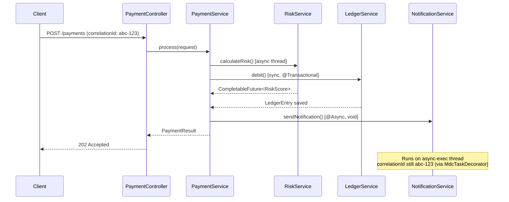

### Tracing Async in Logs

When MDC is propagated, you can trace the entire async flow with a single Kibana/Splunk query:

```
# Kibana KQL
correlationId:"abc-123"

# Returns logs from ALL threads in order:
[tomcat-exec-1]  PaymentController  - Request received
[tomcat-exec-1]  PaymentService     - Starting payment processing
[async-exec-2]   RiskService        - Evaluating risk for accountId=789
[tomcat-exec-1]  LedgerService      - Debiting account 789
[tomcat-exec-1]  PaymentService     - Processing complete, returning 202
[async-exec-4]   NotificationService - Sending notification to userId=456
```

### Tracing Async in the Debugger

**Problem**: A standard breakpoint in an `@Async` method is hit on a different thread. The original HTTP thread's call stack is gone.

**Technique**:

1. In Eclipse: **Debug → Breakpoints → Thread-specific breakpoint** — filter to `async-exec-*` threads.
2. In IntelliJ: In the debug panel, switch thread in the **Frames** dropdown — select the async thread to see its stack.
3. Set a breakpoint at the start of the `@Async` method — the debugger pauses on the async thread with its own stack.
4. Use **Evaluate Expression** to inspect the MDC map: `MDC.getCopyOfContextMap()`.

---

## A.5 CompletableFuture — Tracing and Debugging

### The CompletableFuture Execution Chain

```java
CompletableFuture
    .supplyAsync(() -> fetchCustomer(id), executor)         // Thread A
    .thenApplyAsync(customer -> enrichData(customer), executor)  // Thread B
    .thenCompose(data -> callExternalApi(data))             // Thread C (or B reused)
    .thenAccept(result -> saveResult(result))               // Thread C (or pool thread)
    .exceptionally(ex -> {
        log.error("Pipeline failed", ex);
        return null;
    });
```

### Common Bugs in CompletableFuture Chains

| Bug | Symptom | Root Cause |
|-----|---------|-----------|
| Lost MDC | Async logs have no correlationId | ThreadLocal not propagated |
| Silent failure | Nothing logged, result missing | `.exceptionally()` missing or swallowed |
| Blocking the HTTP thread | Thread pool exhaustion | `.join()` on bounded thread pool |
| Wrong executor | Slow operations on ForkJoinPool | Not specifying explicit executor |
| Timeout not enforced | Slow external call hangs thread | `.orTimeout()` not set |

### Adding Timeout to CompletableFuture (Java 9+)

```java
CompletableFuture<RiskScore> riskFuture = riskService.calculateRisk(req)
    .orTimeout(3, TimeUnit.SECONDS)  // throws CompletionException after 3s
    .exceptionally(ex -> {
        if (ex.getCause() instanceof TimeoutException) {
            log.warn("Risk service timed out — using default score");
            return RiskScore.DEFAULT;
        }
        throw new RuntimeException(ex);
    });
```

### Debugging a CompletableFuture Chain

1. Set breakpoints at each lambda — they fire on whichever thread executes that stage.
2. Use `CompletableFuture.isDone()`, `isCompletedExceptionally()` in Evaluate Expression.
3. Add `.whenComplete((result, ex) -> log.debug("Stage complete: result={}, ex={}", result, ex))` at each stage to trace execution.

---

## A.6 Spring Application Events (Async)

### How Spring Events Work

```
Publisher                    EventMulticaster               Listener
────────────────             ────────────────────           ──────────────────────
applicationContext           [SyncTaskExecutor or           @EventListener method
  .publishEvent(event)  ──▶   AsyncTaskExecutor]       ──▶ (on same or async thread)
```

### Synchronous Event (Default)

```java
// Publisher — same thread, listener executes before publishEvent returns
applicationEventPublisher.publishEvent(new PaymentCompletedEvent(paymentId));

// Listener
@EventListener
public void handlePaymentCompleted(PaymentCompletedEvent event) {
    auditService.record(event.getPaymentId());
}
```

### Asynchronous Event

```java
// Listener runs on async thread pool — publisher returns immediately
@Async
@EventListener
public void handlePaymentCompletedAsync(PaymentCompletedEvent event) {
    notificationService.notify(event.getPaymentId());
}
```

### Tracing Events

```java
// Add logging in the publisher
log.info("Publishing PaymentCompletedEvent for paymentId={}", paymentId);
applicationEventPublisher.publishEvent(new PaymentCompletedEvent(paymentId));

// Add logging in the listener
@Async
@EventListener
public void handlePaymentCompleted(PaymentCompletedEvent event) {
    log.info("Received PaymentCompletedEvent paymentId={}", event.getPaymentId());
    // MDC will be empty here if MdcTaskDecorator is not configured!
}
```

### Mermaid: Spring Event Flow

```mermaid
flowchart LR
    A[PaymentService.process()] -->|publishEvent| B[ApplicationEventMulticaster]
    B -->|SyncListener| C[AuditListener.record()]
    B -->|AsyncExecutor| D[NotificationListener.notify()]
    B -->|AsyncExecutor| E[ReportingListener.update()]
    C --> F[AuditDB]
    D --> G[EmailService]
    E --> H[ReportingService]
```

---

## A.7 Message-Driven Async Flows (JMS / Kafka / RabbitMQ)

### The Listener Container Pattern

Message-driven beans run in listener threads managed by the broker client library, completely separate from the HTTP thread pool.

```
Broker (Kafka/RabbitMQ/JMS)
        │
        │  message
        ▼
[Listener Container Thread]
  @KafkaListener / @JmsListener / @RabbitListener
        │
        ▼
  Your @Service method
```

### Kafka Listener Example

```java
@Component
public class PaymentEventConsumer {

    private static final Logger log = LoggerFactory.getLogger(PaymentEventConsumer.class);

    @KafkaListener(
        topics = "payment.events",
        groupId = "payment-processor",
        containerFactory = "paymentKafkaListenerContainerFactory"
    )
    public void consume(
            @Payload PaymentEvent event,
            @Header(KafkaHeaders.RECEIVED_PARTITION) int partition,
            @Header(KafkaHeaders.OFFSET) long offset) {

        MDC.put("correlationId", event.getCorrelationId());     // restore from message header
        MDC.put("partition", String.valueOf(partition));
        MDC.put("offset", String.valueOf(offset));

        try {
            log.info("Processing payment event paymentId={}", event.getPaymentId());
            paymentService.process(event);
        } finally {
            MDC.clear();
        }
    }
}
```

### Tracing a Message End-to-End

**The key**: embed the correlationId in the message header at publish time, restore it in the consumer.

**Publisher:**
```java
kafkaTemplate.send(MessageBuilder
    .withPayload(event)
    .setHeader("correlationId", MDC.get("correlationId"))
    .setHeader(KafkaHeaders.TOPIC, "payment.events")
    .build());
```

**Consumer:**
```java
@KafkaListener(topics = "payment.events")
public void consume(ConsumerRecord<String, PaymentEvent> record) {
    String correlationId = record.headers().lastHeader("correlationId") != null
        ? new String(record.headers().lastHeader("correlationId").value())
        : UUID.randomUUID().toString();
    MDC.put("correlationId", correlationId);
    // ... process
}
```

Now the same `correlationId` appears in logs from the HTTP thread, the Kafka producer, and the Kafka consumer — even minutes later.

### Mermaid: Message-Driven End-to-End Trace

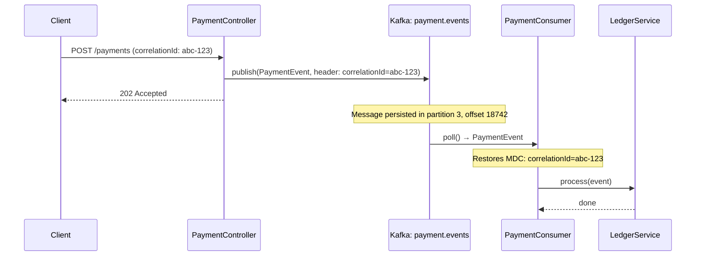

---

## A.8 Async Flow Debugging Checklist

Use this checklist whenever you encounter unexpected behavior in async code:

### Setup
- [ ] Is `@EnableAsync` present on a `@Configuration` class?
- [ ] Is there a named `Executor` bean, or is the default simple executor used?
- [ ] Is `MdcTaskDecorator` configured on the `ThreadPoolTaskExecutor`?
- [ ] Is `AsyncUncaughtExceptionHandler` configured for `void @Async` methods?

### Tracing
- [ ] Is the correlationId being propagated to async threads (check logs)?
- [ ] For Kafka/RabbitMQ: is the correlationId embedded in the message header?
- [ ] Are all async threads named with a recognizable prefix (`async-exec-*`)?

### Debugging
- [ ] Did you check that the `@Async` method is on a different bean (not self-invocation)?
- [ ] Is the `@Async` method `public` and non-`final`?
- [ ] For `CompletableFuture`: is `.exceptionally()` or `.handle()` present?
- [ ] Is `.orTimeout()` set on external calls?
- [ ] Is the thread pool sized correctly for the expected concurrency?

### Production
- [ ] Are thread pool metrics exposed via Actuator?
- [ ] Is `ThreadPoolTaskExecutor` rejecting tasks? (`CallerRunsPolicy` vs `AbortPolicy`?)
- [ ] Are dead-letter queues monitored (for message-driven async)?

---

## A.9 Async Debugging Lab

### Lab: Trace a Lost Correlation ID

**Setup:**
```java
@RestController
public class OrderController {
    @PostMapping("/orders")
    public ResponseEntity<String> create(@RequestBody OrderRequest req) {
        MDC.put("correlationId", UUID.randomUUID().toString());
        orderService.createAsync(req);
        return ResponseEntity.accepted().body("processing");
    }
}

@Service
public class OrderService {
    @Async
    public void createAsync(OrderRequest req) {
        log.info("Creating order for customer {}", req.getCustomerId());  // correlationId missing?
        inventoryService.reserve(req);
    }
}
```

**Steps:**
1. Make a POST to `/orders`. Check the logs — does the `createAsync` log line have `correlationId`?
2. Without `MdcTaskDecorator`: it will be missing.
3. Add `MdcTaskDecorator` to your `AsyncConfig`. Re-test.
4. Verify both log lines share the same `correlationId`.
5. Set a breakpoint inside `createAsync`. In the debugger, inspect `MDC.getCopyOfContextMap()` before and after the fix.

---

> **Supplement A Complete — Async Flow Tracing.**
>
> You now understand `@Async` internals and the self-invocation trap, MDC propagation across thread boundaries with `MdcTaskDecorator`, `CompletableFuture` chain tracing and debugging, Spring application events (sync vs async), message-driven Kafka/RabbitMQ end-to-end correlation ID tracing, and the async debugging checklist.

---

# Supplement B — Scheduler / Job Flow Tracing

> **Goal**: Understand every type of scheduled and job-based execution in enterprise Java — `@Scheduled`, Quartz, Spring Batch, and custom triggers. Know how to trace, monitor, debug, and diagnose misfires, overlaps, and silent failures in background jobs.

---

## B.1 Why Scheduled Jobs Are Hard to Debug

Schedulers are invisible at runtime. Unlike HTTP requests (which produce immediate log output tied to a user action), scheduled jobs:

- Fire on a timer — no caller, no incoming request to trace
- Run on background threads with no MDC context unless you set it up
- Fail silently if exceptions are swallowed
- Can overlap if the previous execution is still running
- Can misfire (skip executions) under cluster conditions
- Can hold DB locks for long periods without anyone noticing

The result: broken jobs are often found in production by a business analyst noticing stale data, not by the engineering team noticing an error.

---

## B.2 @Scheduled — Spring's Built-In Trigger

### How It Works Internally

```
Spring Container Startup
        │
        ▼
ScheduledAnnotationBeanPostProcessor scans all beans
        │  finds @Scheduled methods
        ▼
TaskScheduler (single thread by default)
        │
        ├── fixedRate task ──▶ fires every N ms regardless of last run
        ├── fixedDelay task ──▶ fires N ms AFTER last run completes
        └── cron task ──▶ fires at cron expression time
```

> **Critical**: By default, Spring uses a **single-thread** `ThreadPoolTaskScheduler` with `poolSize=1`. All your `@Scheduled` methods share one thread. If one job runs long, all others are delayed.

### Configuration

```java
@Configuration
@EnableScheduling
public class SchedulerConfig implements SchedulingConfigurer {

    @Override
    public void configureTasks(ScheduledTaskRegistrar registrar) {
        ThreadPoolTaskScheduler scheduler = new ThreadPoolTaskScheduler();
        scheduler.setPoolSize(5);                          // allow 5 jobs in parallel
        scheduler.setThreadNamePrefix("scheduler-");
        scheduler.setErrorHandler(t ->
            log.error("Unhandled exception in scheduled task", t));  // catch silent failures
        scheduler.initialize();
        registrar.setTaskScheduler(scheduler);
    }
}
```

### @Scheduled Variants and When to Use Each

```java
@Component
public class SettlementJobs {

    // Runs every 60 seconds. Next fire is 60s after THIS fire, regardless of duration.
    @Scheduled(fixedRate = 60_000)
    public void pollPendingSettlements() { ... }

    // Waits 30s AFTER the previous run finishes before firing again.
    // Safer for jobs that can run long - prevents overlap.
    @Scheduled(fixedDelay = 30_000)
    public void processRetryQueue() { ... }

    // Runs at 1:00 AM every day. Cron: second minute hour day month weekday
    @Scheduled(cron = "0 0 1 * * *")
    public void generateDailyReport() { ... }

    // Initial delay: wait 10s after startup, then run every 60s
    @Scheduled(fixedRate = 60_000, initialDelay = 10_000)
    public void warmupPoller() { ... }

    // Cron from config - best practice for production
    @Scheduled(cron = "${jobs.settlement.cron:0 0 1 * * *}")
    public void configuredJob() { ... }
}
```

### Cron Expression Reference

```
┌─────────────── second (0-59)
│ ┌───────────── minute (0-59)
│ │ ┌─────────── hour (0-23)
│ │ │ ┌───────── day-of-month (1-31)
│ │ │ │ ┌─────── month (1-12 or JAN-DEC)
│ │ │ │ │ ┌───── day-of-week (0-7 or MON-SUN)
│ │ │ │ │ │
* * * * * *

Common expressions:
0 * * * * *        Every minute
0 0 * * * *        Every hour at :00
0 0 6 * * *        Daily at 6:00 AM
0 0 6 * * MON-FRI  Weekdays at 6:00 AM
0 0/30 9-17 * * *  Every 30 min between 9 AM and 5 PM
0 0 1 1 * *        1st of every month at 1:00 AM
```

---

## B.3 Adding Observability to @Scheduled Jobs

Without logging, a job is a black box. Add this pattern to every scheduled method:

```java
@Scheduled(cron = "${jobs.reconciliation.cron}")
public void runReconciliation() {
    String jobId = UUID.randomUUID().toString();
    MDC.put("jobName", "reconciliation");
    MDC.put("jobId", jobId);
    Instant start = Instant.now();

    log.info("Job started");
    try {
        int processed = reconciliationService.run();
        long elapsed = Duration.between(start, Instant.now()).toMillis();
        log.info("Job completed: processed={} elapsed={}ms", processed, elapsed);
    } catch (Exception e) {
        log.error("Job failed after {}ms", Duration.between(start, Instant.now()).toMillis(), e);
        throw e;   // re-throw so error handler captures it too
    } finally {
        MDC.clear();
    }
}
```

**Log output:**
```
[scheduler-1] INFO  ReconciliationJob - jobName=reconciliation jobId=f3a1b2 | Job started
[scheduler-1] INFO  ReconciliationJob - jobName=reconciliation jobId=f3a1b2 | Job completed: processed=1482 elapsed=3241ms
```

---

## B.4 Preventing Job Overlap with ShedLock

In a multi-instance (clustered) deployment, every instance runs its own scheduler. Without coordination, the same job fires on all 3 nodes simultaneously — processing the same records in parallel.

### Mermaid: The Overlap Problem

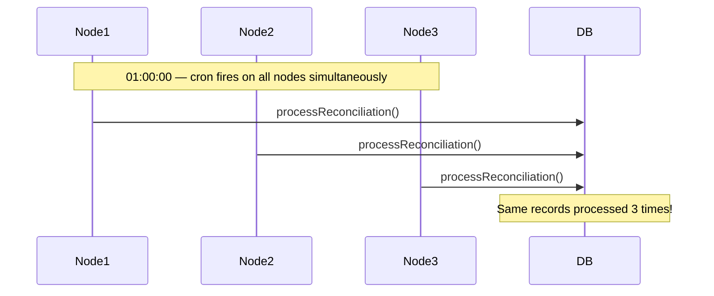

### ShedLock — Distributed Lock for Schedulers

```xml
<dependency>
    <groupId>net.javacrumbs.shedlock</groupId>
    <artifactId>shedlock-spring</artifactId>
    <version>5.10.0</version>
</dependency>
<dependency>
    <groupId>net.javacrumbs.shedlock</groupId>
    <artifactId>shedlock-provider-jdbc-template</artifactId>
    <version>5.10.0</version>
</dependency>
```

```sql
-- Required DB table
CREATE TABLE shedlock (
    name        VARCHAR(64)  NOT NULL,
    lock_until  TIMESTAMP    NOT NULL,
    locked_at   TIMESTAMP    NOT NULL,
    locked_by   VARCHAR(255) NOT NULL,
    PRIMARY KEY (name)
);
```

```java
@Configuration
@EnableScheduling
@EnableSchedulerLock(defaultLockAtMostFor = "PT10M")  // max lock duration: 10 minutes
public class SchedulerConfig {

    @Bean
    public LockProvider lockProvider(DataSource dataSource) {
        return new JdbcTemplateLockProvider(
            JdbcTemplateLockProvider.Configuration.builder()
                .withJdbcTemplate(new JdbcTemplate(dataSource))
                .usingDbTime()  // use DB clock, not server clock
                .build()
        );
    }
}
```

```java
@Scheduled(cron = "${jobs.reconciliation.cron}")
@SchedulerLock(
    name = "reconciliationJob",
    lockAtLeastFor = "PT1M",    // hold lock for at least 1 min (prevent double-fire)
    lockAtMostFor  = "PT9M"     // release lock after 9 min even if node crashes
)
public void runReconciliation() { ... }
```

### Mermaid: With ShedLock

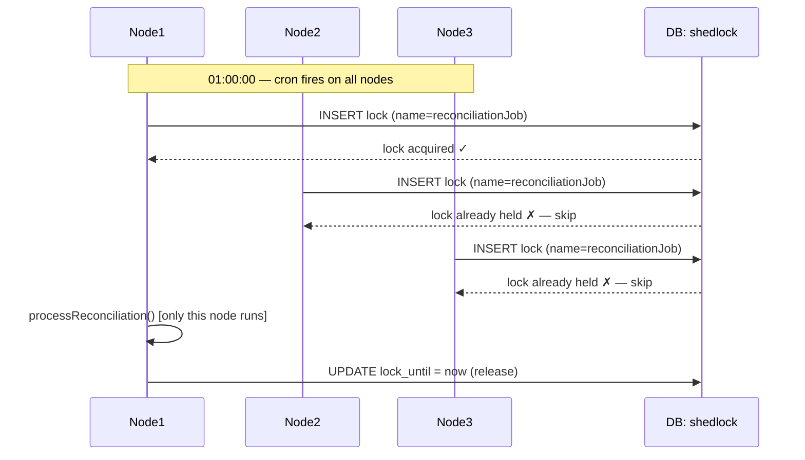

---

## B.5 Quartz Scheduler — Enterprise Job Scheduling

Quartz is used when you need: persistent job definitions, job clustering, job chaining, retry logic, or dynamic trigger management at runtime.

### Key Concepts

| Concept | Description |
|---------|-------------|
| `Job` | Interface with `execute(JobExecutionContext)` — your logic |
| `JobDetail` | Defines the job class + `JobDataMap` (parameters) |
| `Trigger` | When/how often the job fires (SimpleTrigger or CronTrigger) |
| `Scheduler` | The engine that manages Jobs and Triggers |
| `JobStore` | Where job state is persisted (RAM or JDBC — use JDBC in prod) |
| `JobExecutionContext` | Passed to `execute()` — holds trigger, job data, scheduler ref |

### Implementing a Quartz Job

```java
@Component
public class StatementGenerationJob implements Job {

    // Spring beans cannot be injected directly — use SpringBeanJobFactory
    @Autowired
    private StatementService statementService;

    @Override
    public void execute(JobExecutionContext context) throws JobExecutionException {
        JobDataMap data = context.getMergedJobDataMap();
        String accountType = data.getString("accountType");
        String correlationId = UUID.randomUUID().toString();
        MDC.put("jobName", "statementGeneration");
        MDC.put("correlationId", correlationId);

        log.info("Executing for accountType={}", accountType);
        try {
            statementService.generate(accountType);
            log.info("Completed successfully");
        } catch (Exception e) {
            log.error("Failed to generate statements", e);
            throw new JobExecutionException(e, true); // true = request refire
        } finally {
            MDC.clear();
        }
    }
}
```

### Scheduling a Quartz Job Programmatically

```java
@Configuration
public class QuartzJobConfig {

    @Bean
    public JobDetail statementJobDetail() {
        return JobBuilder.newJob(StatementGenerationJob.class)
            .withIdentity("statementJob", "reporting")
            .withDescription("Monthly statement generation")
            .usingJobData("accountType", "SAVINGS")
            .storeDurably()         // keep job even if no trigger
            .build();
    }

    @Bean
    public CronTrigger statementJobTrigger(JobDetail statementJobDetail) {
        return TriggerBuilder.newTrigger()
            .forJob(statementJobDetail)
            .withIdentity("statementTrigger", "reporting")
            .withSchedule(CronScheduleBuilder
                .cronSchedule("0 0 2 1 * ?")       // 2 AM on 1st of each month
                .withMisfireHandlingInstructionDoNothing())  // skip if fired late
            .build();
    }
}
```

### Quartz Misfire Strategies

A **misfire** occurs when a trigger's fire time is missed (app was down, job was running too long, or scheduler was paused).

| Strategy | Behavior | When to Use |
|----------|---------|-------------|
| `MISFIRE_INSTRUCTION_DO_NOTHING` | Skip the missed firing, wait for next | Batch jobs (don't re-run stale data) |
| `MISFIRE_INSTRUCTION_FIRE_ONCE_NOW` | Fire once immediately on recovery | Data sync jobs (catch up ASAP) |
| `MISFIRE_INSTRUCTION_IGNORE_MISFIRE_POLICY` | Fire all missed firings immediately | Audit / compliance — must not miss |

### Quartz JDBC Store (Required for Clusters)

```yaml
spring:
  quartz:
    job-store-type: jdbc               # persist to DB (not RAM)
    jdbc:
      initialize-schema: never         # use your own schema management
    properties:
      org.quartz.jobStore.isClustered: true
      org.quartz.jobStore.clusterCheckinInterval: 20000
      org.quartz.scheduler.instanceId: AUTO
      org.quartz.scheduler.instanceName: FinTechCluster
      org.quartz.threadPool.threadCount: 10
```

---

## B.6 Spring Batch — Processing Large Datasets

Spring Batch is the standard for high-volume record processing: file imports, settlement runs, reconciliation, report generation.

### Mermaid: Spring Batch Job Structure

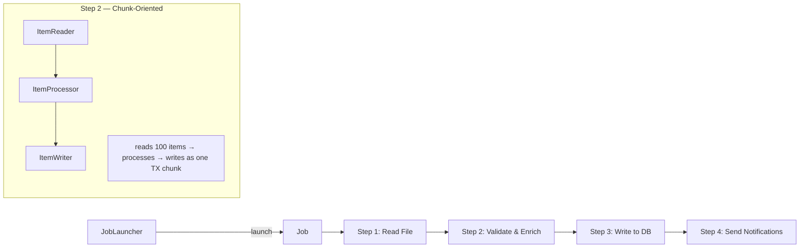

### Key Spring Batch Components

| Component | Responsibility |
|-----------|---------------|
| `Job` | Top-level batch process definition |
| `Step` | One phase of the job (can be chunk-oriented or tasklet) |
| `ItemReader` | Reads records from source (file, DB, queue) |
| `ItemProcessor` | Transforms/validates each record |
| `ItemWriter` | Writes processed records to destination |
| `JobRepository` | Persists job execution metadata to DB |
| `JobExecution` | Runtime state of one job run |
| `StepExecution` | Runtime state of one step within a job run |
| `ExecutionContext` | Key-value store per job or step — survives restarts |

### A Complete Spring Batch Step

```java
@Configuration
public class ReconciliationBatchConfig {

    @Bean
    public Job reconciliationJob(JobRepository jobRepository,
                                  Step reconciliationStep) {
        return new JobBuilder("reconciliationJob", jobRepository)
            .incrementer(new RunIdIncrementer())       // unique run each time
            .flow(reconciliationStep)
            .end()
            .build();
    }

    @Bean
    public Step reconciliationStep(JobRepository jobRepository,
                                    PlatformTransactionManager txManager) {
        return new StepBuilder("reconciliationStep", jobRepository)
            .<TransactionRecord, ReconciliationResult>chunk(500, txManager)  // commit every 500
            .reader(transactionFileReader())
            .processor(reconciliationProcessor())
            .writer(reconciliationWriter())
            .faultTolerant()
                .skipLimit(100)                        // skip up to 100 bad records
                .skip(ValidationException.class)
                .retryLimit(3)
                .retry(TransientDataAccessException.class)
            .listener(new ReconciliationStepListener())
            .build();
    }
}
```

### Monitoring Batch Job Progress

```sql
-- Check all job executions
SELECT je.job_instance_id, ji.job_name,
       je.start_time, je.end_time,
       je.status, je.exit_code, je.exit_message
FROM batch_job_execution je
JOIN batch_job_instance ji ON ji.job_instance_id = je.job_instance_id
ORDER BY je.start_time DESC
LIMIT 20;

-- Check step details for a specific execution
SELECT step_name, start_time, end_time, status,
       read_count, write_count, skip_count,
       commit_count, rollback_count,
       exit_message
FROM batch_step_execution
WHERE job_execution_id = :executionId
ORDER BY start_time;
```

---

## B.7 Tracing a Scheduler / Job Flow End-to-End

### Mermaid: Full Job Execution Flow

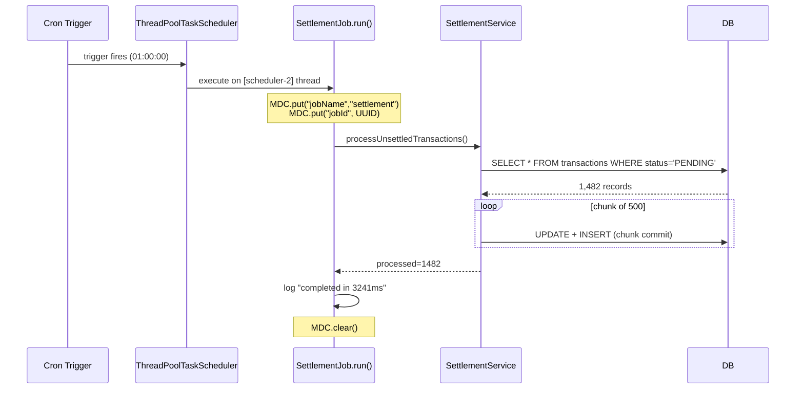

### Startup Sequence Tracing for Jobs

On startup you want to know: when does Spring register scheduled tasks? What happens if a job fires before the app is fully ready?

```
Spring Boot Startup Sequence (relevant to scheduling):
──────────────────────────────────────────────────────
1. ApplicationContext created
2. All @Bean methods invoked — beans created
3. @PostConstruct methods run
4. ApplicationReadyEvent fired
5. @Scheduled tasks registered (ScheduledAnnotationBeanPostProcessor)
6. First scheduled execution fires after initialDelay
```

**Key**: Scheduled tasks do NOT fire during step 2/3. If you have an `initialDelay=0` job, it fires only after step 5 — after the full context is ready. You can safely inject any Spring bean into a scheduled component.

**Anti-pattern to avoid:**
```java
@PostConstruct
public void init() {
    runReconciliation();  // WRONG: runs at startup before app is ready, blocks startup
}
// vs.
@Scheduled(initialDelay = 5000, fixedDelay = 60000)
public void runReconciliation() { ... }  // CORRECT: runs after startup
```

---

## B.8 Job Debugging Checklist

### Job Never Fires
- [ ] Is `@EnableScheduling` present on a `@Configuration` class?
- [ ] Is the class annotated with `@Component` / `@Service` (Spring-managed)?
- [ ] Is the method `public` and non-`final`?
- [ ] Is the cron expression valid? (Use [crontab.guru](https://crontab.guru) to verify)
- [ ] Is the cron property defined in `application.yml` / environment?
- [ ] Is the `ThreadPoolTaskScheduler` pool exhausted (all threads busy)? — check logs for delay warnings

### Job Fires But Does Nothing
- [ ] Is the exception being swallowed? — add `ErrorHandler` to the scheduler config
- [ ] Is `@Transactional` on the job method going through the proxy? (self-invocation trap)
- [ ] Is the job acquiring a ShedLock but failing before doing work?
- [ ] Check Quartz `QRTZ_FIRED_TRIGGERS` table for stuck entries

### Job Fires Multiple Times (Cluster)
- [ ] Is ShedLock configured and the `shedlock` table present in DB?
- [ ] Is Quartz using JDBC store with `isClustered=true`?
- [ ] Are all cluster nodes using the same DB clock? (`usingDbTime()` in ShedLock)

### Job Is Slow
- [ ] Add start/end timing logs around job logic
- [ ] Is it loading too many records? — add pagination or chunking
- [ ] Enable Hibernate SQL logging for the job's thread:
  ```
  logger name="org.hibernate.SQL" level="DEBUG"
  logger name="org.hibernate.type.descriptor.sql" level="TRACE"
  ```
- [ ] Is `@Transactional` wrapping the entire job? — large TX holds DB connections and blocks other jobs

### Job Runs Correctly Locally But Not in Production
- [ ] Is the cron timezone correct? (Server UTC vs local time)
  ```java
  @Scheduled(cron = "0 0 1 * * *", zone = "Europe/London")
  ```
- [ ] Is the production instance running in correct timezone (JVM arg: `-Duser.timezone=UTC`)?
- [ ] Is the container restarting before the job completes? — check pod/container lifetime

---

## B.9 Scheduler Debugging Lab

### Lab: Silent Job Failure

**Setup:**
```java
@Scheduled(fixedDelay = 5000)
public void processRetryQueue() {
    List<FailedTransaction> items = retryRepository.findPendingRetries();
    for (FailedTransaction t : items) {
        try {
            paymentService.retry(t);
        } catch (Exception e) {
            // swallowed — will never surface
        }
    }
}
```

**Steps:**
1. Run the app. Observe that `processRetryQueue` fires (add log at start of method).
2. Introduce a failure in `paymentService.retry()` — throw a `RuntimeException`.
3. Observe: no error in logs. Queue grows but no one notices.
4. Fix: add `log.error("Retry failed for transactionId={}", t.getId(), e)` in the catch block.
5. Add an `ErrorHandler` to the `ThreadPoolTaskScheduler` to catch uncaught exceptions.
6. Verify failure is now visible in logs.

### Lab: Cluster Overlap Detection

**Steps:**
1. Start two instances of the app locally (ports 8080 and 8081).
2. Trigger a `@Scheduled` job without ShedLock — observe both instances log "Job started".
3. Add ShedLock with appropriate `lockAtLeastFor` / `lockAtMostFor`.
4. Restart both instances. Observe: only one logs "Job started", the other is silent.
5. Check the `shedlock` table in the DB to see the lock entry.

---

> **Supplement B Complete — Scheduler / Job Flow Tracing.**
>
> You now understand `@Scheduled` internals (single-thread default, fixedRate vs fixedDelay vs cron), job observability with MDC, ShedLock for cluster-safe execution, Quartz for persistent enterprise scheduling (JobDetail, Trigger, misfire strategies, JDBC store), Spring Batch for large-volume record processing, startup sequence timing for jobs, and the complete job debugging checklist with labs.

---

# Supplement C — Production Troubleshooting Playbook

> **Goal**: A step-by-step diagnostic playbook for the most common production incidents in enterprise Java systems. Each entry follows the same structure: Symptom → Verify → Root Cause → Fix → Prevention.

---

## C.1 How to Use This Playbook

When production breaks, cognition degrades under pressure. This playbook replaces guesswork with a repeatable process. For every incident type:

1. **Match the symptom** — find which playbook entry fits.
2. **Run the verify steps** — confirm you have the right diagnosis before acting.
3. **Apply the fix** — targeted, minimal, reversible where possible.
4. **Write a mini post-mortem** — one paragraph. What broke, why, what changed.
5. **Apply prevention** — file a ticket, make the fix permanent.

---

## C.2 NullPointerException Investigation

### Symptom
```
java.lang.NullPointerException
  at com.fintech.service.PaymentService.process(PaymentService.java:87)
  at com.fintech.controller.PaymentController.submit(PaymentController.java:43)
```

### Mermaid: NPE Investigation Flow

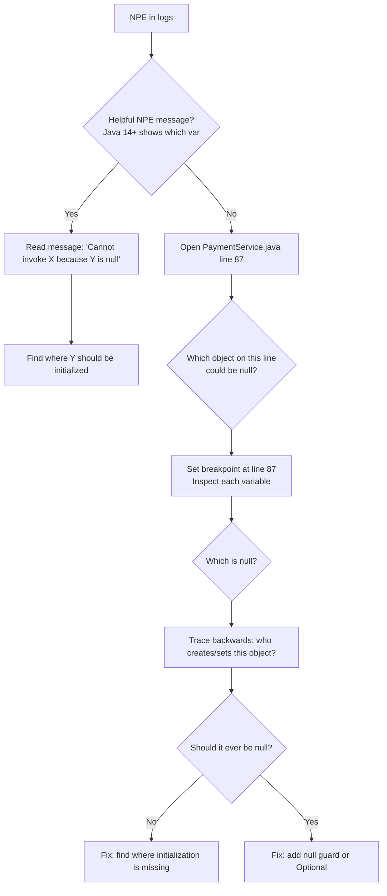

### Verify Steps

```java
// Java 14+ Helpful NPE — READ THIS FIRST
// "Cannot invoke 'Customer.getAddress()' because 'customer' is null"
// This tells you EXACTLY which variable is null.

// For older Java: count the dereferences on the failing line
payment.getCustomer().getAddress().getCity()
//      ^           ^             ^
// Any of these could be null — set breakpoint, inspect each
```

**Log query to find all NPEs in the last hour:**
```
# Splunk
index=prod level=ERROR "NullPointerException" earliest=-1h
| table _time, service, class, message
| sort -_time

# Kibana
level:"ERROR" AND exception.class:"NullPointerException"
```

### Common Root Causes

| Root Cause | Signal | Fix |
|-----------|--------|-----|
| Spring bean not injected | `@Autowired` field is null | Check component scan, circular deps |
| Optional not unwrapped | `findById().get()` without check | Use `orElseThrow()` |
| Missing `@Transactional` | Lazy entity field accessed after session close | Add `JOIN FETCH` or `@EntityGraph` |
| API response not checked | External REST call returns null body | Null-check `ResponseEntity.getBody()` |
| Config property missing | `@Value` injects null | Add `@Value("${prop:defaultValue}")` |
| Race condition | Object partially initialized | Synchronization or immutable design |

### Fix Pattern

```java
// BAD
String city = order.getCustomer().getAddress().getCity();

// GOOD — defensive null chain
String city = Optional.ofNullable(order.getCustomer())
    .map(Customer::getAddress)
    .map(Address::getCity)
    .orElse("UNKNOWN");

// GOOD — fail fast at system boundary (controller / service entry)
public PaymentResult process(PaymentRequest request) {
    Objects.requireNonNull(request, "PaymentRequest must not be null");
    Objects.requireNonNull(request.getCustomerId(), "customerId must not be null");
    // ... rest of method
}
```

---

## C.3 Timeout Debugging

### Symptom
```
com.fintech.exception.ServiceTimeoutException: Call to fraud-service timed out after 5000ms
-- or --
java.net.SocketTimeoutException: Read timed out
-- or --
HikariPool-1 - Connection is not available, request timed out after 30000ms
```

### Mermaid: Timeout Investigation Flow

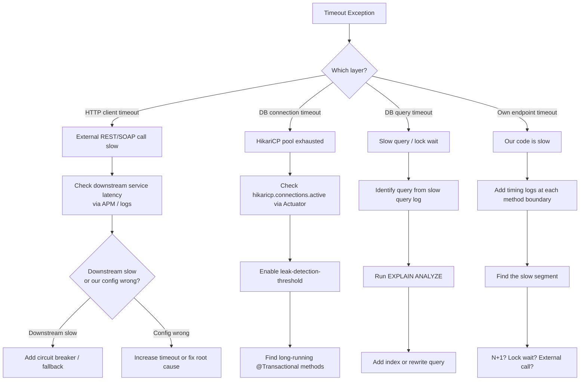

### Verify: Locate the Timeout

```java
// Add timing instrumentation to narrow down the slow segment
public PaymentResult process(PaymentRequest request) {
    long t0 = System.currentTimeMillis();

    RiskScore risk = riskService.evaluate(request);
    log.debug("riskService elapsed={}ms", System.currentTimeMillis() - t0);

    LedgerEntry ledger = ledgerService.debit(request);
    log.debug("ledgerService elapsed={}ms", System.currentTimeMillis() - t0);

    notificationService.notify(request);
    log.debug("notificationService elapsed={}ms", System.currentTimeMillis() - t0);

    return buildResult(risk, ledger);
}
```

### Verify: HikariCP Pool Exhaustion

```bash
# Via Actuator
curl http://localhost:8080/actuator/metrics/hikaricp.connections.active
curl http://localhost:8080/actuator/metrics/hikaricp.connections.pending
curl http://localhost:8080/actuator/metrics/hikaricp.connections.timeout
```

```yaml
# Enable leak detection
spring.datasource.hikari.leak-detection-threshold: 5000   # ms
```

Look for:
```
WARN  HikariPool-1 - Connection leak detection triggered for connection ...
      at com.fintech.service.ReportService.generateMonthlyReport(ReportService.java:142)
```

### Fix: HTTP Client Timeouts (RestTemplate / WebClient)

```java
// RestTemplate — explicit timeout config
@Bean
public RestTemplate restTemplate() {
    HttpComponentsClientHttpRequestFactory factory = new HttpComponentsClientHttpRequestFactory();
    factory.setConnectTimeout(2000);     // 2s to establish connection
    factory.setReadTimeout(5000);        // 5s to read response
    return new RestTemplate(factory);
}

// WebClient (reactive) — per-request timeout
webClient.post()
    .uri("/fraud/check")
    .bodyValue(request)
    .retrieve()
    .bodyToMono(RiskScore.class)
    .timeout(Duration.ofSeconds(3))
    .onErrorReturn(TimeoutException.class, RiskScore.DEFAULT);
```

### Fix: Circuit Breaker (Resilience4j)

```java
@Service
public class FraudService {

    @CircuitBreaker(name = "fraudService", fallbackMethod = "defaultRisk")
    @TimeLimiter(name = "fraudService")
    public CompletableFuture<RiskScore> evaluate(PaymentRequest request) {
        return CompletableFuture.supplyAsync(() -> fraudClient.check(request));
    }

    // Fallback — called when circuit is open or timeout exceeded
    public CompletableFuture<RiskScore> defaultRisk(PaymentRequest request, Exception e) {
        log.warn("Fraud service unavailable, using default risk: {}", e.getMessage());
        return CompletableFuture.completedFuture(RiskScore.MEDIUM);
    }
}
```

```yaml
resilience4j:
  circuitbreaker:
    instances:
      fraudService:
        slidingWindowSize: 10
        failureRateThreshold: 50
        waitDurationInOpenState: 30s
  timelimiter:
    instances:
      fraudService:
        timeoutDuration: 3s
```

---

## C.4 Slow API Debugging

### Symptom
- Endpoint `/api/payments` taking > 3 seconds
- Grafana latency dashboard shows P99 spike
- Users reporting slow screens

### Investigation Steps

**Step 1: Confirm the slow endpoint**
```
# Splunk — find slowest endpoints in last 30 minutes
index=prod "elapsed" service=payment-service earliest=-30m
| rex "elapsed=(?<ms>\d+)"
| stats avg(ms) p95(ms) p99(ms) max(ms) by uri
| sort -p99
```

**Step 2: Isolate the layer**
Add a `HandlerInterceptor` that logs total controller time, and MDC-based timing in service/repo layers.

**Step 3: Check for N+1 queries**
```yaml
spring.jpa.properties.hibernate.generate_statistics: true
logging.level.org.hibernate.SQL: DEBUG
logging.level.org.hibernate.type.descriptor.sql: TRACE
```
Count SQL statements logged during one API call. If you see dozens of identical `SELECT`s — N+1 confirmed.

**Step 4: Check for missing index**
Capture the slow SQL from logs, run `EXPLAIN ANALYZE` on it directly in your DB client.

**Step 5: Check for synchronous external calls**
Every `RestTemplate.exchange()` or `WebClient.block()` in the request path adds network latency. Can any be made async or cached?

### Common Root Causes Table

| Root Cause | Diagnosis | Fix |
|-----------|-----------|-----|
| N+1 query | Hibernate stats show 100+ queries for one request | `JOIN FETCH` / `@EntityGraph` |
| Missing DB index | `EXPLAIN ANALYZE` shows `Seq Scan` on large table | `CREATE INDEX CONCURRENTLY` |
| Synchronous downstream call | Timing log shows 2s in one service call | Make async or add cache |
| Loading entire table | `findAll()` without pagination | Add `Pageable` |
| Unnecessary object mapping | Deep `ModelMapper` on large graphs | Use DTO projections |
| Missing `readOnly=true` | Hibernate dirty-checking all loaded entities | Add `@Transactional(readOnly=true)` |
| Response serialization | Jackson serializing large lazy collections | Add `@JsonIgnore` / projections |

---

## C.5 Memory Leak Debugging

### Symptom
```
java.lang.OutOfMemoryError: Java heap space
-- or --
OutOfMemoryError: GC overhead limit exceeded
-- or --
Heap grows steadily over hours/days without releasing
```

### Mermaid: Memory Leak Investigation

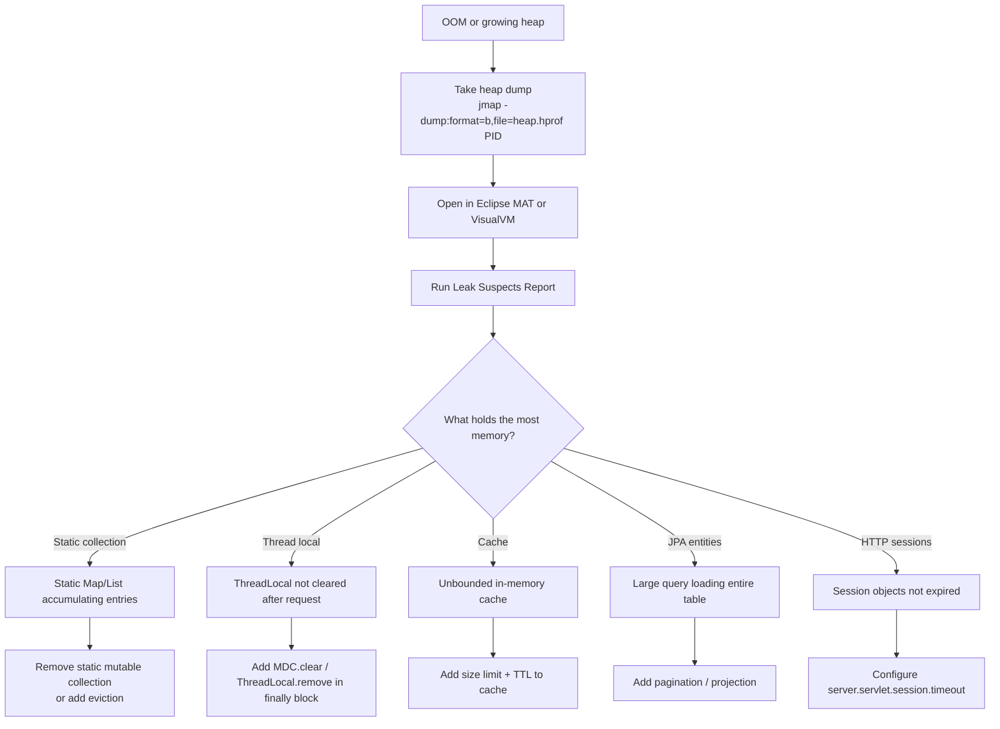

### Taking a Heap Dump

```bash
# Option 1: jmap (requires PID)
jmap -dump:live,format=b,file=/tmp/heap.hprof <PID>

# Option 2: JVM flag (auto-dump on OOM — add to startup args)
-XX:+HeapDumpOnOutOfMemoryError
-XX:HeapDumpPath=/var/log/app/heapdump.hprof

# Option 3: Via Actuator (if spring-boot-actuator + heapdump endpoint enabled)
curl http://localhost:8080/actuator/heapdump -o heap.hprof
```

### Analyzing with Eclipse MAT

1. Open MAT → File → Open Heap Dump → select `heap.hprof`
2. Run **Leak Suspects Report** — MAT identifies the object graph holding the most retained memory
3. Look for:
   - `Retained Heap` — how much memory is freed if this object is GC'd
   - `Dominator Tree` — which objects dominate (retain) large portions of the heap
   - `OQL (Object Query Language)`: `SELECT * FROM java.util.HashMap` — count all HashMaps

### Common Leak Patterns in Enterprise Java

```java
// LEAK: Static cache with no eviction
public class TokenCache {
    // Grows forever — each new token added, nothing removed
    private static final Map<String, Token> cache = new HashMap<>();

    public static void put(String key, Token token) { cache.put(key, token); }
}

// FIX: Use bounded cache with TTL
private static final Cache<String, Token> cache = Caffeine.newBuilder()
    .maximumSize(10_000)
    .expireAfterWrite(15, TimeUnit.MINUTES)
    .build();

// LEAK: ThreadLocal not cleared in filter/interceptor
public void doFilter(HttpServletRequest req, ...) {
    RequestContext.set(new RequestData(req));
    chain.doFilter(req, res);
    // FORGOT: RequestContext.clear() — ThreadLocal leaks on pooled threads
}

// FIX:
try {
    RequestContext.set(new RequestData(req));
    chain.doFilter(req, res);
} finally {
    RequestContext.clear();   // always clear
}
```

---

## C.6 DB Lock Debugging

### Symptom
```
com.fintech.exception.LockTimeoutException: could not obtain lock within timeout
-- or --
org.springframework.dao.PessimisticLockingFailureException
-- or --
Deadlock found when trying to get lock; try restarting transaction
```

### Verify: Find Lock Holders (PostgreSQL)

```sql
-- Who is holding locks right now?
SELECT
    pg_stat_activity.pid,
    pg_stat_activity.query,
    pg_stat_activity.state,
    pg_stat_activity.wait_event_type,
    pg_stat_activity.wait_event,
    pg_locks.relation::regclass AS locked_table,
    age(clock_timestamp(), pg_stat_activity.query_start) AS query_age
FROM pg_stat_activity
JOIN pg_locks ON pg_locks.pid = pg_stat_activity.pid
WHERE pg_locks.granted = true
  AND pg_stat_activity.state != 'idle'
ORDER BY query_age DESC;

-- Who is waiting for locks?
SELECT
    blocked.pid AS blocked_pid,
    blocked.query AS blocked_query,
    blocking.pid AS blocking_pid,
    blocking.query AS blocking_query,
    blocked_locks.relation::regclass AS locked_table
FROM pg_locks blocked_locks
JOIN pg_stat_activity blocked ON blocked.pid = blocked_locks.pid
JOIN pg_locks blocking_locks ON blocking_locks.transactionid = blocked_locks.transactionid
    AND blocking_locks.pid != blocked_locks.pid
    AND blocking_locks.granted = true
JOIN pg_stat_activity blocking ON blocking.pid = blocking_locks.pid
WHERE NOT blocked_locks.granted;
```

### Verify: Find Locks (MySQL)

```sql
SELECT * FROM information_schema.innodb_trx ORDER BY trx_started;
SELECT * FROM information_schema.innodb_lock_waits;
SELECT * FROM performance_schema.events_waits_current
WHERE event_name LIKE '%lock%';
```

### Common Lock Causes and Fixes

| Cause | Description | Fix |
|-------|-------------|-----|
| Long-running `@Transactional` | Transaction holds row lock for seconds | Reduce transaction scope; use `readOnly=true` for reads |
| Pessimistic lock not releasing | `SELECT FOR UPDATE` inside a slow method | Add lock timeout: `@QueryHint(name="javax.persistence.lock.timeout", value="5000")` |
| Deadlock: two txs acquiring locks in opposite order | TX1 locks A then B; TX2 locks B then A | Enforce consistent lock acquisition order |
| Optimistic lock storm | Many threads updating same row simultaneously | Implement retry with backoff on `OptimisticLockException` |
| Batch job locking app tables | Full-table scan in batch locks rows | Run batch in off-hours with `LOCK_TIMEOUT` set |

### Fix: Deadlock Prevention

```java
// DEADLOCK PRONE: two services lock accounts in different order
// Service A: locks account 100, then 200
// Service B: locks account 200, then 100

// FIX: always acquire locks in consistent order (by primary key)
List<Long> accountIds = Arrays.asList(fromAccountId, toAccountId);
Collections.sort(accountIds);  // always lock lower ID first

Account first  = accountRepository.findByIdForUpdate(accountIds.get(0));
Account second = accountRepository.findByIdForUpdate(accountIds.get(1));
```

---

## C.7 SOAP Fault Debugging

### Symptom
```xml
<soap:Envelope>
  <soap:Body>
    <soap:Fault>
      <faultcode>soap:Server</faultcode>
      <faultstring>Internal Server Error</faultstring>
      <detail>
        <ns2:ServiceFault>
          <errorCode>PAYMENT_REJECTED</errorCode>
          <errorMessage>Account balance insufficient</errorMessage>
        </ns2:ServiceFault>
      </detail>
    </soap:Fault>
  </soap:Body>
</soap:Envelope>
```

### Verify: Enable CXF Message Logging

```yaml
cxf:
  bus:
    properties:
      pretty-print: true    # format XML in logs
logging:
  level:
    org.apache.cxf: DEBUG
    org.apache.cxf.interceptor.LoggingInInterceptor: DEBUG
    org.apache.cxf.interceptor.LoggingOutInterceptor: DEBUG
```

### Verify: Add CXF Logging Interceptors in Code

```java
@Bean
public Endpoint paymentEndpoint(PaymentWebService service) {
    EndpointImpl endpoint = new EndpointImpl(bus, service);
    endpoint.publish("/PaymentService");

    LoggingInInterceptor inLogger = new LoggingInInterceptor();
    inLogger.setPrettyLogging(true);
    LoggingOutInterceptor outLogger = new LoggingOutInterceptor();
    outLogger.setPrettyLogging(true);

    endpoint.getInInterceptors().add(inLogger);
    endpoint.getOutInterceptors().add(outLogger);
    endpoint.getOutFaultInterceptors().add(outLogger);  // log fault responses too

    return endpoint;
}
```

### SOAP Fault Debugging Checklist

- [ ] Is the fault in `soap:Fault/detail` a business error or a system error?
- [ ] Is the faultcode `soap:Client` (caller error) or `soap:Server` (our error)?
- [ ] Search logs for the correlationId embedded in the SOAP header
- [ ] Enable CXF `LoggingInInterceptor` — capture the full raw XML request
- [ ] Check if the `@SchemaValidation` annotation is throwing due to bad input
- [ ] Is the JAXB unmarshalling failing? — look for `UnmarshalException` upstream
- [ ] Is a WS-Security header missing or expired?
- [ ] Test with SoapUI — paste the raw XML, send directly, inspect raw response

### Reading SOAP Fault Codes

| Fault Code | Meaning | Who's Responsible |
|-----------|---------|------------------|
| `soap:Client` / `Client` | Bad request — invalid XML, schema violation, missing field | Caller must fix their request |
| `soap:Server` / `Server` | Server-side processing error — exception in service impl | We must fix our code |
| `soap:VersionMismatch` | Wrong SOAP version (1.1 vs 1.2) | Caller/config mismatch |
| `soap:MustUnderstand` | A required header was not processed | Interceptor/handler missing |

---

## C.8 HTTP 500 Error Debugging

### Symptom
```
HTTP/1.1 500 Internal Server Error
{"timestamp":"...","status":500,"error":"Internal Server Error","message":""}
```

### Mermaid: 500 Investigation Flow

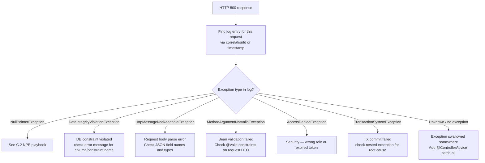

### Fix: Global Exception Handler

```java
@RestControllerAdvice
public class GlobalExceptionHandler {

    private static final Logger log = LoggerFactory.getLogger(GlobalExceptionHandler.class);

    // Catch-all — prevents silent 500s
    @ExceptionHandler(Exception.class)
    public ResponseEntity<ErrorResponse> handleUnexpected(Exception ex, HttpServletRequest req) {
        String correlationId = MDC.get("correlationId");
        log.error("Unhandled exception on {} {}: correlationId={}",
            req.getMethod(), req.getRequestURI(), correlationId, ex);

        return ResponseEntity.status(HttpStatus.INTERNAL_SERVER_ERROR)
            .body(new ErrorResponse("INTERNAL_ERROR",
                "An unexpected error occurred. Reference: " + correlationId));
    }

    @ExceptionHandler(MethodArgumentNotValidException.class)
    public ResponseEntity<ErrorResponse> handleValidation(MethodArgumentNotValidException ex) {
        String details = ex.getBindingResult().getFieldErrors().stream()
            .map(e -> e.getField() + ": " + e.getDefaultMessage())
            .collect(Collectors.joining(", "));
        log.warn("Validation failed: {}", details);
        return ResponseEntity.badRequest()
            .body(new ErrorResponse("VALIDATION_FAILED", details));
    }

    @ExceptionHandler(DataIntegrityViolationException.class)
    public ResponseEntity<ErrorResponse> handleDataIntegrity(DataIntegrityViolationException ex) {
        log.warn("Data integrity violation: {}", ex.getMostSpecificCause().getMessage());
        return ResponseEntity.status(HttpStatus.CONFLICT)
            .body(new ErrorResponse("DUPLICATE_ENTRY", "A record with this data already exists"));
    }
}
```

---

## C.9 Application Startup Failure Debugging

### Symptom
```
APPLICATION FAILED TO START
Description:
  Parameter 0 of constructor in com.fintech.service.PaymentService
  required a bean of type 'com.fintech.repository.FraudRepository' that could not be found.
-- or --
BeanCreationException: Error creating bean with name 'dataSource'
Caused by: com.zaxxer.hikari.pool.HikariPool$PoolInitializationException:
  Failed to validate connection (Connection refused)
```

### Startup Failure Decision Tree

```
App fails to start
      │
      ├─ "required a bean ... could not be found"
      │    → Missing @Component/@Service or not in component scan package
      │    → Check @ComponentScan base packages
      │    → Check @ConditionalOn... condition not met
      │
      ├─ "BeanCreationException ... Connection refused"
      │    → DB not reachable — wrong URL, auth, or DB not running
      │    → Check spring.datasource.url, username, password
      │    → Test: can you connect from the server with psql/mysql CLI?
      │
      ├─ "The injection point has the following annotations: @Autowired(required=true)"
      │    → Two beans of same type — use @Qualifier
      │    → Or bean is in wrong scope
      │
      ├─ "Circular dependency"
      │    → A depends on B, B depends on A
      │    → Fix: introduce interface, use @Lazy, or restructure
      │
      ├─ "Property ... not found / Could not resolve placeholder"
      │    → application.yml missing a required property
      │    → Environment variable not set
      │    → Check active profile: spring.profiles.active
      │
      └─ "Port 8080 already in use"
           → Another process on the port
           → netstat -ano | findstr :8080  (Windows)
           → lsof -i :8080  (Linux/Mac)
```

### Common Startup Fixes

```java
// Fix: ambiguous bean — qualify it
@Service
public class PaymentService {
    @Autowired
    @Qualifier("primaryDataSource")   // specify which DataSource to inject
    private DataSource dataSource;
}

// Fix: circular dependency via @Lazy
@Service
public class ServiceA {
    private final ServiceB serviceB;

    public ServiceA(@Lazy ServiceB serviceB) {  // break cycle with lazy init
        this.serviceB = serviceB;
    }
}

// Fix: optional property with default
@Value("${feature.fraud-check.enabled:true}")   // default = true if not set
private boolean fraudCheckEnabled;
```

---

## C.10 Production Incident Response Template

Use this every time you work a production incident. Fill it in during the incident; refine it after resolution.

```markdown
## Incident: [Short Title]
**Date/Time**: [when alert fired]
**Severity**: P1 / P2 / P3
**Duration**: [how long until resolved]
**Reporter**: [who raised it]

### Timeline
| Time  | Event |
|-------|-------|
| HH:MM | Alert fired: [metric/log that triggered] |
| HH:MM | Investigated: [what we checked first] |
| HH:MM | Hypothesis: [what we thought was wrong] |
| HH:MM | Confirmed: [what we found] |
| HH:MM | Fix applied: [what we did] |
| HH:MM | Resolved: [when service recovered] |

### Root Cause
[One paragraph. Be specific. What code/config/data caused this?]

### Impact
- Users affected: [estimate]
- Transactions affected: [count/value]
- SLA breach: Y/N

### Fix Applied
[What was done during the incident — hotfix, config change, restart]

### Permanent Fix
[Link to JIRA ticket — what code/config change prevents recurrence]

### Detection Gap
[Did monitoring catch this? If not, what alert would have caught it earlier?]

### Lessons Learned
- [Observation 1]
- [Observation 2]
```

---

## C.11 Production Troubleshooting Master Checklist

Use this as a first-response checklist for any production issue:

### Triage (First 5 Minutes)
- [ ] What is the exact error message and stack trace?
- [ ] When did it start? What changed (deploy, config, data volume)?
- [ ] What percentage of requests are affected?
- [ ] Is it getting worse / stable / improving?
- [ ] Is there a correlationId to trace a specific failing request?

### Locate (Minutes 5–15)
- [ ] Find the full log sequence for one failing request (correlationId query)
- [ ] Identify the exception type and the exact line where it is thrown
- [ ] Is this a known error? Check the runbook
- [ ] Check DB: are there stuck records, lock waiters, growing error counts?
- [ ] Check downstream services: are their error rates elevated?

### Diagnose (Minutes 15–30)
- [ ] Form a specific, testable hypothesis: "I think X fails because Y"
- [ ] Verify with a log query, DB query, or metric — NOT guesswork
- [ ] Can you reproduce in a non-prod environment?

### Fix
- [ ] Is a safe, targeted fix available? (config, feature flag, data fix)
- [ ] Does the fix require a deploy? (higher risk — get approval)
- [ ] Test the fix in a lower environment first if possible
- [ ] Apply fix; monitor for 5 minutes before declaring resolved

### Post-Incident
- [ ] Write the incident report (template in C.10)
- [ ] File a prevention ticket
- [ ] Add the failure mode to your flow documents
- [ ] Add a runbook entry for next time

---

> **Supplement C Complete — Production Troubleshooting Playbook.**
>
> You now have step-by-step playbooks for: NullPointerException investigation, timeout and circuit breaker debugging, slow API root-cause analysis, memory leak detection with heap dumps, DB lock hunting (PostgreSQL + MySQL queries), SOAP fault diagnosis, HTTP 500 investigation, application startup failure triage, a production incident report template, and the master first-response checklist.

---

# Supplement D — Mermaid Diagram Reference

> **Goal**: A complete visual reference of every major system flow, architecture pattern, and debugging sequence in this guide — expressed as Mermaid diagrams that render in GitHub, GitLab, Obsidian, VS Code, and any modern Markdown viewer.

---

## D.1 Architecture Diagrams

### Layered Architecture (N-Tier)

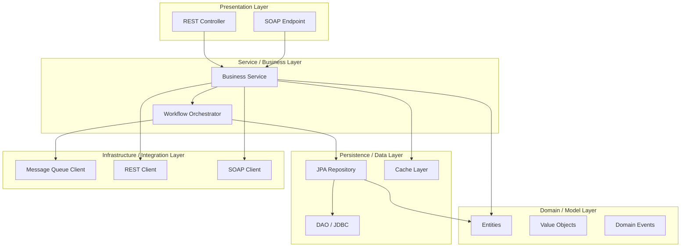

### Hexagonal Architecture (Ports & Adapters)

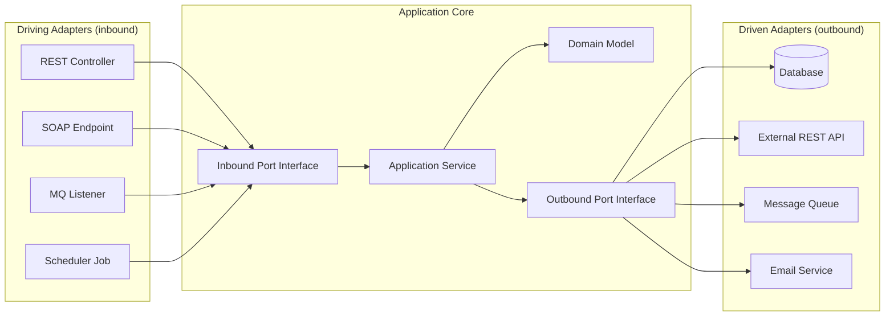

### Monolith vs Microservices Comparison

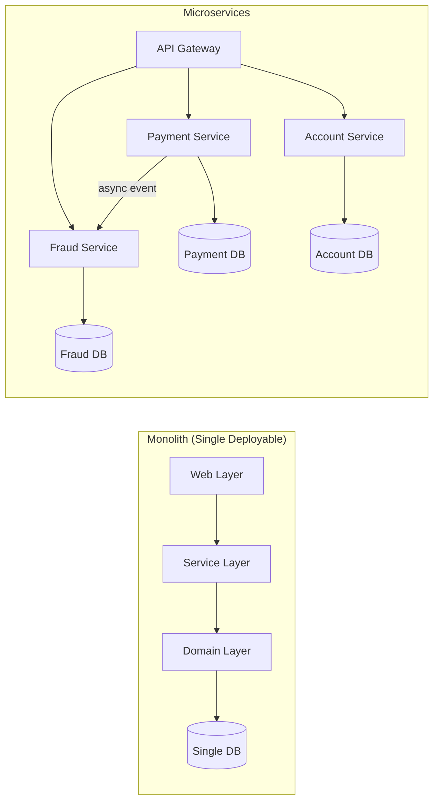

---

## D.2 Request Lifecycle Diagrams

### HTTP REST Request — Full Lifecycle

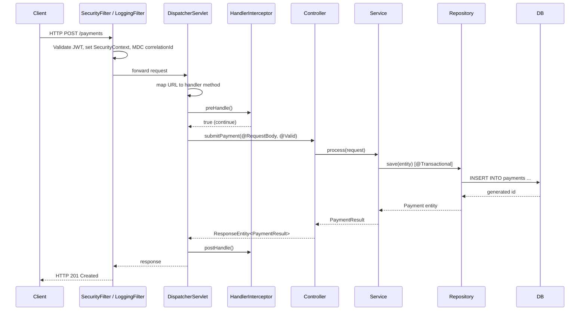

### SOAP Request — Full CXF Lifecycle

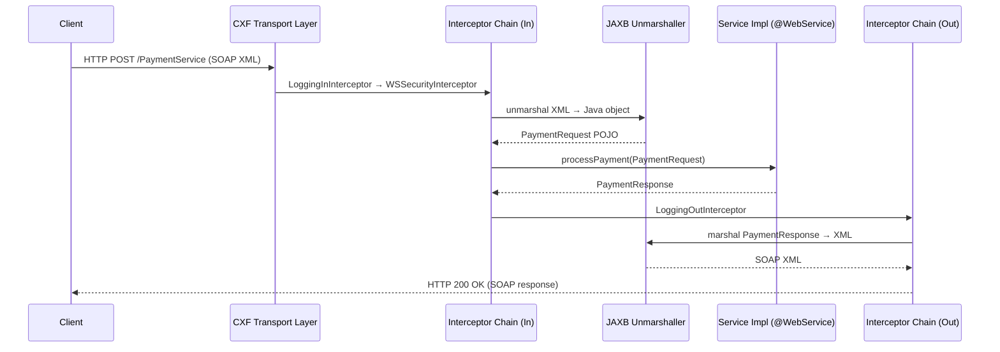

### Transaction Lifecycle

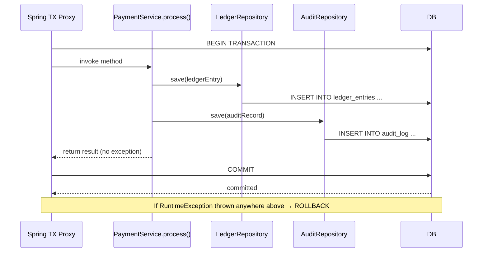

---

## D.3 Spring Internals Diagrams

### Spring Bean Lifecycle

```mermaid
flowchart TD
    A[Class Definition\n@Component / @Bean] --> B[Bean Instantiation\nconstructor called]
    B --> C[Dependency Injection\n@Autowired fields / constructor args]
    C --> D[BeanNameAware.setBeanName]
    D --> E[BeanFactoryAware.setBeanFactory]
    E --> F[ApplicationContextAware.setApplicationContext]
    F --> G[BeanPostProcessor.postProcessBeforeInitialization]
    G --> H[@PostConstruct method]
    H --> I[InitializingBean.afterPropertiesSet]
    I --> J[Custom init-method]
    J --> K[BeanPostProcessor.postProcessAfterInitialization]
    K --> L[Bean READY — in use]
    L --> M[ApplicationContext closing]
    M --> N[@PreDestroy method]
    N --> O[DisposableBean.destroy]
    O --> P[Custom destroy-method]
    P --> Q[Bean garbage collected]
```

### Spring AOP Proxy

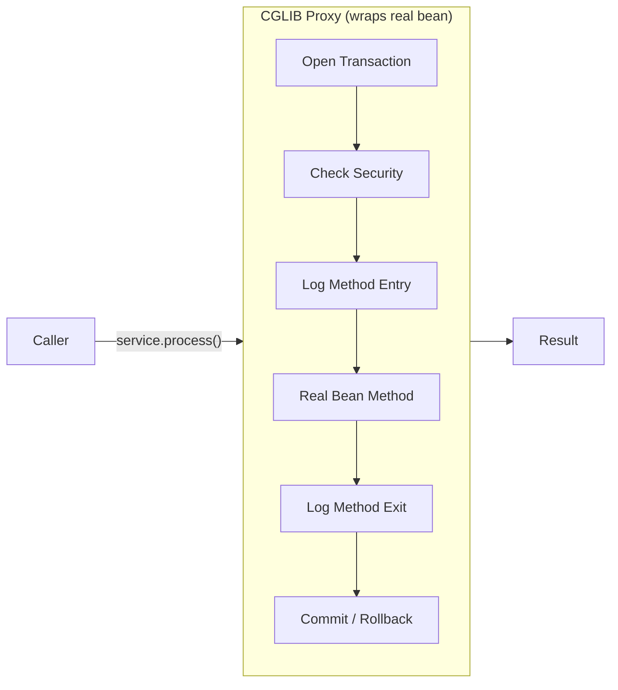

### Spring Boot Autoconfiguration

```mermaid
flowchart TD
    A[spring-boot-autoconfigure jar] --> B["META-INF/spring/\norg.springframework.boot.autoconfigure.AutoConfiguration.imports"]
    B --> C{Conditions evaluated}
    C -->|@ConditionalOnClass HikariDataSource| D[DataSourceAutoConfiguration applied]
    C -->|@ConditionalOnMissingBean DataSource| E[Skip if already defined]
    C -->|@ConditionalOnProperty enabled=true| F[FeatureAutoConfiguration applied]
    D --> G[DataSource bean created]
    D --> H[JdbcTemplate bean created]
    F --> I[Feature beans created]
```

### IoC Container — Dependency Injection Flow

```mermaid
flowchart TB
    subgraph Context["ApplicationContext"]
        BF[BeanFactory]
        BD1[BeanDefinition: PaymentService]
        BD2[BeanDefinition: LedgerRepository]
        BD3[BeanDefinition: DataSource]
    end

    BF --> BD1
    BF --> BD2
    BF --> BD3

    BD1 -->|depends on| BD2
    BD2 -->|depends on| BD3

    subgraph Resolution["Dependency Resolution"]
        DS[DataSource created first]
        LR[LedgerRepository created\nwith DataSource injected]
        PS[PaymentService created\nwith LedgerRepository injected]
    end

    BD3 --> DS --> LR --> PS
```

---

## D.4 Database Flow Diagrams

### JPA / Hibernate Layer Stack

```mermaid
flowchart TB
    A["Your Code\n@Repository / @Service"] --> B["EntityManager\n(JPA API)"]
    B --> C["SessionImpl\n(Hibernate Core)"]
    C --> D1["First-Level Cache\n(PersistenceContext)"]
    C --> D2["Second-Level Cache\n(EhCache / Redis — optional)"]
    C --> D3["Query Engine\n(JPQL → SQL)"]
    C --> D4["Dirty Checking\n(flush before commit)"]
    D3 --> E["JDBC Connection\n(from HikariCP pool)"]
    E --> F["Database Driver\n(PostgreSQL / Oracle / MySQL)"]
    F --> G[("Database Server")]
```

### N+1 Query Problem — Before and After

```mermaid
flowchart TD
    subgraph Before["❌ N+1 Problem"]
        A1[findAll customers] --> Q1[SELECT * FROM customers]
        Q1 --> L1[Loop over 1000 customers]
        L1 --> Q2["SELECT * FROM orders WHERE customer_id=1"]
        L1 --> Q3["SELECT * FROM orders WHERE customer_id=2"]
        L1 --> QN["SELECT * FROM orders WHERE customer_id=N\n(1000 more queries!)"]
    end

    subgraph After["✅ Fixed with JOIN FETCH"]
        A2["findAllWithOrders()"] --> Q4["SELECT c.*, o.* FROM customers c\nJOIN orders o ON o.customer_id = c.id\n(1 query — done)"]
    end
```

### Transaction Propagation Behaviors

```mermaid
flowchart LR
    subgraph REQUIRED
        direction TB
        R_CALLER[Caller TX exists?] -->|Yes| R_JOIN[Join existing TX]
        R_CALLER -->|No| R_NEW[Create new TX]
    end

    subgraph REQUIRES_NEW
        direction TB
        RN_CALLER[Always] --> RN_SUSPEND[Suspend caller TX]
        RN_SUSPEND --> RN_NEW[Create independent TX]
        RN_NEW --> RN_RESUME[Resume caller TX after]
    end

    subgraph MANDATORY
        direction TB
        M_CALLER[Caller TX exists?] -->|Yes| M_JOIN[Join existing TX]
        M_CALLER -->|No| M_THROW[Throw IllegalTransactionStateException]
    end

    subgraph NOT_SUPPORTED
        direction TB
        NS_CALLER[Always] --> NS_SUSPEND[Suspend any existing TX]
        NS_SUSPEND --> NS_RUN[Run without transaction]
    end
```

---

## D.5 SOAP Diagrams

### WSDL Structure Breakdown

```mermaid
flowchart TB
    WSDL[WSDL File] --> TYPES[types\nXSD schema definitions]
    WSDL --> MESSAGES[message\nInput/Output message parts]
    WSDL --> PORT_TYPE[portType\nAbstract operations]
    WSDL --> BINDING[binding\nSOAP protocol + style]
    WSDL --> SERVICE[service\nEndpoint URL]

    TYPES --> XSD[XSD elements / complexType]
    MESSAGES --> PARTS[message parts referencing XSD elements]
    PORT_TYPE --> OP[operation: processPayment\ninput: ProcessPaymentRequest\noutput: ProcessPaymentResponse]
    BINDING --> STYLE["style: document/literal-wrapped"]
    SERVICE --> PORT["port: PaymentServicePort\naddress: http://host/PaymentService"]
```

### CXF Interceptor Chain

```mermaid
flowchart LR
    subgraph In["Inbound Chain"]
        direction LR
        I1[TransportInterceptor] --> I2[ReadHeadersInterceptor] --> I3[LoggingInInterceptor] --> I4[WSSecurityInterceptor] --> I5[SchemaValidationInterceptor] --> I6[JAXBUnmarshalInterceptor]
    end

    subgraph Impl["Service Implementation"]
        SVC[@WebService impl]
    end

    subgraph Out["Outbound Chain"]
        direction RL
        O1[JAXBMarshalInterceptor] --> O2[LoggingOutInterceptor] --> O3[WSSecurityOutInterceptor] --> O4[TransportOutInterceptor]
    end

    I6 --> SVC --> O1
    O4 --> Client

    Client -->|SOAP Request| I1
```

---

## D.6 Logging and Tracing Diagrams

### MDC Correlation ID Flow

```mermaid
sequenceDiagram
    participant Client
    participant Filter as CorrelationIdFilter
    participant Service as PaymentService
    participant Async as AsyncThread
    participant Logger as Logback + MDC

    Client->>Filter: POST /payments (X-Correlation-ID: abc-123)
    Filter->>Logger: MDC.put("correlationId", "abc-123")
    Filter->>Service: forward request
    Service->>Logger: log.info("Processing...") → [correlationId=abc-123]
    Service->>Async: submit @Async task (MdcTaskDecorator copies MDC)
    Async->>Logger: log.info("Async work...") → [correlationId=abc-123]
    Service-->>Filter: response
    Filter->>Logger: MDC.clear()
    Filter-->>Client: 202 Accepted
```

### Distributed Tracing (Zipkin / Sleuth)

```mermaid
flowchart LR
    subgraph Request["Single Business Request — traceId: abc123"]
        direction LR
        API["payment-service\nspanId: span1\n[HTTP POST /payments]"]
        FRAUD["fraud-service\nspanId: span2\n[REST call]"]
        LEDGER["ledger-service\nspanId: span3\n[DB write]"]
        NOTIFY["notification-service\nspanId: span4\n[Kafka message]"]

        API -->|traceId propagated| FRAUD
        API -->|traceId propagated| LEDGER
        API -->|traceId propagated| NOTIFY
    end

    ZIPKIN["Zipkin UI\nTimeline view of all spans"]
    API & FRAUD & LEDGER & NOTIFY -->|report spans| ZIPKIN
```

### Logback Configuration Structure

```mermaid
flowchart TD
    APP[Application Code\nlog.info / log.error] --> SLF4J[SLF4J API\nLogger interface]
    SLF4J --> LOGBACK[Logback Implementation\nLoggerContext]
    LOGBACK --> FILTER[TurboFilter\nglobal log level gate]
    FILTER --> LOGGER_LEVEL{Logger Level\nmatches?}
    LOGGER_LEVEL -->|Yes| APPENDERS
    LOGGER_LEVEL -->|No| DISCARD[Discard]
    subgraph APPENDERS["Appenders"]
        CONSOLE[ConsoleAppender\nstdout]
        FILE[RollingFileAppender\nlogs/app.log]
        LOGSTASH[LogstashTcpSocketAppender\nELK / Splunk]
    end
    APPENDERS --> ENCODER[Encoder\nPattern / JSON]
    ENCODER --> OUTPUT[Log Output]
```

---

## D.7 Debugging Flow Diagrams

### Breakpoint Decision — Which Type to Use

```mermaid
flowchart TD
    Q[What do I want to catch?] --> A{Known line in code?}
    A -->|Yes| LINE[Line Breakpoint\nClick gutter]
    A -->|No - exception| EX[Exception Breakpoint\nBreak when X is thrown]
    A -->|No - method entry| METHOD[Method Breakpoint\nBreak on any call to method]
    A -->|Only for specific data| COND[Conditional Breakpoint\northerId.equals 'ORD-456']
    A -->|Field access or write| WATCH[Watchpoint\nBreak on field read/write]
    A -->|High-frequency loop| LOG_BP[Log Breakpoint\nLog without stopping]

    LINE --> COND2{High traffic?\nOnly care about 1 case?}
    COND2 -->|Yes| COND
    COND2 -->|No| INSPECT[Inspect variables\nStep through]
```

### Remote Debug Session Flow

```mermaid
sequenceDiagram
    participant DEV as Developer Machine\n(Eclipse / IntelliJ)
    participant TUNNEL as SSH Tunnel
    participant SERVER as Remote JVM\n(Dev/Staging Server)

    SERVER->>SERVER: Start with\n-agentlib:jdwp=transport=dt_socket,server=y,suspend=n,address=*:5005
    DEV->>TUNNEL: ssh -L 5005:remote-host:5005 user@remote-host
    DEV->>DEV: IDE → Run → Remote Debug → localhost:5005
    DEV->>TUNNEL: JDWP connect request
    TUNNEL->>SERVER: forward to port 5005
    SERVER-->>DEV: JDWP handshake — connected
    Note over DEV,SERVER: Set breakpoint in IDE
    SERVER->>SERVER: Code hits breakpoint
    SERVER-->>DEV: Suspend + send stack frame
    DEV->>DEV: Inspect variables, step through
    DEV->>SERVER: Continue / Step commands
```

### Production Issue — First-Response Decision Tree

```mermaid
flowchart TD
    ALERT[Alert / Report: Something is Wrong] --> Q1{Do you have\na correlationId?}
    Q1 -->|Yes| LOG_QUERY[Query logs:\ncorrelationId=xyz]
    Q1 -->|No| TIME_QUERY[Query logs by time window\nand service name]

    LOG_QUERY --> READ_STACK[Read full stack trace]
    TIME_QUERY --> FIND_ERROR[Find first ERROR entry]
    FIND_ERROR --> READ_STACK

    READ_STACK --> Q2{What exception type?}
    Q2 -->|NPE| NPE[See Playbook C.2]
    Q2 -->|Timeout| TO[See Playbook C.3]
    Q2 -->|DataIntegrityViolation| DB_ERR[Check constraint name\nFind duplicate/null field]
    Q2 -->|AccessDenied| SEC[Check JWT/role/Spring Security config]
    Q2 -->|No exception — 500| SWALLOWED[Exception swallowed\nSearch 'catch' near failing code]
    Q2 -->|Unknown| HYPOTHESIS[Form hypothesis\nVerify with DB/metric query]
```

---

## D.8 CI/CD and Deployment Diagrams

### Maven Build Lifecycle

```mermaid
flowchart LR
    V[validate] --> C[compile] --> TC[test-compile] --> T[test] --> P[package] --> VI[verify] --> I[install] --> D[deploy]

    style T fill:#f9f,stroke:#333
    style P fill:#bbf,stroke:#333
    style D fill:#bfb,stroke:#333
```

### Spring Boot Startup Sequence

```mermaid
flowchart TD
    A[main method\nSpringApplication.run] --> B[Create ApplicationContext]
    B --> C[Load autoconfiguration\nspring.factories / imports]
    C --> D[Scan @Component @Service @Repository]
    D --> E[Resolve & inject all dependencies\nBeanFactory.getBean]
    E --> F[Run BeanPostProcessors]
    F --> G[Run @PostConstruct methods]
    G --> H[Fire ApplicationReadyEvent]
    H --> I[Register @Scheduled tasks]
    H --> J[Start servlet container\nTomcat port 8080]
    I & J --> K[Application READY]

    style K fill:#bfb,stroke:#333
```

### Docker → Kubernetes Deployment Flow

```mermaid
flowchart LR
    subgraph Dev["Developer"]
        CODE[Code change] --> BUILD[mvn clean package]
        BUILD --> DOCKER_BUILD[docker build -t image:tag .]
    end

    subgraph CI["CI Pipeline (GitHub Actions / Jenkins)"]
        PUSH[git push] --> CI_BUILD[Build & Test]
        CI_BUILD --> IMAGE[Push Docker image\nto registry]
    end

    subgraph K8S["Kubernetes Cluster"]
        DEPLOY[kubectl apply\nDeployment.yaml]
        ROLLING[Rolling update:\nkill old pods one by one\nstart new pods]
        SVC[Service\nLoad Balancer]
        POD1[Pod 1: new version]
        POD2[Pod 2: new version]
        POD3[Pod 3: new version]
        DEPLOY --> ROLLING --> POD1 & POD2 & POD3
        SVC --> POD1 & POD2 & POD3
    end

    IMAGE --> DEPLOY
```

---

## D.9 Eclipse and IntelliJ Workflow Diagrams

### Eclipse — Call Hierarchy Investigation

```mermaid
flowchart TD
    TARGET["Target: processPayment()"] --> CH["Open Call Hierarchy\nCtrl+Alt+H"]
    CH --> CALLERS["All callers shown\nin hierarchy tree"]
    CALLERS --> C1["PaymentController.submit()\n→ line 43"]
    CALLERS --> C2["PaymentRetryJob.retry()\n→ line 87"]
    CALLERS --> C3["PaymentServiceIT.testProcess()\n→ line 112 (test)"]
    C1 --> Q1{Is this the call path\ncausing the bug?}
    Q1 -->|Yes| BP[Set breakpoint here\nRun with debug]
    Q1 -->|No| C2
```

### IntelliJ — Navigation Flow

```mermaid
flowchart LR
    ENTRY[Unknown Symbol] --> GD["Ctrl+B\nGo to Declaration"]
    GD --> DECL[Source Declaration]
    DECL --> FU["Alt+F7\nFind Usages"]
    FU --> ALL_USES["All usages\nin project"]
    ALL_USES --> TYPE["Ctrl+H\nType Hierarchy"]
    TYPE --> IMPLS[All implementations\nof interface]
    IMPLS --> STRUCT["Alt+7\nFile Structure"]
    STRUCT --> MEMBERS[All methods\nin class]
    MEMBERS --> BP[Set breakpoint\nRun with Debug]
```

---

## D.10 System-Level Architecture Reference

### FinTech Enterprise Java — Typical Production Topology

```mermaid
flowchart TB
    subgraph External["External"]
        BROWSER[Browser / Mobile App]
        PARTNER[Partner API Client]
        LEGACY[Legacy SOAP Client]
    end

    subgraph DMZ["DMZ / Load Balancer"]
        LB[Nginx / F5\nLoad Balancer]
        WAF[Web Application Firewall]
    end

    subgraph AppCluster["Application Cluster (3 nodes)"]
        NODE1[payment-service:8080\nNode 1]
        NODE2[payment-service:8080\nNode 2]
        NODE3[payment-service:8080\nNode 3]
    end

    subgraph Data["Data Tier"]
        PG[(PostgreSQL\nPrimary)]
        PG_RO[(PostgreSQL\nRead Replica)]
        REDIS[(Redis\nCache / Sessions)]
    end

    subgraph Messaging["Messaging"]
        KAFKA[Apache Kafka\npayment.events]
        MQ[RabbitMQ\nnotifications]
    end

    subgraph Downstream["Downstream Services"]
        FRAUD[fraud-service]
        LEDGER[ledger-service]
        NOTIFY[notification-service]
    end

    subgraph Observability["Observability Stack"]
        ELK[Elasticsearch\nKibana]
        ZIPKIN[Zipkin\nDistributed Tracing]
        GRAFANA[Grafana\nPrometheus Metrics]
    end

    BROWSER & PARTNER & LEGACY --> WAF --> LB
    LB --> NODE1 & NODE2 & NODE3
    NODE1 & NODE2 & NODE3 --> PG
    NODE1 & NODE2 & NODE3 --> PG_RO
    NODE1 & NODE2 & NODE3 --> REDIS
    NODE1 & NODE2 & NODE3 --> KAFKA --> NOTIFY & LEDGER
    NODE1 & NODE2 & NODE3 --> FRAUD
    NODE1 & NODE2 & NODE3 --> ELK & ZIPKIN & GRAFANA
```

### Module Dependency Map (Multi-Module Maven)

```mermaid
flowchart BT
    API[":api\nREST controllers, DTOs"] --> SERVICE
    SOAP_API[":soap-api\nSOAP endpoints, WSDL"] --> SERVICE
    SERVICE[":service\nBusiness logic, orchestration"] --> DOMAIN
    SERVICE --> INFRA
    DOMAIN[":domain\nEntities, value objects, events"] 
    INFRA[":infrastructure\nJPA repos, external clients, MQ"] --> DOMAIN
    COMMON[":common\nUtils, exceptions, logging config"] 
    SERVICE --> COMMON
    INFRA --> COMMON
    API --> COMMON
```

---

> **Supplement D Complete — Mermaid Diagram Reference.**
>
> This supplement provides Mermaid-rendered visual references for: layered and hexagonal architecture, REST and SOAP full request lifecycles, transaction lifecycle, Spring bean lifecycle, Spring AOP proxy, IoC/DI resolution, JPA/Hibernate stack, N+1 problem before/after, transaction propagation behaviors, WSDL structure, CXF interceptor chain, MDC correlation flow, distributed tracing, Logback configuration, breakpoint selection, remote debug session, production first-response decision tree, Maven lifecycle, Spring Boot startup sequence, Docker/Kubernetes deployment, Eclipse call hierarchy, IntelliJ navigation, FinTech production topology, and multi-module dependency map.
>
> **All four supplements are now complete. The guide is fully updated.**
